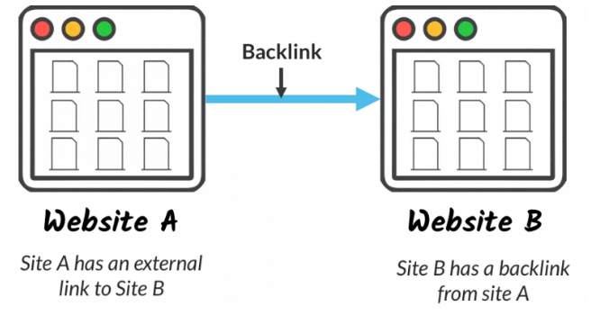

## Apa itu backlink?

Backlink adalah link yang ditautkan dengan situs web dan merujuk ke situs web lain. Namun, tidak semua link dikenali sebagai backlink oleh mesin pencari sperti Google. Backlink yang dapat dikenali oleh mesin pencari haruslah hyperlink yang dapat diklik. 

Contohnya, `https://www.aradechoco.com` dengan link yang dihapus tidak dianggap sebagai backlink, tapi dengan link https://www.aradechoco.com 
ini dianggap sebagai backlink.

## Apakah dengan banyak backlink itu bagus untuk SEO ? 
Jawabannya adalah `"tidak selalu"`. Tentu saja jumlah backlink dapat membantu web anda lebih cepat terindex oleh search engine, tetapi jika backlink situs web Anda sebagian besar adalah backlink berkualitas yang rendah, maka dapat berdampak negatif terhadap `Serp` atau `Rank` web Anda.

Backlink yang berkualitas tinggi adalah salah satu faktor yang dapat membantu situs web Anda naik dan muncul di halaman pertama pencarian Google. Backlink berkualitas tinggi dapat dipahami sebagai tautan balik yang berasal dari situs otoritatif yang di percayai oleh Google dan sudah berperingkat di antara mesin pencari teratas dengan konten yang terkait dengan situs web Anda.

Selain itu, backlink harus berasal dari situs yang relevan dengan situs web dan berasal dari situs otoritatif peringkat atas, dan sangat tidak di sarankan untuk memberikan backlink ke situs perjudian atau situs cabul ilegal.

Singkatnya, semakin banyak backlink berkualitas tinggi yang diterima dari berbagai situs otoritatif yang terkait dengan konten situs web Anda, semakin tinggi peluangnya untuk tampil di halaman pertama mesin pencari Google.





## Mengapa backlink itu penting untuk SEO ?

Intinya, backlink ke situs Anda adalah sinyal ke mesin pencari yang lain yang memberikan jaminan bahwa konten Anda bagus, relevan, dan juga dapat membantu mereka. Jika banyak situs yang menautkan link ke halaman yang sama, mesin telusur dapat menyimpulkan bahwa konten tersebut layak ditampilkan pada halaman pertama pada keyword yang berhubungan.

Jadi, mendapatkan backlink dapat memberikan efek positif pada posisi peringkat suatu situs website dalam hal visibilitas pencarian.

### Meningkatkan Pagerank

Seperti yang disebutkan sebelumnya, backlink adalah sebuah link yang di tanamkan di berbagai website lain dan mengarahkannya ke website Anda atau website lain yang sedang di optimasi. 


### Meningkatkan trafik
Memiliki banyak backlink secara alami akan meningkatkan jaringan bisnis Anda dan meningkatkan trafik. Jika seseorang membaca posting yang bagus dan melihat backlink menunju ke sumber itu, kemungkinan mereka akan mengklik link tersebut untuk mencari tahu siapa penulisnya dan di mana mereka mempostingnya.

### Meningkatkan Organic Search atau Pencarian Organik 
Pencarian organik adalah hasil pencarian mesin pencari, bukan hasil pencarian kata kunci, yang merupakan iklan bayar per klik seperti PPC atau CPC. 

Membangun backlink memiliki dampak positif untuk rank search engine karena mesin pencari adalah salah satu kriteria di mana situs web adalah situs web tepercaya yang diakui oleh situs web lain. Karena itu, pengelolaan backlink yang baik dapat sangat membantu untuk tampil di page one mesin pencari.


## Istilah-istilah Backlink

`Link Juice` : Istilah ini digunakan untuk merujuk pada nilai hyperlink atau backlink ke situs web atau halaman tertentu. Ketika tautan dari situs web atau post apa pun ke situs tersebut di publish, maka tautan itu akan menghasilkan 'link juice', yang membantu mendapatkan peringkat yang lebih tinggi pada mesin pencari. 

Misalnya, jika halaman A memposting link ke kata kunci ganda, link itu akan memberikan link juice, yang akan membantu meningkatkan [peringkat](https://www.aradechoco.com/cara-mengetahui-peringkat-situs-web/) di mesin pencari.
 

`Nofollow` : Tautan ini tidak memberikan link juice di situs web atau halaman, dan juga tidak berkontribusi pada peringkat mesin pencari. Jika tidak ingin meningkatkan peringkat situs web yang Anda rujuk dengan backlink, Anda dapat menggunakan tautan nofollow, yaitu 

```
<a href="http://www.website.com" rel="nofollow"> Teks... </a>.
```
 

`Sponsored link` : Penjualan link untuk iklan atau biaya. Google tidak mengumpulkan tautan itu. Cukup terapkan sebagai berikut:

```
<a href="http://www.website.com" rel="sponsored"> Teks </a> dalam HTML.
```
 

`User generated content link (tautan UGC)` : link di dalam konten yang mirip dengan komentar yang dibuat pengguna. Itu tidak dikumpulkan oleh robot pencarian dan dapat diterapkan sebagai berikut:

```
<a href="http://www.website.com" rel="ugc"> Teks </a> dalam HTML.
```
 

`Follow the link` : Secara default, semua tautan diikuti, jadi link juice akan dikirim kecuali Anda menyetelnya sebagai tidak ada tautan ikuti.
 

`Anchor text atau link text` : Teks ini merujuk pada teks yang dapat diklik, digaris bawahi dalam hyperlink berwarna biru. Optimasi anchor text berfungsi dengan baik ketika Anda ingin mendapatkan keuntungan di posisi pencarian kata kunci tertentu. 

Misalnya, jika Anda memiliki tautan yang berbunyi "klik di sini," Anda harus menggantinya dengan nama laman yang ditautkannya, atau kata kunci yang diwakilinya (misalnya, "alat manajemen media sosial"). Gunakan beberapa tools gratis untuk mencari sugesti kata kunci seperti (Keyword Research) jika diperlukan.
 

`Link the root domain` : Jumlah backlink dari domain Anda ke situs web Anda. Tidak peduli berapa banyak backlink yang Anda miliki, tidak ada efek pada peringkat teratas mesin pencari jika semua domain yang memiliki backlink adalah sama.
 

`Internal Link` : Tautan dari satu halaman ke halaman lain dalam situs web yang sama disebut tautan internal atau tautan internal.
 

`Low quality link` : Tautan dari spam dan situs otomatis adalah tautan berkualitas rendah, sehingga tautan balik ini dapat mempengaruhi peringkat halaman web Anda. Tautan berkualitas rendah dapat dihapus melalui Google Search Console .


## Cara membangun Backlink Berkualitas untuk pemula

### 1. Bagikan postingan populer atau Social bookmark
Anda dapat menulis artikel yang berisi kata kunci populer yang terkait dengan situs web / perusahaan / produk Anda dan membagikannya ke sosial media untuk mendorong pembaca agar secara sukarela membagikannya kembali.

### 2. Minta untuk mengganti broken link web lain

Broken link artinya link dari suatu halaman website ke website lain yang sudah mati. Ketika di-klik, halamannya sudah tidak ada. Karena domainnya kadaluarsa, salah tulis, artikelnya dihapus, atau alasan lain.

> **Note:** Nah, dalam broken link building, kita akan mencari broken link dari website lain. Kemudian kita akan membantu mereka memperbaiki broken link tersebut dengan memberikan website kita sebagai alternatifnya.

### 3. Guest Blogging atau jadi penulis tamu

Ini cara terbaik dan termudah untuk mendapatkan trafik ke website Anda dan untuk meningkatkan rangking di Google.
Setelah melakukan [guest blogging](https://www.aradechoco.com/guest-blog-seo/), maka pengunjung dari website tersebut akan mengenal dan akan jadi pengunjung di website anda.

## Tools backlink

[Optimasi SEO](https://www.aradechoco.com/SEO-untuk-pemula/) melalui pembangunan backlink dilakukan dengan mengelola backlink yang dimiliki situs web secara efektif. Di bawah ini adalah tools backlink yang memungkinkan Anda untuk mengelola tidak hanya situs web Anda tapi juga tautan backlink web yang bersaing secara bersamaan. Kelola backlink Anda lebih efektif dengan tools manajemen backlink.

- [Check My Link](https://chrome.google.com/webstore/detail/check-my-links/ojkcdipcgfaekbeaelaapakgnjflfglf) ( Ekstensi Google Chrome )
- [Ahrefs](https://www.ahrefs.com/) ( Berbayar )
- [Linkbird](https://www.linkbird.com/en/) ( Gratis / Berbayar )
- [Pitchbox](http://pitchbox.com/) ( Berbayar )
- [Monitorbacklink](https://monitorbacklinks.com/) ( Gratis / Berbayar )
- [Linkody](https://www.linkody.com/) ( Gratis / Berbayar )

Menyebarkan backlink membutuhkan waktu yang agak lama, tetapi ini sepadan dengan hasil yang di dapatkan jika Anda menerapkannya dengan benar. Namun, daripada berfokus pada backlink, yang terbaik adalah membuat konten berkualitas tinggi yang akan memuaskan para pembaca sehingga backlink dapat dibuat secara alami.

Dalam posting ini, saya belajar tentang backlink. Jika Anda memiliki pertanyaan atau saran tentang backlink atau SEO off-page, silakan tinggalkan komentar.


## Terkait 

- [Cara Riset Keyword](https://www.aradechoco.com/cara-riset-keyword-untuk-pemula/) : Long Tail dan Short Tail untuk Pemula
- [SEO Untuk Pemula](https://www.aradechoco.com/SEO-untuk-pemula/) - Langkah Awal Untuk Naik Peringkat Google 
- [Tanya Jawab tentang Optimasi SEO](https://www.aradechoco.com/seo-link-building/) - Link Building
- [Guest Blogging dan Pengaruhnya terhadap SEO](https://www.aradechoco.com/guest-blog-seo/)

