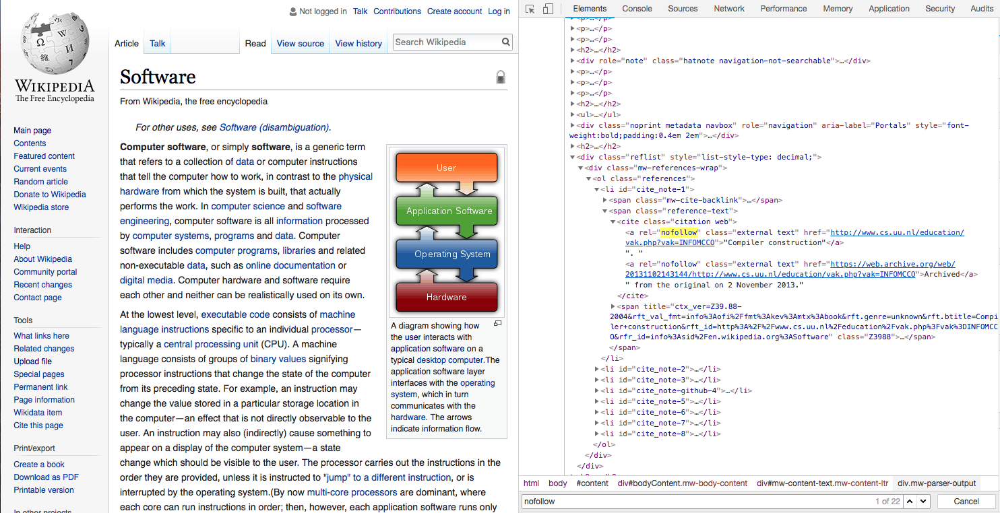

Untuk mendapat [Peringkat tinggi](https://www.aradechoco.com/cara-mengetahui-peringkat-situs-web/) di Google, Anda perlu memahami algoritma Google. Saat ini, Google memaparkan situs web yang sangat tepercaya di bagian atas hasil pencarian. Kriteria di mana mesin pencari Google menentukan kepercayaan situs web tertentu adalah jumlah tautan yang diterima dari situs web tepercaya lainnya.

Misalnya, jika Anda menerima link dari homepage pemerintah atau banyak link dari pers atau situs web yang berpengaruh, itu dapat dilihat sebagai situs web yang sangat handal. Proses memilih situs web eksternal dan membuat tautan ke situs web Anda disebut [Link Building](https://www.aradechoco.com/seo-link-building/). Tentu saja, beberapa [Backlink yang memiliki dampak negatif pada SEO](https://www.aradechoco.com/menghapus-backlink-spam/).

## SEO dan Wikipedia

Jika demikian, Anda mungkin bertanya-tanya situs apa yang tepat untuk membangun backlink Anda. Secara khusus, marketing company online perlu menemukan situs web baru setiap kali, tergantung pada sifat proyek, jenis produk, dan target.

Wikipedia adalah situs representatif yang dapat Anda gunakan tanpa khawatir tentang hal kualitsnya. Apa pun yang Anda cari di Google,  Anda pasti sering melihat mesin pencari menampilkan jawaban Wikipedia di  layar pertama . Jadi itu adalah bahwa Wikipedia dipandang sebagai situs perwakilan handal dari Google ( tentu saja, ada kontroversi tentang keakuratan informasi ). Oleh karena itu, link diarahkan dari Wikipedia sebagai klien atau situs Web,  semakin  tinggi  peringkat yang dapat membantu.

## Kekurangan dari Wikipedia

Tetapi Wikipedia juga memiliki kekurangannya. Semakin banyak link spam di Wikipedia tetapi Wikipedia telah menerapkan `rel = ” nofollow ”` di semua link yang keluar . Dengan kata lain, `"tautan yang menuju langsung ke situs web tertentu"`  tidak memengaruhi peringkat pencarian Anda. Misalnya, membuat tautan di Wikipedia ke `www.aradechoco.com` tidak memengaruhi hasil penelusuran Anda. Selain itu, Google berkata, `"Secara umum,   jangan ikuti tautan nofollow ."` Karena itu,  pendapat para ahli SEO tentang efektivitas Wikipedia menjadi terbagi.

## Apakah Wikipedia baik untuk membangun backlink?

Meskipun kontroversial, Wikipedia layak digunakan untuk link building . Pertama-tama, hanya perlu memiliki banyak informasi tentang perusahaan dan klien Anda di Wikipedia dan memiliki dampak positif pada SEO . Seperti disebutkan sebelumnya  ,  tidak peduli informasi apa yang dicari pengguna , Google menunjukkan jawaban Wikipedia di halaman pertama. Jika Anda memaparkan banyak informasi ke Wikipedia melalui link internal dan juga outbound link ( tautan keluar ),  Anda dapat meningkatkan trafik ke situs web Anda.

## Terkait 

- [Apa itu backlink ?](https://www.aradechoco.com/apa-itu-backlink/) Mengapa penting untuk SEO ?
- [SEO Untuk Pemula](https://www.aradechoco.com/SEO-untuk-pemula/) - Langkah Awal Untuk Naik Peringkat Google 
- [Cara Riset Keyword](https://www.aradechoco.com/cara-riset-keyword-untuk-pemula/) : Long Tail dan Short Tail untuk Pemula

