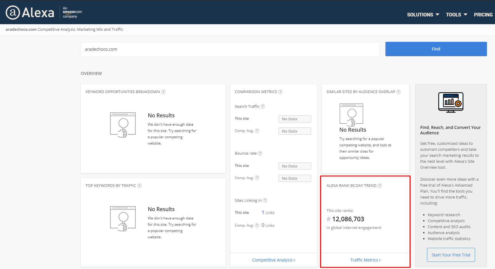
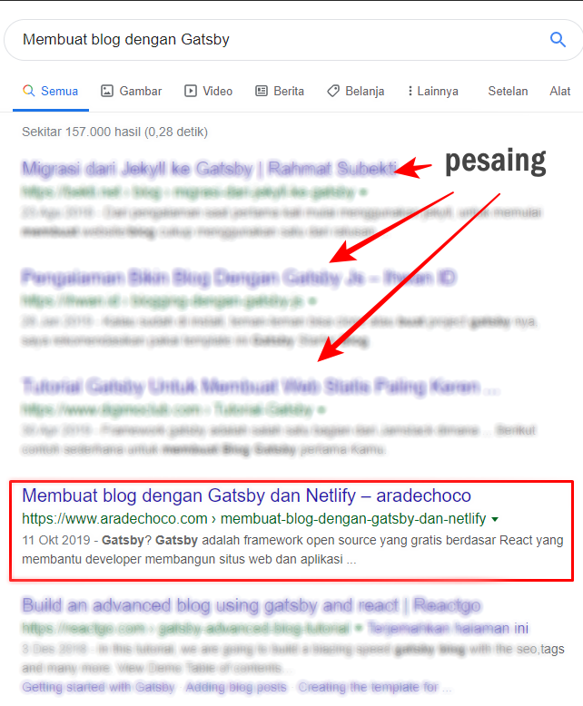

Saat ini, ada lebih dari 1 miliar situs web di seluruh dunia. Menemukan posisi situs web di peringkat adalah pertanyaan sederhana, tetapi juga pertanyaan penting tentang seberapa baik Anda melakukan digital marketing atau [Optimasi SEO](https://www.aradechoco.com/SEO-untuk-pemula/) dibandingkan dengan pesaing Anda.
Namun, ada banyak cara untuk menentukan peringkat situs web. Pemeringkatan dapat didasarkan pada seberapa banyak konten yang Anda miliki, seberapa rendah `bounce rate`, berapa banyak `trafik` atau seberapa tinggi `conversion rate` Anda.

Berikut adalah tiga metode yang paling tepat, dan kami akan melihat wawasan yang bisa diperoleh pemasar dengan menggunakan peringkat berdasarkan setiap kriteria.

### 1. Ketahui peringkat situs web Anda dengan Alexa Rank

Ini adalah metode yang paling dikenal. Untuk mengetahui rank global , buka situs [Alexa Rank](http://www.alexa.com/siteinfo) dan masukkan url situs web Anda. Anda dapat melihat berapa banyak trafik dan lalu lintas yang Anda miliki dan betapa mudahnya untuk melihat peringkat. Sebagai contoh saya mengambil sreenshoot alexa rank dari situs web ini.

Anda juga dapat membandingkan lalu lintas dengan pesaing Anda dan melihat kinerja lalu lintas secara keseluruhan menggunakan tools similiar.

Untuk membandingan situs Anda dengan situs pesaing,silahikan kunjungi [similiarweb](https://www.similarweb.com/).

### 2. Pelajari kinerja situs berdasarkan skor domain ( DA dan PA )

Otoritas Domain adalah skor yang memperkirakan seberapa tinggi peringkat situs web di mesin pencari, skor yang mempertimbangkan berbagai aspek seperti tautan masuk, kualitas konten, dan riwayat operasi situs web. .

100 dari 100 poin diperoleh dari alamat domain seperti Google dan Facebook, dan Naver adalah 89 poin. Singkatnya, Anda dapat melihat keandalan alamat web. Anda dapat memeriksa skor Anda dengan mengghunakan [MOZ](https://moz.com/).
Skor DA dan PA domain berguna untuk menentukan seberapa terkenal atau tepercaya situs web target, tetapi pembaruan tidak cukup cepat untuk menentukan kinerja saat ini. Selain itu, semakin tinggi jumlah tautan masuk, semakin tinggi skornya.

### 3. Lihat peringkat situs web dengan kata kunci yang ditargetkan

Cara menentukan peringkat situs web dengan cara memberi peringkat hasil pencarian tidak hanya dapat memeriksa kinerja situs web target, tetapi juga kinerja dan status real time dari situs web pesaing. Anda hanya perlu memilih kata kunci yang ingin Anda peringkat.
 

 
Gambar diatas menunjukkan cara melihat peringkat situs web Anda berdasarkan kata kunci yang di bidik.
Trafik mungkin merupakan posisi yang paling mudah untuk dipahami, yang dapat membantu menentukan seberapa sukses situs web Anda. Anda juga dapat mengidentifikasi posisi Anda dalam persaingan.
Skor domain tidak intuitif dan sepertinya tidak terlalu berguna. Anda hanya perlu tahu seberapa handal situs web yang Anda bangun.
Metode menggunakan hasil pencarian ini memang sangat praktis, tetapi tidak nyaman untuk memilih keyword dengan baik dan membandingkannya dengan mencari kata kunci yang lain beberapa kali. Namun, memungkinkan untuk memahami kinerja situs web yang Anda target dibandingkan dengan pesaing saat ini.

### Terrkait

- [Cara Riset Keyword](https://www.aradechoco.com/cara-riset-keyword-untuk-pemula/) : Long Tail dan Short Tail untuk Pemula
- [SEO Untuk Pemula](https://www.aradechoco.com/SEO-untuk-pemula/) - Langkah Awal Untuk Naik Peringkat Google