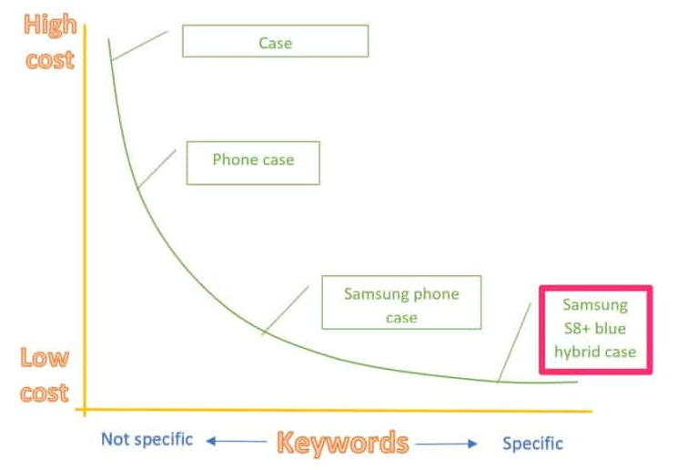
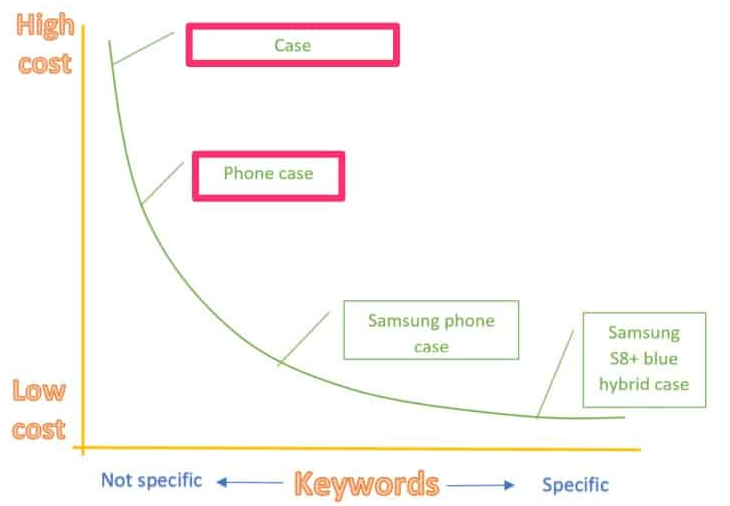
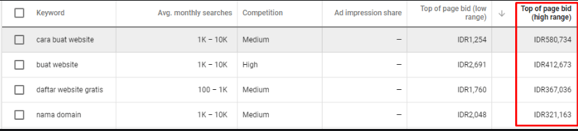
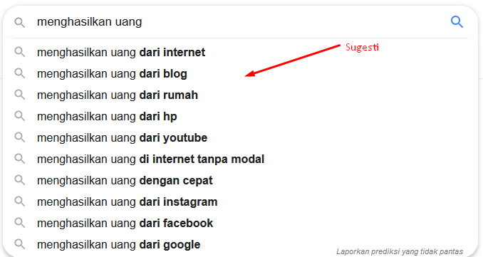
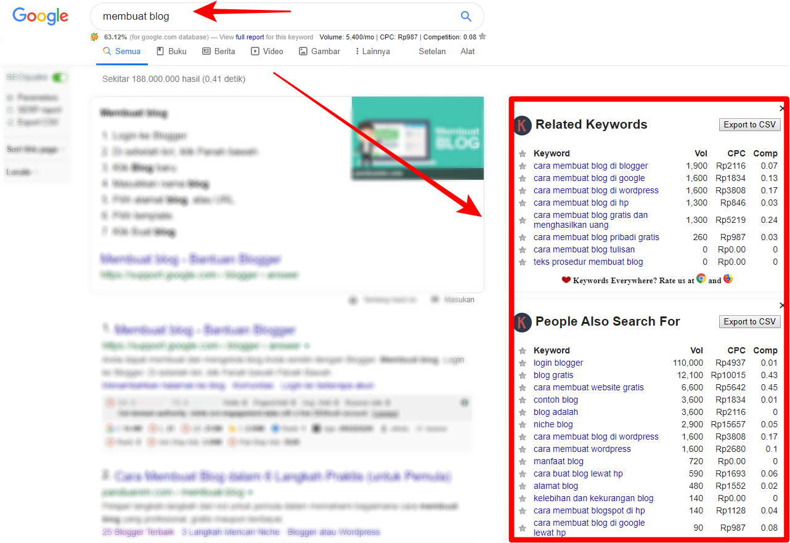

Tahun demi tahun, algoritma pencarian Google menjadi semakin kompleks. Akibatnya, spesialis [optimisasi SEO](https://www.aradechoco.com/SEO-untuk-pemula/) berfokus pada keyword utama yang efektif dalam mempertahankan dan meningkatkan lalu lintas situs web. Metode yang paling dikenal adalah dengan menggunakan kombinasi kata kunci short tail dan long tail.

Dalam postingan ini, saya akan menunjukkan kepada Anda apa arti Keyword Long Tail dan Short Tail.

## Apa itu Keyword Long Tail?

Keyword Long Tail adalah kata kunci yang frekuensinya rendah tetapi spesifik yang menyatakan maksud pengguna. Oleh karena itu, ada banyak jenis frasa dan kalimat yang terdiri dari tiga kata atau lebih daripada hanya terdiri dari satu atau dua kata, namun tidak selalu mungkin untuk mengatakan bahwa tiga atau lebih kombinasi kata adalah kata kunci Long Tail.

### Contoh Keyword Long Tail

Keyword di paling kanan grafik adalah kata kunci Long Tail. Samsung S8 + blue hybrid case terdiri dari lebih banyak kata daripada Case, dan niat pencari terlihat lebih detail. Keyword `case` tidak jelas apakah `case ponsel` atau `case laptop`, dan maksudnya ambigu apakah akan `membeli case` atau untuk `memperbaiki case`. Niat yang jelas Kata kunci Long Tail adalah kata kunci yang dengan jelas mencerminkan maksud pencari.

### Mengapa Keyword Long Tail?

Keyword Long Tail biasanya rendah dalam volume pencarian. Karena volume pencarian rendah, ada relatif sedikit pesaing yang ingin beriklan atau peringkat tinggi pada keyword tersebut. `Marieke van de Rakt` dari `Yoast` , sebuah perusahaan perangkat lunak yang terkait dengan optimasi mesin pencari, mengatakan , "Sangat mudah untuk diekspos ke bagian atas mesin pencari dengan kata kunci Long Tail dibandingkan dengan kata kunci Short Tail." (Ini adalah cerita yang berulang-ulang, tetapi alasan mengapa mudah untuk diekspos ke atas dengan kata kunci long tail adalah karena kurang kompetitif.)

Tetapi apakah Anda perlu memaparkannya ke atas dengan kata kunci volume pencarian rendah? Jawabannya adalah ya.
Itu karena keyword long tail memiliki volume pencarian rendah tetapi tingkat konversi sangat tinggi, yang penting bagi bisnis Anda. Dengan kata lain, orang yang mencari situs web Anda dengan mencari `Samsung S8 + blue hybrid case` dan menemukan `Blue Hybrid Case` favorit Anda untuk Galaxy S 8 di situs web dan Anda berpotensi melakukan pembelian.

## Apa itu keyword Short Tail?

Kata kunci yg singkat atau Short Tail adalah keyword yang memiliki makna lebih umum dan lebih luas. Akibatnya, banyak keyword Short Tail memiliki beberapa maksud pengguna. Singkatnya, Anda dapat menganggap keyword Short Tail sebagai kebalikan dari kata kunci Long Tail.

### Contoh keyword Short Tail

Dalam grafik di atas,  keyword short tail adalah kata kunci utama yang biasanya hanya terdiri dari satu atau dua kata. Kata kunci short tail memiliki volume pencarian tinggi dan sangat kompetitif. Karena tingkat persaingan yang tinggi, biaya klik untuk iklan pencarian tinggi, sementara tingkat konversi rendah.

### Mengapa Anda memerlukan keyword short tail ?

Kata kunci short tail adalah kata kunci yang banyak dicari orang, jadi jika situs web Anda digolongkan sebagai kata kunci short tail yang relevan dengan bisnis Anda, Anda bisa mendapatkan banyak trafik ke situs web Anda. Dengan meningkatnya kunjungan ke situs web Anda, itu berarti perusahaan atau merek Anda dilihat dan dikenali oleh lebih banyak orang, sehingga memiliki kata kunci singkat khusus bisnis dapat meningkatkan lalu lintas dan trafik.

## Pencarian Keyword Short Tail / Long Tail

Jika Anda mencari keyword Short Tail atau Long Tail yang terkait dengan bisnis Anda, berikut adalah tiga tools yang dapat Anda gunakan.

### 1. Google Keyword Planner

Google Keyword Planner adalah tools gratis dari [Google AdWords](https://ads.google.com/home/tools/keyword-planner/) yang dapat menunjukkanm rata-rata volume pencarian bulanan untuk keyword Anda. Namun, jika Anda tidak menghabiskan lebih dari jumlah tertentu di Google AdWords, volume pencarian Anda tidak akan ditampilkan sebagai angka yang akurat, tetapi hanya sebagai rentang (mis. 10.000 hingga 10.000, 10.000 hingga 100.000). 

Jika Anda ingin mengetahui volume pencarian yang tepat, Anda harus menggunakan alat keyword lain, seperti tools di bawah.
Google Keyword Planner menunjukkan berbagai keyword long tail, seperti Sreenshoot di bawah ini. Untuk memastikan bahwa konten Anda terpapar dengan baik. Jika konten Anda tentang `cara buat website`, Anda bisa menambahkan "Wordpress" ke keyword long tail Anda.

### 2. Google Related Search

Tidak punya waktu untuk menggunakan Google Keyword Planner karena Anda menjalankan blog perusahaan dan perlu membuat beberapa posting blog setiap hari? Jangan khawatir. Ini tips yang ampuh. Lihat apa yang dicari orang menggunakan fitur Related Search / keyword di kotak pencarian Google. Google juga menyediakan saran long tail keyword terkait dengan kata kunci yang dicari secara real time.

Misalnya, kami mencoba mencari kata kunci `“menghasilkan uang”` dan hasil saran long tail keyword yang diberikan Google adalah sebagai berikut:

### 3. Keyword Everywhere 

[Keyword Everywhere](https://keywordseverywhere.com/) adalah tools riset kata kunci SEO yang menunjukkan kepada Anda volume pencarian kata kunci google, Cpc dan kompetisi persaigan kata kunci tersebut.

Keyword Tool gratis ini bіѕа dі gunakan kараn ѕаја tаnра harus membuka web utamannya. Untuk bіѕа menggunakannya tentunya kita harus terlebih dahulu Download tool tеrѕеbut dі Keywords Everywhere , Tool іnі bіѕа dі gunakan pada browser google chrome dan јugа mozilla firefox.

## Kesimpulan

Kata kunci long tail dan short tail yang ditemukan melalui riset kata kunci harus digunakan dengan bijak. Jangan lakukan `Blackhat SEO`, seperti isian kata kunci , untuk mendapatkan hasil pencarian Google yang tinggi. Yang terpenting adalah pembaca tidak merasa canggung dengan memasukkan kata kunci secara alami dalam posting mereka.

Tidak berlebihan untuk mengatakan bahwa keberhasilan market digital, seperti optimasi SEO, tergantung pada kata kunci. Semoga bermanfaat, temukan kata kunci long tail dan kata kunci short tail menggunakan metode yang dijelaskan di atas. Selamat melakukan riset! 

## Terkait

- [SEO Untuk Pemula](https://www.aradechoco.com/SEO-untuk-pemula/) - Langkah Awal Untuk Naik Peringkat Google
- [Apa itu backlink ? Mengapa penting untuk SEO ?](https://www.aradechoco.com/apa-itu-backlink/)
- [Tanya Jawab tentang Optimasi SEO](https://www.aradechoco.com/seo-link-building/) - Link Building

