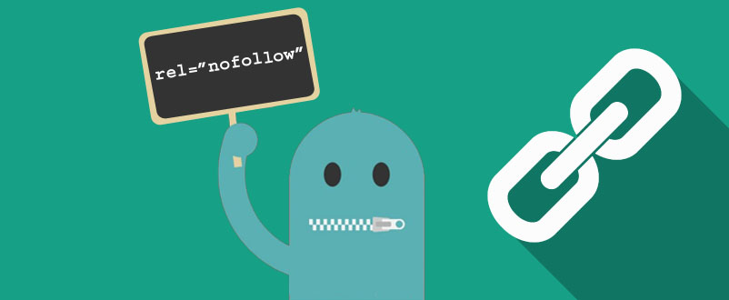
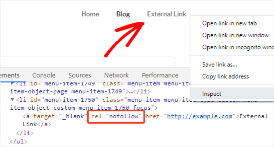

Apakah Link No Follow mempengaruhi peringkat situs web dalam peringkat di hasil pencarian dan apakah Do Follow dan No Follow masih diperlukan untuk SEO?

Mengapa masalah ini selalu menjadi kontroversi di industri SEO? Menurut pendapat saya, ini terkait dengan SEO Off-Page, yaitu [Backlink](https://www.aradechoco.com/apa-itu-backlink/). 

Forum-forum SEO di seluruh dunia menyarankan untuk melakukan [Optimasi SEO Off-page](https://www.aradechoco.com/seo-dasar-untuk-pemula/) yang memiliki pengaruh besar terhadap SEO, dan berkali-kali link No-Follow sering kali didebatkan apakah itu benar-benar akan memengaruhi SEO ?.

Sebelum membahas lebih mendalam, pertama-tama saya ingin Anda memahami apa itu Do Follow dan No Follow dan bagaimana mereka berhubungan dengan SEO Off-page.



## Apa itu Do Follow ?

Ketika terhubung ke situs web lain maka Situs web itu juga akan menerima skor SEO tersebut (seolah-olah situs web itu dipilih). 

Itu adalah dasar dari backlink  yang harus dipahami semua orang.  

Semakin banyak situs web yang mendapatkan banyak backlink, semakin banyak trafik yang akan didapat dan itu akan mengarah ke halaman hasil pencarian yang lebih tinggi. 

Dan ini adalah definisi dari Link Do Follow. Ini adalah tautan yang akan mengirim skor SEO ke situs web tujuan.

Di sudut teknis, menautkan ke situs web lain dan menugaskannya ke Do Follow berarti Googlebots dapat mengikuti tautan itu ke halaman tujuan.

Algoritma Google menggunakan robot untuk mengikuti tautan untuk mencari tautan antara situs web yang saling bertautan. 

Tentu saja, ini membantu halaman web tujuan agar lebih terindeks.

Setiap situs web yang menerima banyak backlink Do Follow akan membantu meningkatkan peringkat situs web. 

Dan kemungkinan besar bahwa halaman web itu akan diindeks ke dalam basis data Google.

## Apa itu No Follow?

Sedangkan untuk No Follow, jika ingin mudah dimengerti Ingat bahwa definisi apa yang bertentangan dengan Do Follow adalah tautan ke situs web lain tanpa meneruskan skor SEO ke situs web tujuan.

Ketika tautan ditetapkan sebagai tidak ada tindak, itu berarti bahwa situs web tujuan yang menerima backlink tidak akan mendapatkan skor SEO (seolah-olah tidak dipilih) dan yang paling penting, Googlebots tidak akan mengikuti tujuan itu.

Ini adalah standar yang digunakan oleh banyak Mesin Pencari.

Metode No Follow adalah menyisipkan perintah `rel = "nofollow"`  ke dalam `<a href>` selama pembuatan tautan. Sebagian besar digunakan di Forum atau Komentar di bawah artikel untuk mencegah orang memposting apa pun yang merupakan spam.

```html
<a href=”https://www.aradechoco.com/” rel=”nofollow”>aradechoco</a>
```
Ini berarti bahwa situs web yang menerima backlink tidak diikuti dan tidak akan mendapatkan hasil yang baik dalam SEO, tidak membantu situs web untuk mendapatkan peringkat lebih tinggi. 

Itu artinya tidak bisa meningkatkan peluang untuk halaman tujuan untuk diindeks lebih banyak, jadi Backlink yang baik seharusnya tidak menjadi No Follow Link.

## Apakah Link No Follow Benar-Benar Tidak Berguna untuk SEO?

Pertanyaan ini dibagi menjadi 2 bagian yaitu

- Orang yang percaya bahwa No Follow tidak berguna untuk SEO.
- Orang yang berpikir bahwa No Follow berguna untuk SEO.

Saya pribadi memilih berada di bagian 2. Jika melihat definisi yang tertulis di atas, No Follow tidak berguna.

Ini benar-benar tidak berharga untuk SEO, dan kita seharusnya tidak membuang waktu untuk melakukan Backlink dari situs No Follow Link.

Tetapi apakah Anda percaya bahwa sebagian besar Backlink paling alami di dunia ini adalah No Follow? Yang Anda lakukan dari Facebook, Twitter juga no follow.

Pertanyaannya adalah, apakah Google tidak peduli sama sekali tentang Backlink tersebut, meskipun banyak backlink yang ditautkan dari situs web berkualitas ke situs web tujuan yang  berkualitas juga.

Saya juga belum tahu tentang yang itu.

Tapi satu hal yang perlu diketahui adalah bahwa Google belajar dari konteks yang semakin banyak. Itulah koneksi situs web yang membuat backlink ke situs web tujuan yang terkait atau tidak. 

Poin lain adalah bahwa Do Follow memberikan halaman web yang menerima backlink untuk lebih mungkin diindeks ke dalam database Google (karena Googlebots juga mengikuti tautan). 

Saya percaya bahwa banyak orang saat ini tidak peduli dengan Backlink, apakah itu membantu halaman web diindeks lebih mudah? Karena algoritma Google sangat cerdas, masih ada banyak cara untuk mengindeks halaman web tanpa harus mengandalkan backlink.

## Haruskah Backlink No follow ?

Hanya karena No Follow tidak memberikan skor SEO, itu tidak berarti itu tidak berguna.

Terlepas dari apakah itu backlink Do Follow atau No Follow, ingat situs web ini. Selalu pikirkan tentang sifat menghubungkan. Ini bukan hanya upaya backlink untuk skor SEO.

Katakanlah No Follow mungkin tidak memiliki manfaat apa pun untuk SEO, tetapi jika itu membawa banyak **trafik** ke situs web Anda, ini dapat membantu meningkatkan peluang Anda untuk membuat lebih banyak konversi.

So, Jangan peduli karena itu hanya No Follow. Setidaknya jika itu tidak langsung bermanfaat, itu masih berguna. Secara tidak langsung menuju situs web Anda.

## Cara memeriksa link Do Follow atau No Follow

Jadi, bagaimana cara mengetahui apakah backlink tersebut Do Follow atau No Follow ? 

Caranya cukup sederhana, cukup memeriksa apakah link tersebut `rel = "nofollow"` yang di memasukkan di Tag HTML atau tidak, Metodenya seperti di bawah ini:

- Buka Browser Chrome.
- Klik kanan tautan dan pilih Inspect.
- Perhatikan di tag, `<a href>` apakah `rel = "nofollow"`

**Contoh ini adalah No Follow Link :**




## Terkait

- [Perbedaan antara SEO On-Page dan SEO Off-Page](https://www.aradechoco.com/seo-on-page-dan-seo-off-page/)
- [Apa itu backlink ? Mengapa penting untuk SEO ?](https://www.aradechoco.com/apa-itu-backlink/)
- [Membangun Backlink melalui Wikipedia](https://www.aradechoco.com/backlink-melalui-wikipedia/)
