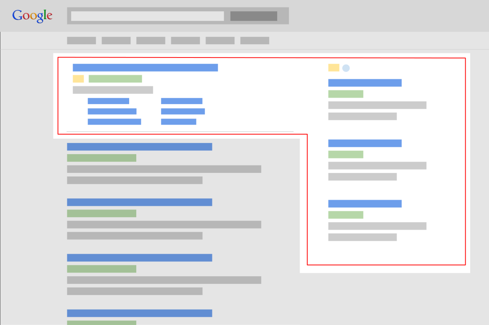

## Apa itu Google Adwords ?

**Adwords** Adalah jasa iklan melalui situs web Google. Banyak orang yang telah menggunakan Adwords dan mengalami masalah yang berbeda. Hari ini, saya telah mengumpulkan beberapa pengguna AdWords yang paling umum, bersama dengan solusi untuk membantu iklan Anda seefektif mungkin.

## Iklan AdWords jarang muncul / tidak tayang 

Orang-orang yang sebelumnya telah mendaftar ke Google Adwords paling sering mengalami masalah ini. 

Kenapa iklan jarang muncul ? Cobalah untuk memperbaikinya dengan menyesuaikan kata kunci, menyesuaikan kata-kata iklan, menyesuaikan halaman, dan mencoba mengatur hal-hal penting yang relevan dengan iklan.

## Penjualan di Adwords menurun dan tidak menghasilkan keuntungan

Jika Anda berharap bahwa hanya **Adwords** yang akan membuat produk laris manis, mungkin Anda salah. 

Untuk membuat bisnis Anda terjual dan menjadi sukses, itu harus dikombinasikan dengan analisis pemasaran yang tepat. Bukan hanya beriklan saja.

## Google Adwords melebihi anggaran dan kehilangan banyak uang

AdWords membutuhkan pemantauan dan evaluasi iklan yang konstan setiap hari. Jika Anda tidak punya waktu untuk memantaunya sendiri, mempekerjakan seseorang untuk memantau dan mengoptimasi Agar tidak membiarkan uang iklan meningkat adalah solusi yang dapat di pertimbangkan.

## Menetapkan BPK tinggi tetapi laju tampilan tidak cukup baik.

BPK adalah biaya per klik. Setelah diatur, tampilan tidak sebagus yang seharusnya, ditambah biaya tambahan Harus dimodifikasi dengan menyesuaikan konten iklan Konten web Untuk meningkatkan efisiensi tampilan.

#Terkait

- [Perbedaan SEM dan SEO beserta Manfaatnya untuk Digital Marketing](https://www.aradechoco.com/perbedaan-sem-dan-seo/)

