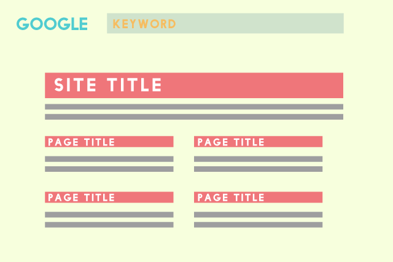
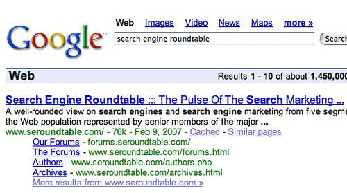
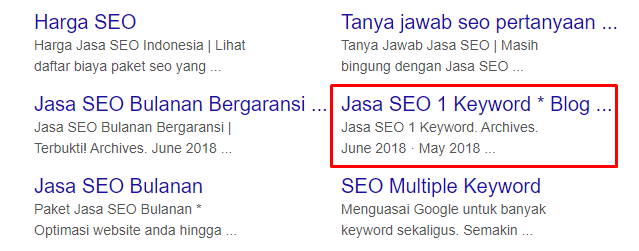
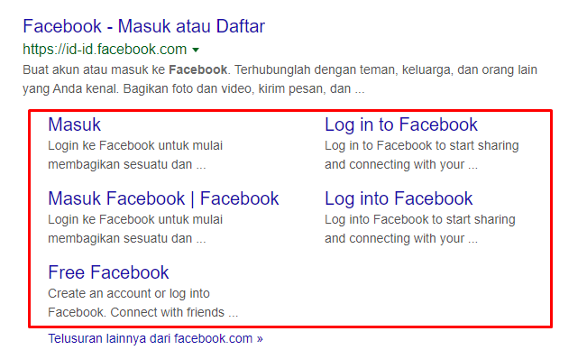
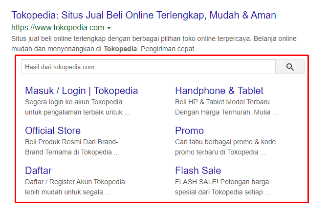
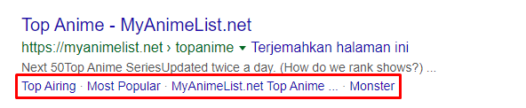
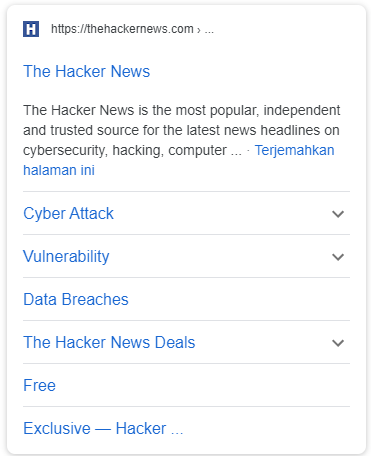
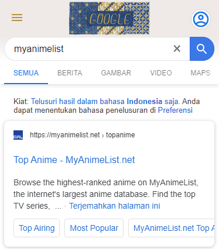

**Google Sitelink** adalah salah satu indikator apakah kualitas web tersebut cukup baik di mata Google. 

Coba ketik nama domain web Anda di Google Search, tanpa harus memasukkan ekstensi `.com` atau sejenisnya.

## Apa itu Google Sitelink ?

**Google Sitelinks** adalah tautan yang menampilkan hasil yang relevan dengan istilah pencarian yang akan ditampilkan di bawah judul dan meta deskripsi yang umumnya ditampilkan ketika pengguna mencari Nama Merek yang tepat dari produk atau situs web tanpa menyertakan `.com` atau ekstensi domain lainnya, tapi tidak setiap situs web akan dipilih untuk menampilkan Sitelinks.

[Google Mulai menampilkan hasil sitelink sejak 2005](https://www.seroundtable.com/archives/002197.html), dan telah dikembangkansecara terus menerus.

Di bawah ini adalah gambar yang menunjukkan bagian pertama [Google Sitelink pada tahun 2007](https://searchengineland.com/what-are-google-sitelinks-10493).

## Manfaat Sitelink

Tujuan menampilkan Sitelink adalah untuk membantu pengguna melihat konten situs web ketika mereka mencari merek atau nama situs web. 

**Untuk manfaat lainnya jika memiliki Google Sitelink:**

- Meningkatkan klik ke situs web (RKT)
- Menambah jumlah orang yang mengklik halaman lain. Di situs tersebut, bukan hanya ke halaman utama ( beranda )
- Membantu pengguna menghemat waktu. Dan cari informasi yang Anda butuhkan dengan cepat
- Merupakan kontrak yang menunjukkan bahwa situs web tersebut dipercaya oleh Google.
- Sitelink adalah cara yang bagus untuk menciptakan **brand awareness**.

Misalnya, situs web tersebut memiliki produk atau layanan dan Ketika seorang pelanggan mencari secara langsung nama Merek tersebut, yang akan mereka lihat tautan di samping informasi halaman utama, dan segera mengenali Produk atau layanan apa yang dimiliki.

Sebagai contoh, web tersebut memiliki [layanan jasa SEO](https://www.aradechoco.com/menyewa-jasa-seo-berkualitas/). Orang-orang lebih tahu apa yang dapat mereka lakukan.

## Jenis-jenis Sitelink

Saat ini saya akan menunjukan beberapa tampilan sitelink yang mungkin belum pernah kita sadari sebelumnya.

### 1) Sitelink umum beranda

### 2) Sitelink Web E-commerce 
Akan ada kotak pencarian.

### 3) Sitelink satu baris
Akan menampilkan pola sitelinks horisontal yang terletak pada satu baris.

### 4) Sitelink Google seluler

Untuk Google Sitelinks yang muncul di **seluler** Akan memiliki dua jenis tayangan: 

Menampilkan sitelink pada setiap baris Yang mana halaman tersebut hanya akan mendapatkan homepage.

 

Jenis yang kedua adalah sitelink tab slide ( geser ), menggeser topik kiri-kanan, yang akan ditampilkan di laman lain yang tidak menggunakan Beranda.

**Google Sitelinks tidak memberikan hasil di semua situs web.**

Jika ada yang membaca artikel ini cobalah mengetikkan nama situs web sendiri di Google dan temukan bahwa situs web Anda memiliki sitelink atau tidak karena tidak semua orang akan memiliki tampilan sitelinks.

**Di bawah ini pernyataan Google secara langsung.**

> ***Kami hanya menampilkan sitelink dalam hasil pencarian ketika kami pikir itu akan bermanfaat bagi pengguna. Jika struktur situs Anda tidak mengizinkan algoritma kami untuk menemukan tautan situs yang baik Atau kami pikir bahwa tautan situs untuk situs web Anda tidak relevan dengan permintaan pencarian pengguna. Kami tidak akan menampilkan tautan situs itu.***

## Jadi bagaimana Cara membuat Google Sitelink ?

Sebenarnya untuk metode membuat sitelink, tidak ada formula khusus, karena Google akan secara otomatis memilih sendiri. 

Apa yang bisa kita lakukan adalah melakukan apa yang diinginkan **algoritma google** adalah membuat struktur tautan web untuk memiliki konten yang mudah dimengerti.

Dan lakukan apa yang menurut Anda akan bermanfaat bagi pengunjung.

**Saya akan membagi proses menjadi 2 cara:** 

- Membuat tautan situs beranda. 
- Membuat sitelink satu baris. Render sitelink pada seluler akan ditampilkan secara otomatis. Setelah memiliki sitelink normal yang berlaku.

### Cara membuat tautan situs Beranda.

- Agar Google dapat memahami struktur dan konten situs web. Hal pertama yang harus dilakukan setiap situs web adalah Menghubungkan web ke [Google search console](https://search.google.com/search-console/welcome).
- Kirim peta situs ( sitemap ) ke Google search console, meskipun di masa lalu Google tidak terlalu mementingkan peta situs di web.
- Ubah judul halaman Beranda Harus memiliki kata-kata yang muncul juga nama web atau nama produk Anda.
- Usia situs web harus 3-6 bulan atau lebih.
- Menu situs web ditulis dengan kata-kata yang pendek dan mudah dimengerti.
- Konten situs web harus memiliki lebih dari 10 halaman / halaman posting / posting.
- Halaman web tersebut Harus memiliki [struktur konten yang SEO](https://www.aradechoco.com/optimasi-schema-markup/).
- Situs web harus memiliki pengunjung unik tiap hari. 

### Cara membuat sitelink satu baris.

**Jenis sitelink ini dapat terjadi pada halaman dan halaman posting.**

- Sitelink satu-baris harus memiliki artikel yang panjang. Berarti ada `1000 kata` atau lebih.
- Struktur konten pada halaman yang juga harus SEO. 
- Membagi konten yang panjang menjadi topik Bagi pembaca untuk memahami konten semudah mungkin.
- Sub-judul utama Dalam artikel tersebut mengunakan `font H2`.
- Di bagian bawah paragraf pertama artikel Buatlah `daftar isi` ( Table of Content ). Jika memakai **Wordpress**, Anda bisa memanfaatkan plugin.

## Penutup

Google Sitelinks adalah indikasi yang baik tentang kualitas situs web, dan dipercaya oleh Google. 

Ini membantu kita melakukan SEO dengan lebih mudah di halaman pertama. 

Tetapi tidak semua situs web akan menampilkan tautan situs. Google akan memilih dan menampilkannya sendiri. 

Jika ada yang selesai menyesuaikan konten web sesuai dengan instruksi di atas, lakukan dengan teliti dan tenang. 

Google memiliki putaran akses - keluar untuk mengumpulkan data web. 

Jika suatu hari dia menyukai situs Anda, **Sitelink** akan ditampilkan sendiri secara otomatis.

## Terkait

- [SEO Untuk Pemula](https://www.aradechoco.com/SEO-untuk-pemula/) - Langkah Awal Untuk Naik Peringkat Google 
- [Cara menulis artikel SEO agar tampil di halaman pertama Google](https://www.aradechoco.com/menulis-artikel-seo/)
- [Cara Menempatkan Keyword yang SEO pada Postingan blog](https://www.aradechoco.com/menempatkan-keyword-seo/)
- [Optimasi SEO dengan Schema Markup](https://www.aradechoco.com/optimasi-schema-markup/)

