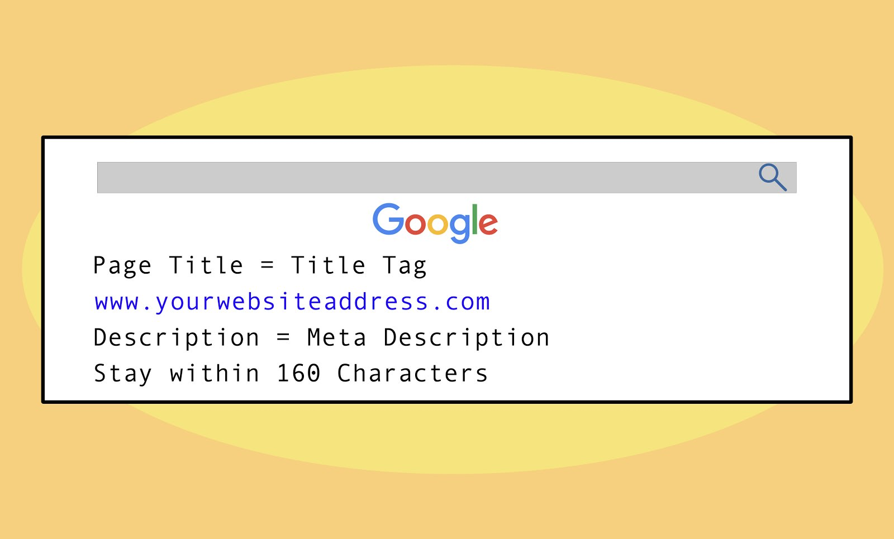

**Title tag** atau **Tag judul** biasanya digunakan untuk menggambarkan judul halaman suatu halaman web. Yang akan ditampilkan di bagian atas Browser Web, yang dikenal sebagai prioritas utama dalam SEO (kedua setelah Nama domain, URL), karena hasil pencarian akan menampilkan konten Di tag judul. 

Jika di perhatikan dengan baik, Anda akan menemukan bahwa setiap web yang menduduki peringkat teratas merupakan hasil dari mesin pencari dengan kata kunci di dalam tag judul. 

Tentu saja, [kata kunci](https://www.aradechoco.com/jenis-kata-kunci/) yang ada di konten juga penting. Tetapi akan lebih baik jika kita mementingkan `title tag` Dengan mempertimbangkannya sebagai berikut.

- Kata kunci yang ingin dibidik atau Kata kunci yang mewakili situs web harus dalam tag Judul.
- Panjangnya tidak boleh lebih dari `60 karakter` atau sekitar `7 - 10 kata`.
- Jangan masukkan nama halaman, seperti **hubungi kami**, **produk**, atau **beranda** karena tidak menyampaikan makna. Karena pengguna tidak akan menggunakan kata-kata itu dalam pencarian.
- Jangan gunakan kata `sinonim` (makna mirip atau sama) sehingga terkesan kurang efektif. Maka dari itu, hindari penggunaan kata sinonim supaya tidak membingungkan calon pembaca.
- Kata kunci harus menjadi kata pertama dalam tag Judul.
- Pastikan membuat judul artikel yang logis dan mudah dipahami.
- Urutan kata kunci itu penting, sebagai contoh, `Honda CBR 150` akan memberikan hasil yang lebih baik daripada `CBR 150 Honda` karena dengan keakraban bahwa kita cenderung mencari dengan merek kendaraan terlebih dahulu. 

Mungkin sampai di sini dulu tentang cara menulis title tag / tag judul artikel yang baik untuk SEO, semoga artikel ini memberikan manfaat untuk kita semua.

#Terkait

- [Cara Menempatkan Keyword yang SEO pada Postingan blog](https://www.aradechoco.com/menempatkan-keyword-seo/)
- [Cara Riset Keyword : Long Tail dan Short Tail untuk Pemula](https://www.aradechoco.com/cara-riset-keyword-untuk-pemula/)
- [Cara menulis artikel SEO agar tampil di halaman pertama Google](https://www.aradechoco.com/menulis-artikel-seo/)
