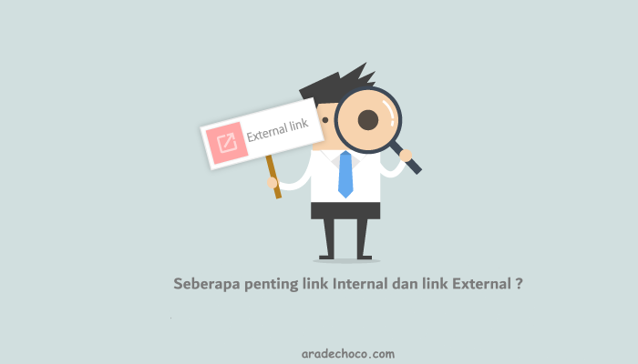

Untuk memiliki **strategi SEO** yang kuat untuk situs web, Anda harus memahami perbedaan antara link internal dan link eksternal, dan bagaimana manfaatnya terhadap SEO. 

Menggunakan link internal dan eksternal yang relevan dapat meningkatkan visibilitas dan peringkat untuk situs web Anda.

Teks yang di atur untuk ditautkan ke web lain akan di tampilkan dalam font dengan warna berbeda dari font umum.

Secara umum, karakter yang di tampilkan di web akan berwarna hitam dengan latar belakang putih.

Sedangkan teks yang di gunakan untuk menjadi link akan **berwarna biru** atau warna lain yang sudah di tentukan.

Dan ketika mengarahkan mouse untuk menunjuk ke teks yang ditautkan maka format pointer akan berubah dari simbol **panah** ke simbol **tangan** sebagai gantinya.

**Jenis link yang di tautkan dibagi menjadi 2 sebagai berikut:**

## Link Internal 

**Link internal** adalah tautan yang digunakan untuk menghubungkan informasi dalam situs web itu sendiri. 

Link internal sering digunakan sebagai ajakan bertindak. Misalnya, mereka mungkin meminta pengunjung untuk membaca atau mempelajari lebih lanjut tentang suatu topik yang mungkin relevan atau berkelanjutan

Misalnya [Perbedaan antara SEO On-Page dan SEO Off-Page](https://www.aradechoco.com/seo-on-page-dan-seo-off-page/). Tautan ini membawa pengunjung ke artikel lain di situs web ini.

## link Eksternal

**Link eksternal** adalah tautan yang digunakan untuk menautkan informasi dari luar situs web. Biasanya dipakai di akhir, Untuk menautkan link sumber atau menyediakan referensi kepada pengunjung.. 

Kualitas dan kuantitas link eksternal itu penting. Menambahkan tautan situs web yang dapat dipercaya dan informatif dan berkualitas tinggi ke halaman Anda akan membantu meningkatkan kredibilitas situs web Anda, sedangkan menambahkan tautan berkualitas buruk akan merusak situs Anda.

Menautkan ke situs web luar tidak akan merusak peringkat halaman Anda selama konten itu relevan dan berasal dari situs otoritatif.

## Tips Menghubungkan tautan yang berkualitas

- Tautan dan warna artikel harus dapat dibedakan dengan jelas. 
- Sebaiknya gunakan kata kunci yang dapat menyampaikan makna yang jelas pada teks tautan.
- Tautan adalah cara optimasi SEO yang membantu Google mengenal situs web Anda.

Ada banyak faktor yang perlu dipertimbangkan mesin pencari seperti Google untuk menentukan peringkat suatu web. Tautan **internal** dan **eksternal** adalah komponen penting dari **strategi SEO** yang kuat dan membantu meningkatkan kekuatan peringkat SEO.

## Terkait

- [Perbedaan antara SEO On-Page dan SEO Off-Page](https://www.aradechoco.com/seo-on-page-dan-seo-off-page/)
- [Apa itu backlink ? Mengapa penting untuk SEO ?](https://www.aradechoco.com/apa-itu-backlink/)