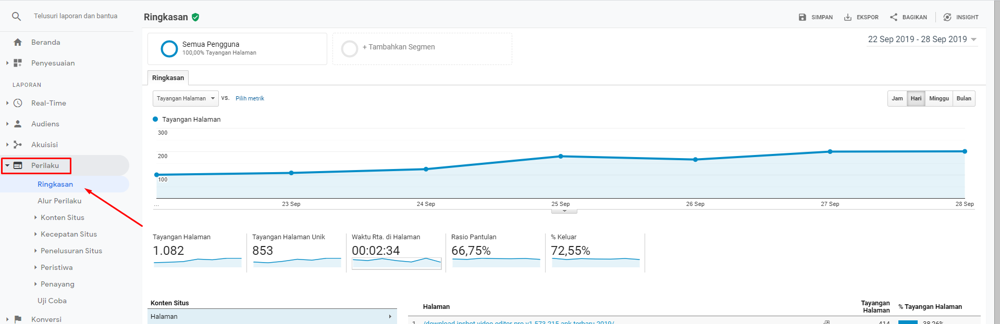

Apa itu Google Analytics ?

**Google Analytics**  adalah layanan gratis dari Google yang dapat menampilkan statistik pengunjung pada sebuah situs web.

Google Analytics sejauh ini merupakan alat analisis terbaik untuk situs web. Jika Anda pernah bertanya-tanya bagaimana memantau kinerja sebuah situs web, mendaftar ke [Google Analytics](https://analytics.google.com/analytics/web/) (GA) akan memberi tahu apa saja yang ingin Anda ketahui tentang trafik, peringkat, pengguna, dan masih banyak lagi.

Bagi Anda yang sudah mendaftar Google Analytics dan bingung harus mencari tahu laporan mana saja yang paling penting. Ini normal. So, mari kita mulai ...

## Apa manfaat menggunakan Google Analytics ?

**Pada saat Anda selesai membaca panduan untuk pemula ini untuk Google Analytics , Anda akan dapat mengetahui:**

- Jumlah orang yang mengunjungi situs web Anda setiap hari, minggu, bulan, dan tahun.
- Dari mana asal orang yang mengunjungi situs web Anda, seperti mesin pencari Google, media sosial, atau situs web lain.
- Situs web yang telah terhubung dengan Anda, yang dapat membawa trafik.
- Halaman web yang dikunjungi oleh kebanyakan orang.
- Berapa lama orang menghabiskan waktu pada setiap halaman web.
- Jumlah pengunjung yang telah mengonversi dalam beberapa cara.

Semua data ini akan membantu Anda memahami apa yang perlu di lakukan untuk meningkatkan situs web untuk konsumen. 
Langkah pertama adalah mencari tahu berapa banyak orang yang datang ke situs Anda setiap hari, minggu, bulan, dan tahun.

## Cara Menemukan Informasi trafik dengan GA

Informasi trafik situs web ada di halaman Beranda GA Anda. Halaman ini kemungkinan adalah halaman pertama yang akan Anda lihat ketika masuk ke akun Analytics Anda. Setelah masuk ke Google Analytics , Anda akan melihat menu di samping kiri dengan kata **"HOME / BERANDA"**. 

**Dasbor ini menunjukkan:**

- Lalu lintas selama tujuh hari terakhir (default).
- Jam berapa orang paling mungkin mengunjungi situs Anda.
- Berapa banyak orang yang online saat itu ( real time ).

Ketika meng-scroll sedikit ke bawah, Anda akan melihat:

- Dari mana orang-orang datang ketika mengunjungi situs Anda. Mungkin Anda akan melihat **"Langsung,"** **"Pencarian Organik,"** **"Media Sosial,"** dan kemudian **"Lainnya"**.
- Anda juga akan melihat dari negara mana orang berasal ketika mengunjungi situs Anda.

Scroll lagi, dan Anda akan melihat:

- Halaman yang paling populer.
- Berapa banyak pengunjung aktif yang Anda miliki dari waktu ke waktu.
- Jenis perangkat apa yang digunakan orang untuk mengunjungi situs Anda (seluler, desktop atau tablet).

Bagian terakhir adalah retensi pengguna Anda, yaitu berapa banyak orang yang kembali ke situs Anda.

Seperti yang Anda lihat, dasbor memberi pratinjau tentang semua hal yang ingin Anda ketahui tentang trafik situs web Anda. 

Scroll kembali ke atas halaman sampai Anda melihat informasi trafik dari 7 hari terakhir. Anda akan melihat ini di sudut kiri bawah bagian itu. Klik panah untuk membuka kerangka waktu yang berbeda, seperti hari ini, kemarin, 7 hari terakhir, 28 hari terakhir, dan 90 hari terakhir.

Ada juga opsi untuk rentang waktu, yang memungkinkan Anda memilih dari: kuartal hingga tanggal, 12 bulan terakhir, tahun ini, dan tahun lalu. Jika Anda mengklik `"Kustom,"` Anda dapat memilih rentang tanggal tertentu untuk melihat trafik yang Anda miliki selama waktu itu.

**Lebih jauh lagi**

Jika Anda mengklik `Audiens`, yang berada di sisi yang sama, Anda akan menuju ke tampilan lalu lintas yang lebih besar.

Anda dapat memilih untuk melihat nomor lalu lintas dari setiap jam, hari, minggu, dan bulan. Anda juga dapat melihat berapa banyak sesi yang dimiliki orang, jumlah tampilan halaman, durasi sesi rata-rata, rasio pentalan, dan berapa banyak orang yang kembali ke situs web Anda setelah mengunjunginya pertama kalinya.

Scroll lagi ke bawah, Anda akan dapat mempelajari lebih lanjut tentang demografi trafik. Untuk informasi itu, cukup klik:

- Bahasa
- Negara
- Kota
- Browser (Desktop)
- Sistem Operasi (Desktop)
- Penyedia Layanan (Desktop)
- Sistem Operasi (Mobile)
- Penyedia Layanan (Seluler)
- Resolusi Layar (Ponsel)

Di sebelah kanan, Anda akan dapat melihat bahasa apa yang digunakan pengunjung. Ini dapat membantu untuk memutuskan apakah Anda harus memasukkan konten yang ditulis dalam berbagai bahasa.

> Ingin mempelajari lebih lanjut tentang trafik pengunjung? Anda dapat melakukannya di bagian demografi.

## Pelajari Lebih Lanjut Tentang Demografi

Setelah selesai menjelajahi bagian informasi trafik GA, Anda dapat mempelajari lebih lanjut tentang pengunjung di Demografi. Lihat ke sisi kiri layar di sidebar dan klik `Demografi`. Ini akan menurunkan tiga opsi: `Gambaran Umum`, `Usia`, dan `Jenis Kelamin`. Informasi ini dapat membantu Anda menentukan apakah Anda menargetkan audiens yang tepat.

Sebagai contoh:

Jika Anda menjual pakaian wanita, dan sebagian besar pria mengunjungi situs web Anda, pasti ada sesuatu yang salah karena situs web Anda tidak menarik konsumen yang tepat. Hal yang sama berlaku untuk usia. Dengan informasi ini, Anda dapat membuat perubahan pada situs Anda untuk menargetkan audiens yang lebih baik.

Anda juga dapat mempelajari minat, lokasi, dan perilaku audiens di situs. Klik pada masing-masing bagian itu, dan kemudian klik pada salah satu opsi menu yang turun. Ketika Anda melihat ini, Anda akan dapat melihat berapa banyak orang untuk setiap minat mengunjungi situs Anda, dari mana mereka berasal, dan apa yang mereka lakukan saat berada di situs Anda.

Mengetahui tentang pengunjung Anda sama pentingnya dengan mengetahui dari mana mereka berasal secara online. Itulah yang **AKUISISI** akan sampaikan kepada Anda.

## Di mana orang menemukan situs web Anda

Mengetahui di mana orang menemukan situs web Anda membantu memutuskan apa yang perlu Anda fokuskan ketika akan mempromosikan bisnis Anda secara online.

Lihat ke sisi kiri di sidebar berada, dan klik `"AKUISISI."` Di bagian itu akan menampilkan `Ikhtisar`, `Semua trafik`, `Iklan Google`, `Search Console`, `Sosial`, dan `Kampanye`. **Ikhtisar** memberi Anda snapshot dari saluran teratas dari mana audiens Anda berasal, seperti apakah mereka mengetik langsung URL situs Anda, menemukan Anda melalui pencarian organik, media sosial, atau saluran lain.

Klik Semua trafik di sisi kiri layar di bawah AKUISISI untuk informasi lebih lanjut. Ini akan memecah berapa banyak orang mengunjungi situs Anda dari setiap saluran, dan semua detail kunjungan mereka, seperti berapa banyak sesi yang mereka miliki, bounce rate, halaman per sesi, durasi sesi rata-rata, tingkat konversi sasaran, penyelesaian sasaran, dan nilai tujuan. Anda dapat memilih rentang tanggal yang ingin Anda lihat informasinya juga di sudut kanan atas grafik.

Jika Anda menggunakan Iklan Google, Anda dapat melihat bagaimana kinerja kampanye tersebut sehubungan dengan orang-orang yang mengunjungi situs Anda. Bagian Treemaps dan Iklan Google di bilah sisi kiri akan menunjukkan kepada Anda nomor trafik dan perincian tentang apa yang dilakukan trafik di situs Anda.

Masih di bawah Semua trafik, Anda akan melihat Referensi. Klik itu untuk melihat situs web apa yang memberi Anda trafik. Ini dapat membantu jika Anda telah berfokus pada [link building](https://www.aradechoco.com/seo-link-building/) dan ingin melihat situs mana yang membantu meningkatkan trafik situs web Anda. Bagian ini merinci dari mana orang berasal, dan kemudian apa yang dilakukan orang saat berada di situs Anda. Sekali lagi, ini memberitahu berapa banyak sesi, rasio pentalan, durasi sesi rata-rata, dan halaman per sesi.

Anda dapat mengetahui seberapa baik kampanye media sosial bekerja dengan meng klik Sosial di sidebar kiri. Ini akan menunjukkan kepada Anda berapa banyak orang mengunjungi situs dari setiap jejaring sosial, berapa banyak halaman yang mereka kunjungi, berapa lama mereka tinggal di situs itu, dan jika mereka mengonversi.

Mendapatkan informasi tentang asal pengunjung dapat membantu menyesuaikan rencana internet marketing Anda kedepan. Sebelum melakukannya, mungkin ada baiknya untuk mengetahui bagaimana perilaku orang-orang di situs ini, sehingga Anda dapat meningkatkan peluang konversi untuk pengunjung baru.

## Yang Dapat dipelajari dari Perilaku Pengunjung

Untuk menyesuaikan situs Anda untuk memenuhi kebutuhan pengunjung, luangkan waktu untuk menganalisis data BEHAVIOR di GA.

GA memberi akan tahu konten mana yang paling populer di situs Anda. Cukup klik `PERILAKU`, dan kemudian klik pada `Konten Situs`. Klik Semua Halaman untuk melihat daftar halaman yang telah dikunjungi orang, dan akan menampilkan konten yang paling populer terlebih dahulu.

Kembali ke kiri dan klik Halaman Arahan untuk melihat seberapa baik halaman arahan telah melakukan. Ini adalah cara yang bagus untuk melihat apakah halaman arahan Anda efektif dalam mengonversi orang .

Anda mungkin ingin memeriksa Halaman Keluar juga **(di sebelah kiri di bawah PERILAKU> Konten Situs> Halaman Keluar)**. Ini memberi tahu Anda halaman mana yang ditinggalkan orang. Gunakan informasi ini untuk melihat apa yang dapat Anda lakukan untuk menyelamatkan konsumen itu. Halaman tersebut mungkin kehilangan sesuatu yang dicari konsumen Anda, atau mungkin hanya perlu memperbaharui informasi dan memberikan penawaran menarik pada halaman tersebut untuk membantu mereka membuat keputusan akhir.

## Habiskan Waktu di GA untuk Memaksimalkannya

Google Analytics penuh dengan informasi yang dapat Anda gunakan untuk meningkatkan situs web untuk konsumen Anda. Mulailah secara perlahan dengan itu, sehingga Anda dapat mencerna semua data. Ketika sudah merasa terbiasa, Anda dapat beralih ke laporan yang lebih rinci. Google Analytics akan memperdalam pemahaman tentang apa yang dilakukan orang di situs Anda, dan apa yang dilakukan situs web Anda untuk orang-orang. Sebelum menyadarinya, Anda akan memahami mengapa GA adalah alat yang paling penting bagi siapa saja yang tertarik untuk menjalankan digital marketing campaign yang sukses. 

**Panduan SEO dasar**

- [Optimasi blog Anda dengan SEO](https://www.aradechoco.com/categories/seo/)

