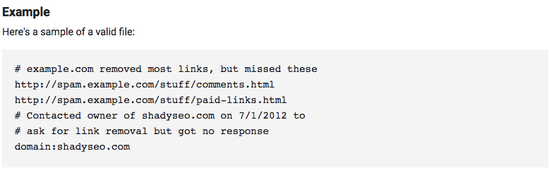
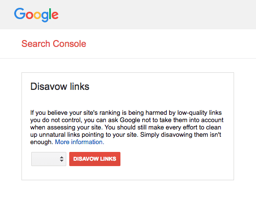

Saat melakukan optimasi SEO , banyak yang berlomba untuk mendapatkan lebih banyak backlink. Ini karena banyak backlink yang diharapkan dapat mendongkrak traffic yang banyak. Tetapi apakah dengan banyak backlink membuat web yang di bangun lebih baik? Jawabannya `belum tentu`. Dalam keadaan apa backlink dapat menjadi buruk untuk rank di pencarian Google, dan bagaimana mengatasi backlink yang tidak diinginkan?.

## Peringkat dan backlink Google

Tautan dari situs web tepercaya sangat penting di mata mesin pencari seperti Google. Misalnya, jika situs tepercaya di dunia Teknologi Informasi, seperti **Microsoft**, mengikuti tautan ke situs web "A", maka mesin pencari Google cenderung menganggap situs web itu penting. Akibatnya, ketika Anda mencari kata-kata yang terkait dengan perusahaan "A", Anda meningkatkan kemungkinan situs web perusahaan Anda akan muncul di halaman pertama.

Pada kenyataannya, tautan sering berasal dari situs yang jauh dari situs tepercaya. Misalnya, bagaimana jika situs perjudian menaruh tautan yang mencurigakan ke situs web "A"? Mesin pencari mempertanyakan kredibilitas situs web "A", dan sebagai hasilnya, peringkat halaman "A" cenderung menurun.

## Menghapus backlink spam yang tidak diinginkan

Jika Anda berharap untuk menerima backlink dari situs web yang tidak diinginkan dan sangat memengaruhi keandalan situs web Anda, seperti dalam contoh di atas, bagaimana cara menyelesaikan masalah ini? Singkatnya, Anda dapat memberikan informasi backlink yang tidak diinginkan ke mesin pencari. Backlink yang tidak diinginkan disebut `Disavow File` dalam bahasa Inggris, atau daftar situs web yang ingin Anda blokir.

Jika Anda membuat File Penolakan dan mengirimkannya ke Google Search Console, mesin pencari tidak akan lagi mempertimbangkan tautan balik dari situs web itu.

Berikut cara menemukan backlink spam yang dapat memengaruhi situs web target Anda, dan cara membuat File Disavow untuk memberi tahu mesin pencari.

### 1. Temukan link Spam

Pertama, Anda dapat melihat daftar link spam yang tidak perlu melalui Search Console. Ada dua cara untuk memeriksa tautan spam dengan [Search Console](https://search.google.com/search-console).

#### Dengan Search Traffic

- Klik Tautan ke Situs Anda.
- Arahkan kursor ke URL Domain untuk membuka jendela. Atau Anda dapat memeriksa daftar melalui file Excel dengan Unduh link terbaru.
- Periksa konten setiap URL dan mengklasifikasikan blok secara terpisah.

#### Dengan membuka Crawl Errors

- Masuk ke Search Console yang terkait dengan situs web Anda.
- pilih Kesalahan Perayapan ( Crawl Errors ).
- Pilih salah satu dari Desktop dan Smartphone, lalu pilih Soft 404, Access ditolak, Tidak ditemukan.
- Jika Anda mengklik URL, Anda dapat melihat Rincian kesalahan dan Tertaut dari popup window.
- Klasifikasi blok URL Tertaut secara terpisah.

### 2. Buat Decline File
 
Setelah Anda memiliki daftar halaman web dan situs web yang ingin Anda blokir, buatlah itu sebagai file.

- Buka file txt.
- Masukkan satu URL per baris.

- Jika Anda ingin memblokir domain selain dari satu halaman, masukkan `"domain:"` sebelum URL. Misalnya, jika Anda ingin memblokir semua tautan dari `"www.example.com"`, masukkan `"domain: www.example.com"`.
- Jika Anda memasukkan semua URL, simpan dalam format `"UTF-8" dan "7-bit ASCII"`. Baca selengkapnya di [sini](https://support.google.com/webmasters/answer/2648487?hl=id)

### 3. Mengirim File Penolakan ( Backlink disavow )

Setelah Anda membuat file terakhir, masuklah dengan akun Google dengan akses konsol pencarian.

- Akses link ini https://www.google.com/webmasters/tools/disavow-links-main
- Pilih situs web Anda sendiri.
- Klik Tolak tautan.
- Klik Pilih file dan kirim.

### 4. Updating Reject File

Saya membuat File Disavow, tetapi mungkin ada tautan spam baru yang ditambahkan. Atau bagaimana jika Anda secara tidak sengaja mengirimkan tautan ke File Disavow yang akan membantu Anda peringkat lebih tinggi? Caranya adalah dengan mengirimkan File Disavow baru. Ini karena File Penolakan yang baru dikirim menggantikan file yang lama.

- Klik link ini https://www.google.com/webmasters/tools/disavow-links-main 
- Klik Tolak Tautan/Reject Link untuk mengunduh Decline File yang sebelumnya dikirimkan.
- Perbarui daftar tautan.
- Simpan file disavow baru sebagai file `.txt`.
- Klik pada `Pilih File` di alat Disavow.
- Temukan file disavow baru.
- Setelah mengunggah, tekan `Kirim`.

Untuk informasi lebih lanjut, silakan kunjungi halaman panduan penolakan backlink yang diterbitkan oleh Pusat Bantuan Google Search Console .

- https://support.google.com/webmasters/answer/2648487?hl=ko

Sayangnya, link spam yang tidak diinginkan adalah masalah konstan. Karena itu, saya menyarankan Anda untuk secara konsisten memblokir link spam dengan membuat dan mengirimkan `File Disavow`. 

## Terkait 

- [Apa itu backlink ?](https://www.aradechoco.com/apa-itu-backlink/) Mengapa penting untuk SEO ?
- [Membangun Backlink melalui Wikipedia](https://www.aradechoco.com/backlink-melalui-wikipedia/) 
- [Tanya Jawab tentang Optimasi SEO](https://www.aradechoco.com/seo-link-building/) - Link Building

