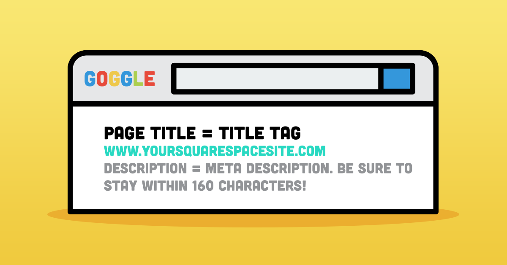
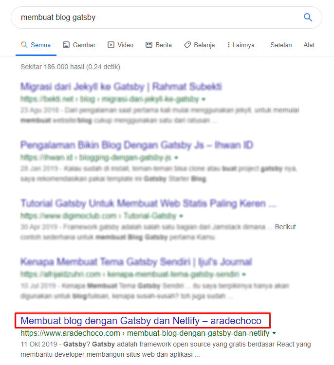
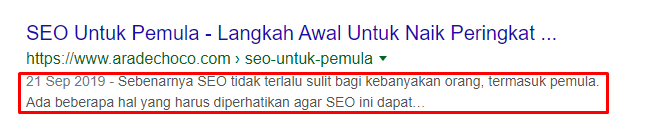

Saat Anda selesai menulis artikel di blog, pasti Anda akan memeriksa kembali apakah ada kesalahan ketik dan memeriksa apakah gambar atau formatnya sudah benar jika di buka melaluidi PC dan seluler.

Ada cara untuk mendapatkan lebih banyak trafik dengan investasi kecil dari beberapa upaya dalam membuat dan mendistribusikan konten ini. Pemeriksaan dan penambahan **meta tag**.

**Meta tag** adalah informasi tambahan tentang pos yang telah Anda tulis, semacam pesan yang tidak terlihat oleh pengunjung tetapi dapat dilihat oleh mesin pencari. Karena mesin pencari tidak mengerti bahasa, subjek, penulis, dan tanggal pembuatan dokumen seperti manusia, meta tag berfungsi untuk menyampaikan struktur ini dengan jelas ke mesin pencari. Singkatnya, konten tanpa meta tag itu tidak baik untuk seo dan mesin pencari.

Jika situs web atau blog Anda berperingkat tinggi di Penelusuran Google dan ingin mendapatkan banyak trafik, sangatlah penting untuk mengetahui **apa itu meta tag dan bagaimana menggunakannya**. Di bawah ini adalah beberapa meta tag yang terkait dengan optimasi mesin pencari yang membantu blog Anda muncul di halaman pertama.

## 1. Title Tag / Tag Judul

Title Tag adalah tag yang mewakili judul halaman. Ini bukan judul yang sama dengan pengunjung melihat situs web Anda dan merupakan bagian yang muncul dalam hasil pencarian. Ini juga teks pertama yang akan dilihat oleh pengunjung ketika mereka mencari di mesin pencari.

## 2.  Meta description / Deskripsi meta 

Meta description adalah ringkasan dari halaman web. Pada halaman hasil pencarian Google, Anda dapat memeriksa konten setelah judul dan URL sebagai potongan. Merupakan ide bagus jika menulis deskripsi meta dengan baik sebelum mereka mengklik halaman web, jadi pastikan untuk menuliskannya dengan baik agar banyak orang yang mengunjungi halaman web Anda.

## 3. Twitter card

Twitter carad adalah fitur yang memungkinkan Anda menulis lebih dari 140 karakter posting Twitter dan melampirkan media seperti foto dan video. Ini sangat bagus untuk memperkenalkan produk baru atau berbagi ke media lain. Pengguna Twitter dapat melihat gambar dan video, mengunjungi halaman lain dan mengunduh aplikasi tanpa meninggalkan Twitter, yang akan memberikan pengalaman pengguna yang lebih baik untuk pengguna seluler.

## 4. Open Graph

Open Graph adalah fitur yang mirip dengan **Twitter Card**. Namun, fungsi ini untuk Facebook, bukan Twitter. Ini adalah fitur yang memungkinkan Anda untuk menggabungkan Facebook, data Anda, dan situs web lainnya. Singkatnya, fitur ini memungkinkan webmaster untuk memberikan informasi terperinci tentang halaman web ke media sosial. Misalnya, ketika Anda berbagi halaman, Anda dapat menentukan gambar apa yang akan digunakan di Facebook.

## 5. Anchor teks

Anchor text adalah istilah untuk teks yang berisi tautan / link. Anchor teks adalah teks seperti [Panduan SEO Dasar untuk pemula](https://www.aradechoco.com/seo-dasar-untuk-pemula/) yang mengarah ke halaman lain. Google merekomendasikan **anchor teks** ini karena Google menggunakan tautan di situs Anda untuk menentukan apakah situs web Anda bermanfaat.

## 6. Alt Text image / Gambar

Saat ini, semua jaringan sosial media adalah sebagian besar dari gambar visual. Gambar benar-benar memainkan peran penting dalam blog apa pun. Menurut **Hubspot**, ide yang baik adalah menempatkan gambar di bagian atas postingan blog untuk menarik pengunjung. Tetapi itu tidak berarti jika hanya menempatkan gambar di bagian atas postingan blog saja. Tapi, coba juga untuk meletakkan gambar di antara paragraf sehingga teks tidak terlihat terlalu panjang. Dan jangan lupa untuk memasukkan `Alt Text` untuk orang yang mengunjungi blog tapi mematikan fitur gambar di browsernya. 

Saat meletakkan Alt text , Anda [harus menggunakan keyword](https://www.aradechoco.com/menempatkan-keyword-seo/) yang menggambarkan gambar apa yang Anda masukkan ke blog. Dan seperti halnya dengan judul blog, pengisian kata kunci tidak boleh dilakukan. Tergantung pada situasinya, memasukkan kata kunci pada postingan yang merusak keterbacaan dan konteksnya membuatnya menjadi magnet bagi penalti Google. Google bisa saja memberi hukuman pada situs web yang melakukan [teknik Black Hat SEO](https://www.aradechoco.com/teknik-black-hat-seo/).

## 7. Kategori dan Tag

Yang terakhir untuk dipertimbangkan bagi pembaca adalah membuat kategori dan tag. Anda harus mengonfigurasi pengunjung blog agar dapat menavigasi blog secara organik karena banyaknya postingan di blog. Misalnya, di blog ini Anda melihat menu **blog** di sisi bawah, Anda dapat melihat beberapa kategori. Ada kategori Code, SEO, Popeler, Tutorial dan sebagainya. 

## Kesimpulan

Saat menulis artikel blog, sangatlah penting untuk menulis konten yang menarik minat orang dengan meningkatkan kualitas konten itu. Namun, konten saja tidak dapat menampung banyak trafik jika tidak di padukan dengan optimasi meta tag. Jadi, ingat dan terapkan faktor pengoptimalan SEO ini.

**Jika ingin membaca lebih lanjut tentang SEO dasar, lihat artikel terkait ini:**

- [Tanya Jawab tentang Optimasi SEO](https://www.aradechoco.com/seo-link-building/) - Link Building
- [Apa itu backlink ?](https://www.aradechoco.com/apa-itu-backlink/) Mengapa penting untuk SEO ?
- [Cara Riset Keyword](https://www.aradechoco.com/cara-riset-keyword-untuk-pemula/) : Long Tail dan Short Tail untuk Pemula
- [SEO Untuk Pemula](https://www.aradechoco.com/SEO-untuk-pemula/) - Langkah Awal Untuk Naik Peringkat Google 
- [Membangun Backlink melalui Wikipedia](https://www.aradechoco.com/backlink-melalui-wikipedia/)
- [Cara mengetahui peringkat situs web](https://www.aradechoco.com/cara-mengetahui-peringkat-situs-web/)
- [Cara Menghapus Backlink Spam](https://www.aradechoco.com/menghapus-backlink-spam/)
- [Optimasi SEO dengan Schema Markup](https://www.aradechoco.com/optimasi-schema-markup/)
- [Teknik SEO](https://www.aradechoco.com/teknik-seo/) - Aspek penting yang tidak boleh di lewatkan
- [Teknik Black Hat SEO Yang Harus di Hindari](https://www.aradechoco.com/teknik-black-hat-seo/)
- [Teknik White Hat SEO](https://www.aradechoco.com/teknik-white-hat-seo/)](https://www.aradechoco.com/teknik-white-hat-seo/)
- [Cara Menempatkan Keyword yang SEO pada Postingan blog](https://www.aradechoco.com/menempatkan-keyword-seo/)
