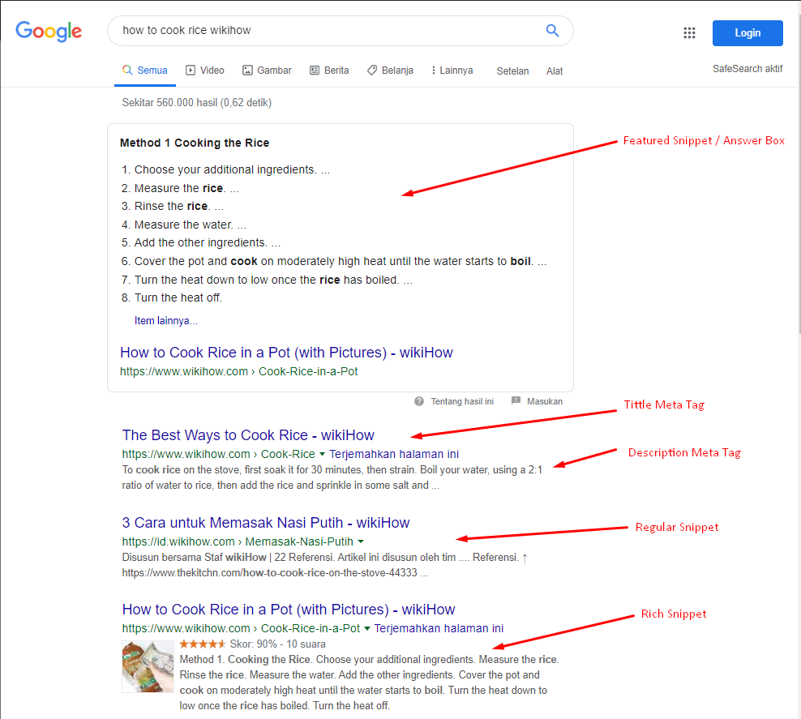

Mengikuti perubahan dalam **algoritma pencarian Google** itu tidak mudah. Karena algoritma pencarian Google telah dimodifikasi, diperbarui, dan ditingkatkan selama puluhan kali setiap tahun. 

Baru-baru ini, hasil pencarian Google menjadi lebih beragam dan lebih kaya. Anda dapat melihat peringkat bintang dan harga seperti gambar di bawah ini.


Tidak mungkin memanggil informasi tambahan ini dalam hasil pencarian untuk mendapatkan lebih banyak klik? Untuk menambahkan informasi seperti gambar, peringkat bintang, harga, dll. Ke hasil pencarian, Anda perlu memasukkan Data Terstruktur ke dalam halaman web menggunakan `Markup Skema` ( Schema Markup ).

## Apa itu Schema Markup ?

Istilah yang tidak dikenal, seperti Markup atau Schema, bisa sangat membingungkan. Pertama, mari kita mulai dengan markup yang akrab. Markup kata tidak asing bagi kita karena kita akrab dengan **Hyper Text Markup Language** (HTML). Anda melihat artikel ini dalam HTML di browser Anda!

**HTML** adalah bahasa markup yang memisahkan konten dari format. Misalnya, jika tag `<h1>` digunakan untuk menampilkan konten dalam **font besar**, dan tag `<h2>` digunakan untuk menampilkan konten dalam font yang lebih kecil daripada tag `<h1>`. Artinya, konten dan format dipisahkan.

Dokumen yang disimpan secara terpisah dalam format ini dapat dilihat dalam format yang sama oleh berbagai aplikasi atau browser web yang mendukung format ini ketika ada standar untuk format tersebut `(misalnya, HTML 5)`. Anda sudah melihat dokumen HTML dengan gaya yang sama di Safari, Chrome, atau di browser web seperti Microsoft Explorer atau Edge! 🙂

Jika bahasa markup didefinisikan dan distandarkan, produsen konten dapat fokus memproduksi konten tanpa mempertimbangkan browser atau aplikasi yang akan digunakan. Juga, ketika mengubah format, sangat mudah mengubah tag markup hanya mengubah batch.

Sekarang setelah Anda mengerti apa itu markup, sekarang saatnya untuk memahami apa itu `Schema`. HTML bukan bahasa markah Schema, yang berarti bahasa markup yang tidak mengerti Schema. Saya sebutkan di atas bahwa HTML dapat disimpan secara terpisah dari konten. Dalam hal ini, Anda tidak memahami konten dalam hal semantik. 

> **Dengan kata lain, HTML tidak memiliki kemampuan untuk memahami atau menentukan apakah konten dalam tag adalah alamat, nama seseorang, nomor telepon, dll. Ini hanya konvensi untuk menampilkan beberapa data dalam format `<h1>` dan beberapa data dalam format `<h2>`**.

Schema berjanji untuk melangkah lebih jauh dan menjanjikan data apa yang merupakan alamat dan data apa yang merupakan nama. Jika semua situs web ditentukan dengan marka skema, Anda dapat secara otomatis mengumpulkan nama orang atau mengumpulkan informasi harga dari semua situs web.

Jadi, data dari `<h1> Apple </ h1>` hanyalah masalah membiarkan browser menampilkan data `"Apple"` dalam ukuran font yang lebih besar dari sudut pandang mesin pencari. Tidak diketahui sama sekali.

## Schema Markup = HTML + Structured Data

Ada deskripsi schema markup dan format yang ditetapkan dengan baik untuk schema markup yang terorganisir dengan baik untuk semua orang. Kunjungi situs [schema.org](http://schema.org/).  

> **Dengan pengaturan schema diatur dengan benar, informasi dan data di situs web Anda sekarang dikategorikan dalam bentuk semantics.**

Ini tidak hanya akan membantu Anda dalam peringkat SEO, tetapi juga akan membantu Anda menemukan informasi yang tepat di halaman hasil pencarian Anda, termasuk informasi tentang situs web Anda, informasi produk / layanan, harga dan informasi lokasi. 

Anda dapat menganggap Schema Markup sebagai pamflet bisnis yang berisi informasi penting tentang bisnis Anda.

Schema Markup yang berguna ini dapat diekspresikan dalam bahasa seperti `JSON-LD`, `Microdata`, dan `RDFa`.

**JSON-LD** :  Notasi Objek JavaScript untuk Data Tertaut (JSON-LD) adalah metode penyandian data tertaut menggunakan format JSON.

```jsx

{  
  "@context": "https://json-ld.org/contexts/person.jsonld",
  "@id": "http://dbpedia.org/resource/John_Lennon",
  "name": "John Lennon",
  "born": "1940-10-09",
  "spouse": " http://dbpedia.org/resource?Cynthia_Lennon"
}

```

**Microdata** : Microdata adalah spesifikasi HTML WHATWG yang digunakan untuk membuat sarang metadata dalam konten yang ada di halaman web. 

```html
<dl itemscope itemtype="https://md.example.com/loco
                        https://md.example.com/lighting"
                itemid="https://md.example.com/product-catalog/33041"
<dt>Name:
 <dd itemprop="name">Tank locomotive (DB 80)
 <dt>Product code:
 <dd itemprop="product-code">33041
 <dt>Scale:
 <dd itemprop="scale">HO
 <dt>Digital:
 <dd itemprop="digital">Delta
</dl>

```

**Itemscope** adalah atribut global boolean yang mendefinisikan ruang lingkup metadata terkait. Atribut terkait, itemtype, digunakan untuk menentukan URL kosa kata yang valid (seperti schema.org) yang menggambarkan item dan konteks propertinya.

**RDFa** : Resource Description in Attributes (RDFa) adalah cara untuk menambahkan satu set ekstensi tingkat atribut ke HTML, XHTML, dan berbagai jenis dokumen berbasis XML untuk memasukkan metadata yang kaya dalam dokumen web.

```html
   <div xmlns:dc="http://purl.org/dc/elements/1.1/"
    about="http://www.example.com/books/wikinomics">
    <span property="dc:tittle">Wikinomics</span>
    <span property="dc:creator">Don Tapscott</span>
    <span property="dc:date">2006-10-01</span>
   </div>
```

## Optimasi SEO dengan Schema Markup

Sekarang setelah Anda memiliki gambaran kasar tentang apa itu `Schema Markup`, sekarang saatnya untuk memanfaatkannya. Mesin pencari adalah layanan yang berupaya memenuhi peran menemukan informasi yang Anda inginkan, dan memahami banyak isi halaman web,berdasarkan ini pengguna pencarian ingin menunjukkan jawaban yang diinginkan dalam hasil pencarian. 

Pada titik ini, jika ada markup skema di halaman web, itu akan menampilkan hasil pencarian yang lebih bermakna.

Mesin pencari dapat menampilkan peringkat atau gambar seperti yang ditunjukkan di bawah ini menggunakan markup skema yang tertanam di halaman web. 

Item hasil pencarian warna biasa disebut Cuplikan Biasa, sedangkan item hasil pencarian yang mengandung gambar, dll, Disebut Cuplikan Kaya.

Jika konten Anda dirancang khusus untuk segera menanggapi maksud pencarian, konten tersebut dapat dipilih sebagai Cuplikan Unggulan dan bahkan ditampilkan sebelum iklan pencarian.



Informasi produk dan hasil ulasan juga termasuk dalam hasil pencarian, jadi jika Anda ingin mengekspos hasil halaman web yang lebih setia dalam hasil pencarian, pertimbangkan untuk menggunakan data terstruktur menggunakan skema markup di situs web Anda.

> **Tips** : Jika Anda tidak yakin bagaimana sebenarnya menerapkan markup skema, Anda mungkin ingin menambahkan kode halaman web dari perusahaan yang memiliki skema yang dirancang dengan baik ke halaman hasil mesin pencari Anda. Mohon diperhatikan. 

Akan jauh lebih mudah untuk dipahami jika Anda melihat contoh yang sebenarnya daripada membaca dan mempelajari markup skema.

## Panduan SEO ✔️

- [Tanya Jawab tentang Optimasi SEO](https://www.aradechoco.com/seo-link-building/) - Link Building
- [Apa itu backlink ?](https://www.aradechoco.com/apa-itu-backlink/) Mengapa penting untuk SEO ?
- [Cara Riset Keyword](https://www.aradechoco.com/cara-riset-keyword-untuk-pemula/) : Long Tail dan Short Tail untuk Pemula
- [SEO Untuk Pemula](https://www.aradechoco.com/SEO-untuk-pemula/) - Langkah Awal Untuk Naik Peringkat Google 
- [Membangun Backlink melalui Wikipedia](https://www.aradechoco.com/backlink-melalui-wikipedia/)
- [Cara mengetahui peringkat situs web](https://www.aradechoco.com/cara-mengetahui-peringkat-situs-web/)
- [Cara Menghapus Backlink Spam](https://www.aradechoco.com/menghapus-backlink-spam/)
- [Teknik SEO](https://www.aradechoco.com/teknik-seo/) - Aspek penting yang tidak boleh di lewatkan
