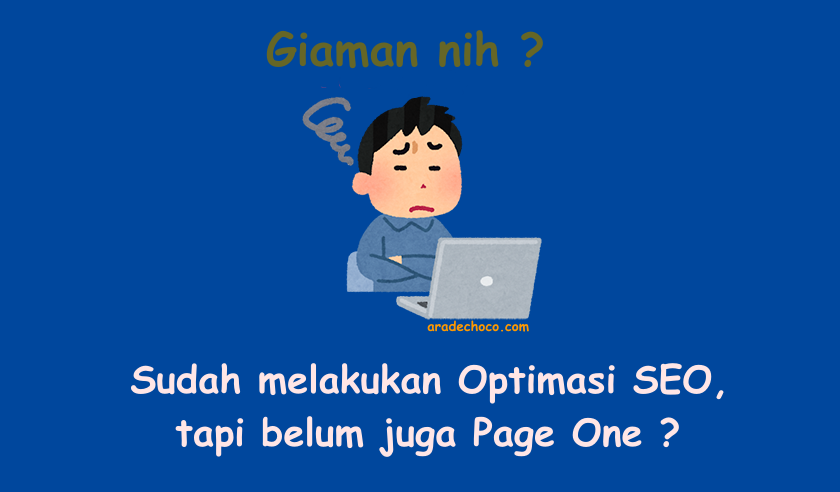

Sudah banyak orang yang terbiasa melakukan **Optimasi SEO** sesuai dengan semua prinsip dan meniru teknik-teknik para master dengan menggunakan tools yang sama, atau mungkin telah membaca [Daftar Panduan SEO](https://www.aradechoco.com/categories/seo/) dan mencoba untuk mengikuti semuanya, Tapi masih belum dapat membuat website tersebut tampil di halaman pertama Google.

**Mengapa bisa terjadi ?**

Saya juga sering melakukan [Optimasi SEO](https://www.aradechoco.com/seo-dasar-untuk-pemula/) secara intuitif tetapi belum mendapat peringkat dalam hasil pencarian. Kadang-kadang halaman yang tidak dimaksudkan untuk diperingkat malah tampil di halaman pertama. 

**Yah! Inilah SEO.** 

Sesuatu yang aneh bahkan jika kita mengikuti semua panduan itu tidak menjamin situs web akan mendapatkan **page one** di Google. 

Banyak hal terjadi dari pengamatan, yang disebabkan oleh coba-coba dan itu bukan sesuatu yang benar-benar diungkapkan oleh Google, dan Google pasti tidak akan mengungkapkannya.

**Itu karena:**

## SEO adalah proses yang membutuhkan waktu.

Harus diulangi sekali lagi bahwa SEO adalah proses yang membutuhkan waktu. Meskipun Google saat ini sedang mengembangkan teknologi dan algoritmanya untuk perayapan dan pengindeksan untuk dapat menampilkan hasil pencarian yang datang dari berbagai halaman dengan cepat, bahkan jika halaman itu baru saja dibuat dalam sistem dalam waktu dekat. Tetapi saya harus mengakui bahwa tidak mudah membuat konten dan masuk ke puncak Google dengan cepat, bahkan butuh waktu bagi Google untuk memberi bobot dan kepercayaan pada halaman web itu.

## Prinsip-prinsipnya mungkin benar tetapi konteksnya mungkin tidak sama.

Dalam SEO, meskipun beberapa panduan berhasil dengan situs web tetapi mungkin tidak berhasil di situs web lain.

Dari pengalaman, saya pernah menelusuri 1 situs web teratas untuk kata kunci yang dibidik dan mencoba melihat apa yang dilakukan situs web tersebut. 

Kemudian mencoba mengikuti tapi Tampaknya peringkat halaman saya bahkan tidak ada di halaman pertama.

Ini adalah konfirmasi bahwa prinsip-prinsip yang berlaku untuk situs web tertentu, atau beberapa kata kunci mungkin tidak dapat digunakan karena situs web lain memainkan kata kunci yang berbeda, karena konteks yang berbeda menjadi sesuatu yang bahkan para ahli SEO tidak berani dan tidak menjaminnya, karena tidak memiliki prinsip yang akan membantu situs web untuk menentukan peringkat di industri tersebut.

## Trafik yang masih sedikit.

Meskipun masih dapat diperdebatkan apakah jumlah trafik ke situs web itu mempengaruhi peringkat dalam hasil pencarian atau tidak. 

Tetapi secara pribadi saya percaya bahwa itu memiliki efek yang sangat besar, Karena saya telah melihat dengan mata kepala sendiri berkali-kali bahwa halaman web itu memiliki banyak lalu lintas ke situs web (Lebih dari halaman lain di situs web), sering dengan mudah diberi peringkat oleh Google.

Jika Anda melihat dan menganalisisnya dengan cermat, jumlah trafik ke situs web adalah hasil dari [SEO Off-page dan Off-page](https://www.aradechoco.com/seo-on-page-dan-seo-off-page/) yang baik akan membawa trafik ke banyak situs web. 

Google akan menghargai situs web yang melakukan optimasi SEO dengan baik dan menghukum mereka yang mencoba manipulasi atau mereka yang suka bermain [tehnik Black-hat SEO](https://www.aradechoco.com/teknik-black-hat-seo/).

## Tidak ada backlink ke halaman tersebut.

[Apa itu backlink ?](https://www.aradechoco.com/apa-itu-backlink/) Backlink adalah link yang ditautkan dengan situs web dan merujuk ke situs web lain.

Meskipun Google telah mengurangi pentingnya Backlink ke peringkat situs web di masa lalu  , memiliki Backlink merujuk ke halaman web kita tidak hanya mempengaruhi Ranking, tetapi juga membantu dalam Pengindeksan. 

## Pesaing dalam kata kunci terlalu kuat.

Semakin tinggi nilai kata kunci untuk bisnis, semakin ketat pula kompetisi untuk tampil di halaman pertama, diikuti oleh SEO tidak sesulit dulu. Sekarang, jika berlatih sedikit, semua orang bisa melakukannya sendiri. 

Jika ada yang ingin tahu prinsip-prinsipnya, ketahui cara melakukannya, terutama pesaing kita. Atau jika pesaing tidak tahu cara melakukan SEO, mereka mungkin punya uang untuk mempekerjakan seseorang dengan pengetahuan dan pengalaman untuk melakukan [Riset kata kunci](https://www.aradechoco.com/cara-riset-keyword-untuk-pemula/) sebagai gantinya. 

## Penutup

Jika sudah mengevaluasi dan belum bisa bersaing dengan pesaing (Mungkin karena situs web tersebut sudah jauh lebih besar dan satu-satunya kata dalam kata kunci itu). 

Jangan patah semangat, terus berjuang, ubah strategi untuk memainkan Kata Kunci lain dengan lebih baik.

Itulah beberapa alasan yang sering menyebabkan Situs web susah mendapat peringkat dalam hasil pencarian, bahkan setelah melakukan semua Optimasi SEO yang benar. 

## Terkait

- [SEO Untuk Pemula](https://www.aradechoco.com/SEO-untuk-pemula/) - Langkah Awal Untuk Naik Peringkat Google.
