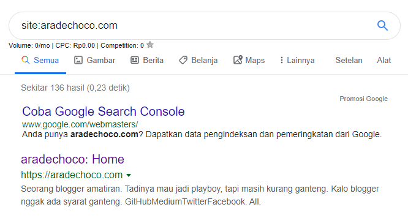
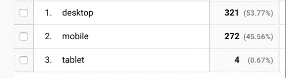

Pada artikel [sebelumnya](https://www.aradechoco.com/optimasi-seo-untuk-gatsby-blog-part-1/), Anda belajar tentang sitemap dan robots.txt, yang penting untuk SEO. Dalam artikel ini, saya akan menunjukkan kepada Anda bagaimana membantu crawler lebih memahami situs Web kami dan alat untuk mengujinya. Sekali lagi, mesin pencari ditulis dengan asumsi Google. Bahkan, dokumen panduan SEO dari Google sangat bagus sehingga saya hampir memindahkannya.

Pertama, ketik `site: URL situs` ke dalam kotak pencarian Google.

Jika situs Anda termasuk dalam indeks Google, situs Anda akan muncul di hasil pencarian seperti yang ditunjukkan di atas. Google tahu keberadaan situs saya.

Sekarang yang perlu kita lakukan adalah memastikan bahwa informasi yang tepat terbuka, serta terbuka untuk pencarian. Selain halaman beranda, Anda perlu memberi tahu perayap informasi apa yang dimiliki setiap halaman.

## Judul dan Deskripsi

Di mesin pencari apa pun, hasil pencarian harus menyertakan judul dan deskripsi halaman. Dengan kata lain, penting untuk memasukkan kedua informasi tersebut sehingga crawler memahami halaman dengan benar dan menampilkan halaman kami yang cocok dengan kata kunci yang dicari. Bagaimana Anda menulis judul terlebih dahulu?

1. Pastikan Anda menggambarkan halaman Anda dengan tepat
2. Jangan menggunakan judul yang berulang atau terlalu standar
3. Baik jika judulnya sendiri bisa menjadi merek

Nomor satu sangat jelas sehingga penting bagi halaman web kami untuk muncul di hasil pencarian yang diinginkan seseorang. Misalnya, blog harus memiliki kata kunci utama dalam judul itu sendiri sehingga halaman dengan artikel yang cocok dengan informasi yang Anda inginkan akan muncul di hasil pencarian. Misalnya, nomor dua akan terlalu standar jika judul posting ini adalah '** Search Engine Optimization **', dan '** [Gatsby Search Engine Optimization] Mengoptimalkan Mesin Pencari untuk Blog Gastby ** akan mengulangi. Itu akan menjadi judul. Saya tidak memahaminya tiga kali, tetapi saya pikir jika pengguna menemukan ada banyak konten bagus di situs saya, saya dapat menemukan kata kunci pencarian sebagai judul situs. Misalnya, untuk setiap posting, pilih "** [Judul Posting] | Jika blog aradechoco ** adalah judulnya, posting saya akan diambil dengan kata kunci '** aradechoco **'.

Bagaimana dengan deskripsinya?

1. Terus beri tahu pengguna Anda dengan ringkas dan dengan tepat merangkum konten halaman ⇒ Promosikan untuk meyakinkan pengguna bahwa apa yang mereka cari dalam hasil pencarian
2. Baik berada di setiap halaman situs, dan kontennya berbeda.
3. Dianjurkan untuk menulis dalam bentuk garis besar halaman, tetapi tidak perlu menulis dalam bentuk kalimat (harus mudah dibaca).

Nomor 1 juga alami. Karena informasi dapat diakses di halaman hasil pencarian, itu harus dinyatakan dengan baik bahwa itu menarik bagi pengguna dan relevan dengan informasi yang diinginkan. Nomor dua menunjukkan bahwa frasa yang diulang dari sudut pandang perayap Google kemungkinan akan muncul di hasil pencarian. Nomor 3 penting bagi perayap dan pengguna untuk membedakan halaman mana yang dihidupkan (saya tidak menyimpannya dari blog saya, jadi saya ingin segera memperbaikinya.) Misalnya, jika Anda menulisnya dalam format garis besar, ** Pelajari lebih lanjut tentang pengoptimalan mesin pencari (SEO) dan cara menerapkannya ke blog yang dibuat dengan Gatsby. ** Ini akan terlihat seperti ini. Atau, itu adalah bentuk informasi penulisan yang dapat ditangkap oleh kata kunci seperti penulis, tanggal publikasi, dan kategori.

```html
<meta
  name = "Deskripsi"
  content = "Penulis: aradechoco, 
Tanggal diterbitkan: 13 September 2019, Kategori: SEO, Code, Gatsby "
/>
```

Ini adalah format yang menguntungkan bagi perayap untuk mengetahui halaman apa yang ada di halaman ini dan kata kunci apa.

## situs mobile friendly

Saat ini, banyak orang mengakses situs web dengan ponsel. Saya sering membaca posting blog ketika saya pergi kerja atau keluar dari pekerjaan. Saya mencari seseorang untuk melihat blog saya.

Jumlah total kunjungan sejak blog dibuka. Jika Anda melihat persentase perangkat yang di sambungkan, Anda akan melihat PC, Mobile, atau Tablet. Menjadikan situs ini mobile-friendly sangat penting dari sudut pandang pengguna.

Sekarang mari kita lihat bagaimana membuatnya blog menjadi mobile friendly. Pertama dan terpenting, desain ** reactive **, yang akrab dengan pengembang front-end, akan menjadi yang paling penting. Untuk memberi tahu browser bahwa halaman Anda dirancang untuk semua perangkat, tambahkan tag meta seperti ini:

```html
<meta name="viewport" content="width=device-width, initial-scale=1.0" />
```

Ini memberi tahu browser bagaimana menyesuaikan ukuran dan penskalaan halaman dengan lebar perangkat. Perayap Google menentukan bahwa laman dengan tag ini dioptimalkan untuk seluler.

Jika versi desktop dan versi seluler menggunakan URL yang berbeda, Anda harus menunjukkan ini.

```html
<link
  rel="alternate"
  media="only screen and (max-width: 640px)"
  href="https://m.aradechoco.com/optimasi-seo-untuk-gatsby-blog-part-2"
/>
```

```html
<link rel = "canonical" href = "https://www.aradechoco.com/optimasi-seo-untuk-gatsby-blog-part-2" />
```

Tag ini harus diterapkan satu-ke-satu pada setiap halaman untuk memberi tahu Google crawler bahwa kedua URL memiliki konten yang sama. Jika versi desktop dan seluler diperlakukan sebagai konten terpisah, URL desktop dan seluler dapat muncul di hasil pencarian desktop, dan Google mungkin diperingkat lebih rendah daripada yang diketahui tentang hubungan antara kedua versi.

## Pengoptimalan gambar

Gambar yang dioptimalkan memainkan peran penting dalam kecepatan memuat halaman dan membantu kami menangkap halaman kami dengan pencarian gambar. Mari kita lihat dua optimasi paling penting.

1. Gunakan nama file gambar dan atribut alt yang benar.
2. Gambar harus berukuran memadai dan format file yang sesuai.

Nomor 1 membantu mesin pencari memahami gambar dan membantu pengguna mencari tahu apa gambar itu jika gambar gagal dimuat karena kegagalan jaringan.
Misalnya, halaman 2 memperlambat pemuatan halaman, misalnya, karena resolusi tinggi dan ukuran gambar, yang tidak memberikan pengalaman pengguna yang baik. Sebagian besar browser mendukung format gambar JPEG, GIF, PNG, BMP, dan WebP.

## Konten yang paling penting

Bahkan, bahkan jika Anda menyimpan semua SEO di atas, jika kualitas kontennya tidak bagus, Anda tidak akan dapat mempertahankan pengguna. Secara khusus, blog harus ditulis dengan pertimbangan apa yang dibutuhkan pembaca konten, keterbacaan yang baik, teks yang tidak terlalu pendek atau panjang, dan apakah judul dan konten itu relevan. Tentu saja, semuanya mungkin tidak sempurna, tetapi jika Anda ingin terus-menerus terpapar oleh lebih banyak orang, akan sangat membantu untuk memeriksa mereka satu per satu dengan hati-hati dan mendapatkan umpan balik sesuai kebutuhan.

## Penutup

Ketika saya menulis artikel ini, saya pikir saya harus belajar lebih banyak tentang SEO, dan saya akan terus memperbarui apa yang telah saya pelajari. Juga, sekali lagi, saya memiliki kesempatan untuk memikirkan kembali kualitas tulisan saya. Di masa depan, saya akan mencoba yang terbaik untuk melihat apakah tulisan saya benar-benar membantu orang lain dan membuatnya lebih mudah untuk dipahami, untuk mendapatkan feedback, dan untuk membuat blog yang lebih baik.

## referensi 

- <a href="https://www.aradechoco.com/optimasi-seo-untuk-gatsby-blog-part-1/" target="_blank"> Optimasi SEO untuk Gatsby Blog Bagian 1 </a>
- <a href="https://support.google.com/webmasters/answer/7451184?hl=id" target="_blank"> Panduan SEO Google </a>
- <a href="https://webmasters.googleblog.com/2007/09/improve-snippets-with-meta-description.html" target="_blank"> Enhance the snippet with the meta description makeover </a>
