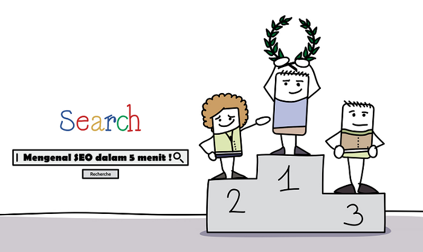

## Apa itu SEO ??

SEO adalah singkatan dari Search Engine Optimization, Sederhananya, SEO adalah teknik untuk membuat peringkat situs web muncul di halaman pertama hasil pencarian di Google Search. 

Untuk membuat situs web muncul di posisi yang baik, Ada banyak langkah dan faktor yang digabungkan dalam hal konten dan aspek teknis.

Oleh karena itu, jika berbicara dengan menutupi arti sebenarnya dari SEO adalah untuk mengembangkan konten situs web (konten) dan struktur situs web (struktur situs) untuk Mesin Pencari (Google, Yahoo, Bing). 

## Bagaimana cara melakukan SEO ?

Metode SEO yang paling sukses adalah "SEO yang Natural" yang akan menghasilkan situs web yang benar-benar berkualitas. Beberapa faktor utama adalah sebagai berikut.

### 1. SEO one page

- Riset Kata Kunci 
- Meta description
- Alt Text
- Title Tag
- SSL / HTTPS
- Struktur URL
- Internal Link
- Performa Halaman

### 2. SEO Off Page

- Backlink berkualitas
- Domain Authority
- Berbagi di sosial media

Silahakan baca [Perbedaan antara SEO On-Page dan SEO Off-Page](https://www.aradechoco.com/seo-on-page-dan-seo-off-page/)

## Manfaat Melakukan SEO ?

Manfaat paling penting dari SEO adalah jika kita dapat menempatkan situs web kita di halaman pertama atau di posisi teratas Pada hasil pencarian, maka akan dapat meningkatkan jumlah orang yang memasuki situs web (Trafik) tanpa harus membayar untuk [menggunakan jasa SEO](https://www.aradechoco.com/menyewa-jasa-seo-berkualitas/) atau Iklan Berbayar.  

## Belajar SEO ✔️

**Jika ingin membaca lebih lanjut tentang SEO, silahkan baca artikel terkait ini:** 

- [SEO Untuk Pemula](https://www.aradechoco.com/SEO-untuk-pemula/) - Langkah Awal Untuk Naik Peringkat Google 
- [SEO Dasar: 17 Tips Optimasi Yang Wajib Diketahui Pemula](https://www.aradechoco.com/seo-dasar-untuk-pemula/)
- [Tanya Jawab tentang Optimasi SEO](https://www.aradechoco.com/seo-link-building/) - Link Building
- [Apa itu backlink ?](https://www.aradechoco.com/apa-itu-backlink/) Mengapa penting untuk SEO ?
- [Cara Riset Keyword](https://www.aradechoco.com/cara-riset-keyword-untuk-pemula/) : Long Tail dan Short Tail untuk Pemula
- [Membangun Backlink melalui Wikipedia](https://www.aradechoco.com/backlink-melalui-wikipedia/)
- [Cara mengetahui peringkat situs web](https://www.aradechoco.com/cara-mengetahui-peringkat-situs-web/)
- [Cara Menghapus Backlink Spam](https://www.aradechoco.com/menghapus-backlink-spam/)
- [Optimasi SEO dengan Schema Markup](https://www.aradechoco.com/optimasi-schema-markup/)
- [Teknik SEO](https://www.aradechoco.com/teknik-seo/) - Aspek penting yang tidak boleh di lewatkan
- [Teknik Black Hat SEO Yang Harus di Hindari](https://www.aradechoco.com/teknik-black-hat-seo/)
- [Teknik White Hat SEO](https://www.aradechoco.com/teknik-white-hat-seo/)
- [Cara Menempatkan Keyword yang SEO pada Postingan blog](https://www.aradechoco.com/menempatkan-keyword-seo/)
- [Optimasi Meta Tag Yang Harus Diketahui Blogger?](https://www.aradechoco.com/optimasi-meta-tag/)
- [Guest Blogging dan Pengaruhnya terhadap SEO](https://aradechoco.com/guest-blog-seo/)
- [Perbedaan SEM dan SEO beserta Manfaatnya untuk Digital Marketing](https://www.aradechoco.com/perbedaan-sem-dan-seo/)
- [25 Tools SEO Gratis Populer yang Wajib Anda Gunakan](https://www.aradechoco.com/tools-seo-gratis/)
- [Perbedaan antara SEO On-Page dan SEO Off-Page](https://www.aradechoco.com/seo-on-page-dan-seo-off-page/)
- [Cara menulis artikel SEO agar tampil di halaman pertama Google](https://www.aradechoco.com/menulis-artikel-seo/)
- [Hal yang perlu diketahui sebelum Sewa Jasa SEO Berkualitas](https://www.aradechoco.com/menyewa-jasa-seo-berkualitas/)
- [Mengapa Riset Kata kunci itu penting untuk SEO ?](https://www.aradechoco.com/riset-kata-kunci/)
- [Sudah melakukan Optimasi SEO tapi belum juga Page One ?](https://www.aradechoco.com/optimasi-seo-page-one/)
- [Bagaimana cara mendapatkan Google Sitelink ?](https://www.aradechoco.com/google-sitelink/)
- [5 Jenis Kata kunci SEO Yang Harus Anda Ketahui](https://www.aradechoco.com/jenis-kata-kunci/)
- [Cara Menulis Judul Artikel yang SEO Friendly](https://www.aradechoco.com/judul-artikel-seo-friendly/)
- [Apa itu Do Follow dan No Follow? Pentingkah untuk SEO?](https://www.aradechoco.com/do-follow-dan-no-follow/)
- [Seberapa penting link Internal dan Eksternal untuk SEO ?](https://www.aradechoco.com/link-internal-dan-eksternal/)
- [7 faktor penting yang menentukan kesuksesan SEO](https://www.aradechoco.com/faktor-kesuksesan-seo/)
