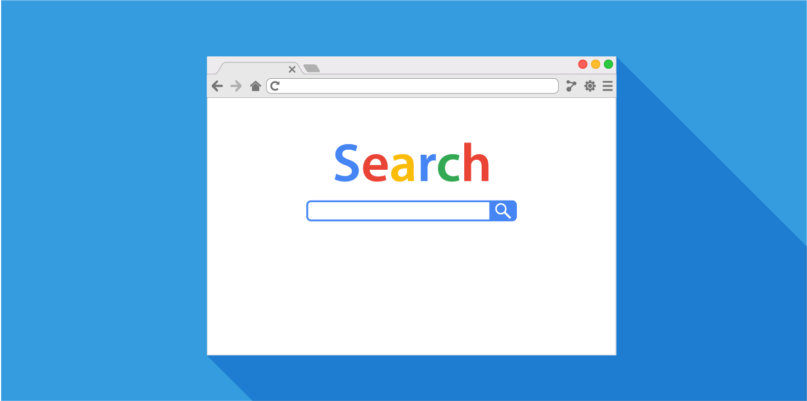
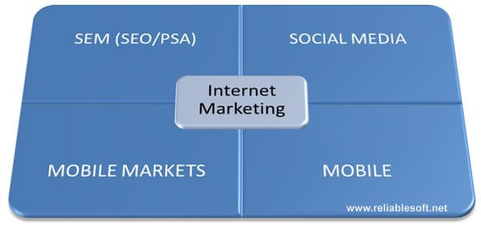
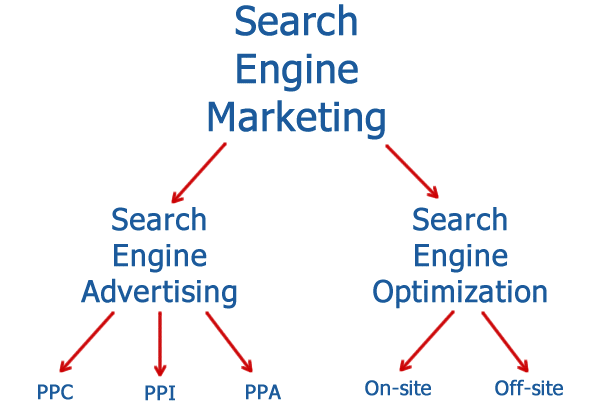
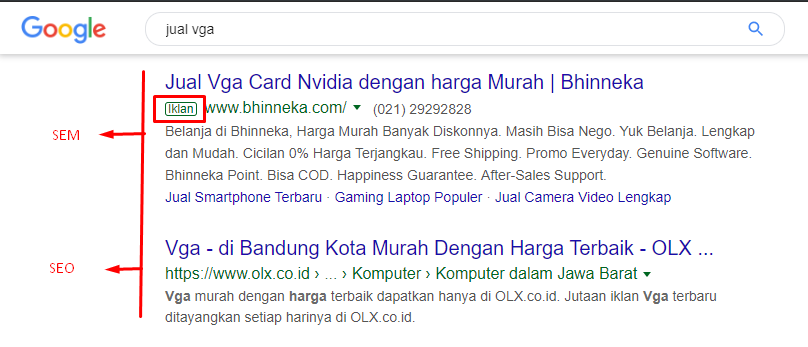

Beberapa orang sering bingung dari kedua istilah Search Engine Optimization (SEO) dan Search Engine Marketing (SEM). Baik SEO dan SEM mereka sama-sama membantu untuk membuat peringkat situs web dalam hasil mesin pencari, tetapi pada kenyataannya SEO lebih dapat didefinisikan sebagai bagian dari SEM yang mencakup berbagai kategori.

Hari ini, saya akan memperkenalkan konsep **SEM** dan **SEO** dan manfaatnya menggunakan masing-masing.

## Apa itu SEM?

**Search Engine Marketing** ( SEM ) meningkatkan peringkat situs web pada Halaman Hasil Mesin Pencari (SERP) melalui promosi dan optimisasi. SEM mencakup berbagai metode pemasaran seperti pengoptimalan mesin pencari (SEO) dan iklan pay per click (PPC). Untuk memahami apa itu SEM, Anda harus terlebih dahulu memahami bagaimana SEM bekerja untuk pemasaran online.

### Apa arti SEM marketing?

Langkah pertama bagi pemasar adalah mendapatkan lebih banyak trafik ke situs web. Seperti yang Anda lihat pada gambar di bawah, ada banyak cara untuk mencapai hal ini, dari media sosial ke situs web yang dioptimalkan untuk pengguna seluler. 

Salah satu cara terbaik untuk mendapatkan lebih banyak trafik ke situs web adalah meningkatkan peringkat situs Anda ketika orang mencari kata kunci terkait. Ada banyak cara bagus untuk memberi peringkat situs web pada SERP, yang semuanya milik SEM. 

Rinciannya adalah sebagai berikut.

Seperti yang Anda lihat, SEM mencakup iklan SEO dan pencarian. Iklan mesin pencari adalah jumlah yang Anda bayarkan untuk situs web Anda dengan peringkat SERP tertinggi.

Google Ads adalah platform terbaik untuk mengiklankan situs web Anda ke mesin pencarian Google. Inilah cara Anda membayar iklan: 

- **Pay per Click** (PPC): Ketika pelanggan mengklik iklan Anda
- **Pay Per Impression** (PPI): Saat pelanggan melihat iklan Anda
- **Pay Per Action** (PPA): Ketika seorang pelanggan mengambil tindakan tertentu, seperti mendaftar.

**Contoh hasil pencarian berbayar:**

Tetapi iklan bukan satu-satunya aspek SEO. Sisi lainnya adalah mendapatkan trafik organik ke situs web Anda melalui SEO. 

## Apa itu SEO marketing?

**SEO** adalah teknologi yang mengoptimalkan situs web untuk mendapat peringkat lebih banyak di SERP. Meskipun SEO adalah strategi jangka panjang, Anda harus fokus pada SEO karena Anda tidak dikenai biaya untuk setiap klik. 

Iklan dapat muncul langsung di bagian atas hasil pencarian, tetapi tidak dapat bertahan. Karena Anda harus membayar untuk setiap klik di situs web Anda. Biaya per klik Anda segera melebihi anggaran dan Anda tidak dapat tidak bergantung lagi pada iklan. 

Maka dari itu situs web Anda harus berada di peringkat tinggi pada halaman hasil mesin pencari tanpa membayar biaya. Situs web Anda dapat mempertahankan peringkat tinggi dalam pencarian dan mendapatkan trafik organik melalui [Optimasi SEO](https://www.aradechoco.com/seo-dasar-untuk-pemula/). 

SEO tergantung pada seberapa banyak Anda [mengoptimalkan situs web](https://www.aradechoco.com/SEO-untuk-pemula/) sesuai dengan algoritma Google. Algoritma adalah rahasia yang dijaga ketat dan terus berubah, sehingga taktik SEO setiap hari berubah. 

### Apa saja komponen SEO? 

SEO berisi aktivitas spesifik yang dapat membantu meningkatkan peringkat situs web Anda dalam hasil mesin pencari. Aktivitas ini terus berubah, seperti halnya algoritma pencarian Google.

### Teknik SEO On-Page

**Beberapa teknik SEO adalah sebagai berikut:**

- Gunakan kata kunci penting yang terkait dengan situs web Anda pada [title tag](https://www.aradechoco.com/optimasi-meta-tag/), **deskripsi meta**, **tag heading**, **teks alt**, dll.
- Integrasikan opsi berbagi di sosial seperti Facebook, Twitter, Pinterest, dan lainnya.
- Optimalkan kecepatan loading situs web Anda
- Salin postingan blog dan situs web yang relevan dengan audiens target Anda.

### Teknik SEO Off-page

**Strategi SEO off-page termasuk:**

- Dapatkan [backlink berkualitas tinggi](https://www.aradechoco.com/apa-itu-backlink/), yang berarti bahwa situs web lain yang memiliki otoritas dan kualitas tinggi harus ditautkan ke situs web Anda. 
- Sebutkan brand Anda di berbagai saluran media sosial dan situs web lainnya. Tentu saja, kualitas dan otoritas saluran itu penting.
- Share ke sosial media itu penting. Ini berarti berbagi dan mengikuti di saluran media sosial lainnya.

## Marketing SEO / SEM

Bagian ini memberikan gambaran tentang manfaat SEM. Ini termasuk iklan SEO dan mesin pencari.

### Manfaat Menggunakan Search Engine Marketing (SEM)

Pertama, mari kita bicara tentang manfaat menggunakan SEM sebagai strategi pemasaran.

- Baik itu SEO atau iklan berbayar, SEM dapat membantu meningkatkan kesadaran tentang brand yang Anda jual. Orang-orang akan melihat situs web di SERP ketika mereka mencari kata kunci lainnya. Anda tidak perlu mengklik situs untuk mengetahui bahwa Anda memiliki wewenang untuk topik tertentu.
- Mesin pencari adalah marketing channel berbasis niat. Inilah mengapa trafik dari SEM lebih mungkin untuk dikonversi daripada trafik dari kampanye di media sosial. 

### Manfaat menggunakan Search Engine Advertising (SEA)

Periklanan memiliki manfaatnya sendiri dan dapat lebih bermanfaat daripada SEO dalam situasi tertentu.

- Anda dapat mengatur kampanye AdWords yang efektif dalam beberapa jam, dan dalam 24 jam situs web Anda akan muncul di bagian atas hasil pencarian Anda. Karena itu, PPC adalah alat yang sangat efektif ketika Anda membutuhkan hasil yang cepat. Misalnya, situs web Anda baru saja membuka atau meluncurkan produk baru.
- Iklan pencarian memungkinkan Anda memilih kapan dan di mana iklan dapat muncul. Ini memungkinkan Anda untuk menargetkan pelanggan lebih akurat daripada SEO.
- [Google AdWords](https://www.aradechoco.com/google-adwords/) memungkinkan Anda untuk melacak secara akurat apa yang diketik orang ke dalam kotak pencarian untuk mengunjungi situs web Anda dari kotak pencarian Google.

### Manfaat menggunakan Search Engine Optimization (SEO)

Tentu saja, SEO jauh lebih efektif daripada iklan. Anda tidak perlu membayar setiap kali mengklik situs web. Dengan berinvestasi dalam SEO dan meningkatkan peringkat, Anda dapat memanfaatkan trafik organik ke situs Anda.
Tidak seperti iklan yang mengandalkan anggaran, iklan ini berkelanjutan dalam jangka panjang. Setelah Anda memiliki peringkat tinggi dengan SEO, Anda dapat mempertahankan SERP tinggi untuk sementara waktu.
Hasil pencarian organik cenderung mendapatkan lebih banyak klik daripada hasil disponsori . Namun, ini tergantung pada sifat pencarian.

## Kesimpulan

Secara keseluruhan, SEM sangat penting untuk pemasaran sehingga tidak dapat diabaikan. Iklan mesin pencari bagus dalam beberapa situasi, terutama jika Anda mencari suara yang terlihat atau berdengung. Namun, iklan dibatasi oleh anggaran dan tidak selalu berkelanjutan dalam jangka panjang.

Jadi itu ide yang baik untuk berinvestasi dalam SEO dari awal. SEO bisa memakan waktu berminggu-minggu atau bahkan berbulan-bulan untuk menunjukkan hasil, tetapi itu layak untuk jangka panjang. 

## Terkait

- [Mengatasi masalah iklan Google Adwords tidak tayang](https://www.aradechoco.com/google-adwords/)
- [SEO Dasar: 17 Tips Optimasi Yang Wajib Diketahui Pemula](https://www.aradechoco.com/seo-dasar-untuk-pemula/)
- [Apa itu backlink ?](https://www.aradechoco.com/apa-itu-backlink/) Mengapa penting untuk SEO ?
- [SEO Untuk Pemula](https://www.aradechoco.com/SEO-untuk-pemula/) - Langkah Awal Untuk Naik Peringkat Google 
