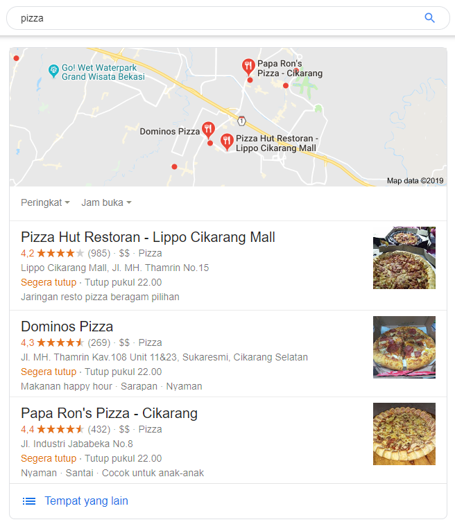
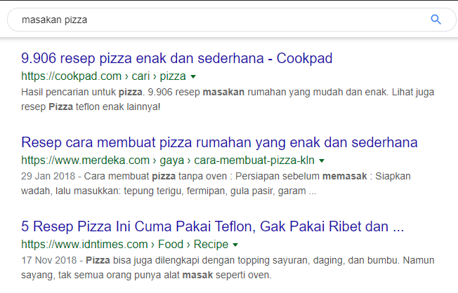
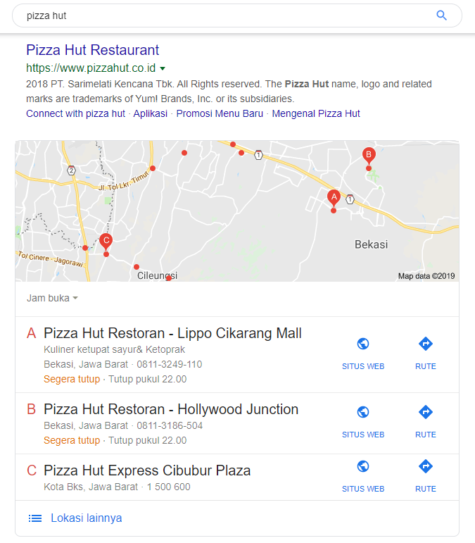

Riset kata kunci adalah proses yang penting dalam SEO, seperti titik awal sebelum [menulis artikel](https://www.aradechoco.com/menulis-artikel-seo/) untuk situs web. 

Karena itu, tidak aneh jika kebanyakan orang cenderung memulai melakukan [Optimasi SEO](https://www.aradechoco.com/seo-dasar-untuk-pemula/) dengan meriset kata kunci yang ingin di bidik terlebih dahulu. 

Tapi proses [melakukan riset kata kunci](https://www.aradechoco.com/cara-riset-keyword-untuk-pemula/) masih membingungkan untuk pemula dan dapat menjadi masalah bagi SEO jika memilih kata kunci yang salah.

Banyak orang yang sudah memiliki latar belakang SEO harus memahaminya Ketika kita memilih kata kunci untuk SEO, kita cenderung mencari berbagai fitur ini.

- Apakah kata kunci terkait dengan situs web dan bisnis tersebut
- Kata kunci yang memiliki jumlah volume pencarian yang sedang
- Merupakan kata kunci yang tidak terlalu kompetitif
- Memilih kata kunci long-tail, bukan wide keywords.

Di atas merupakan cara-cara memilih Kata Kunci SEO yang baik, tapi ada satu hal yang banyak SEO pemula cenderung mengabaikan dan tidak memperhatikan adalah **Konteks setiap pencarian kata kunci**.

Frasa ini berarti Setiap pencari memiliki niat untuk menginginkan sesuatu dari Google, dan niat itu ditunjukkan melalui Kata Kunci yang dia gunakan. Tentu saja, Google menggunakan niat pencari untuk menentukan apa hasilnya (SERP) yang seharusnya.

Istilah "Konteks Kata Kunci dalam Pencarian" dan SEO akan jauh lebih mudah. Pertama-tama, coba cari melalui Google bersama dengan contoh di bawah ini. Dan pada akhirnya, saya akan memberi tahu Anda apa yang ditunjukkan contoh di bawah ini kepada Anda.

Saat mencari melalui Google dengan kata kunci luas `"Pizza"`, hasil yang dikembalikan Google akan menjadi toko pizza di area itu, ditampilkan sebagai Cuplikan Kaya seperti Peta yang mengidentifikasi toko pizza di area si pencari. 

Ketika saya menambahkan kata `"Masakan"` menjadi kata `"Masakan Pizza"`, hasil pencarian akan segera berubah menjadi cerita yang berbeda. Hampir semua hasil akan menjadi situs web yang menyediakan informasi resep pizza dan bahan-bahannya.

Jika saya mencoba mencari menggunakan nama restoran pizza, "Pizza Hut", hasilnya akan berubah ke situs web tentang Pizza Hut dan lokasi toko Pizza Hut terdekat dengan saya.

Dan akhirnya, ketika saya menambahkan kata PNG ke akhir kata kunci "Pizza PNG", hasil pencarian akan memunculkan gambar Pizza yang merupakan file PNG.

Dari semua 4 pencarian, terlepas dari semua kata kunci yang terkait dengan Pizza, tetapi memiliki hasil yang sama sekali berbeda, karena Google sedang mencoba untuk melihat maksud pencari diungkapkan melalui Kata Kunci bahwa ia sedang mengomunikasikan kebutuhan apa.

- Apakah dia lapar?
- Dia mencari alamat ke toko pizza?
- Dia mencari gambar pizza?
- Apakah dia menemukan cara untuk membuat pizza?

Ini dikenal sebagai konteks pencarian di mana Google mencoba untuk mengamati dan mengembangkan hasil pencarian yang paling sesuai dengan kebutuhan pencari. 

Maksudnya untuk memberikan pengalaman terbaik untuk semua pengguna. 

**Apa hubungannya dengan SEO ?**

Jika situs web Anda adalah situs web toko online tetapi memilih untuk jenis kata kunci memberikan informasi, Contoh : **memberikan pengetahuan untuk melakukan SEO**, **Bagaimana melakukan SEO On-page?**, **Seberapa baik Backlink untuk web kita?** 

Mungkin Anda akan kehilangan kesempatan untuk bersaing dengan web toko online lainnya, kemudian menmyerah. Bisa dibilang kalah sebelum berjuang.

Sebaliknya, jika situs web tersebut adalah jenis informasi penawaran , maka pilihlah kata kunci yang sesuai dengan konteks situs web tersebut, seperti Kata Kunci yang **membantu menyelesaikan masalah bagi pengguna**, Kata Kunci **bagaimana cara** yang mengajarkan pengguna untuk melakukan berbagai hal, Kata kunci yang **menyajikan konten**, atau berita yang terkait dengan subjek itu.

Dengan melakukan Optimasi SEO dan fokus pada Kata Kunci seperti sebelumnya, tidaklah cukup, tapi harus memperhatikan juga semua konteks pengguna yang relevan yang sesuai dengan nilai yang diberikan atau tidak oleh situs web tersebut. Karena konteks ini merupakan faktor penting dalam menentukan hasil pencarian yang Google pilih untuk tunjukkan kepada pengguna.

#Terkait

- [Cara Menempatkan Keyword yang SEO pada Postingan blog](https://www.aradechoco.com/menempatkan-keyword-seo/)
- [Cara Riset Keyword : Long Tail dan Short Tail untuk Pemula](https://www.aradechoco.com/cara-riset-keyword-untuk-pemula/)
- [Cara menulis artikel SEO agar tampil di halaman pertama Google](https://www.aradechoco.com/menulis-artikel-seo/)