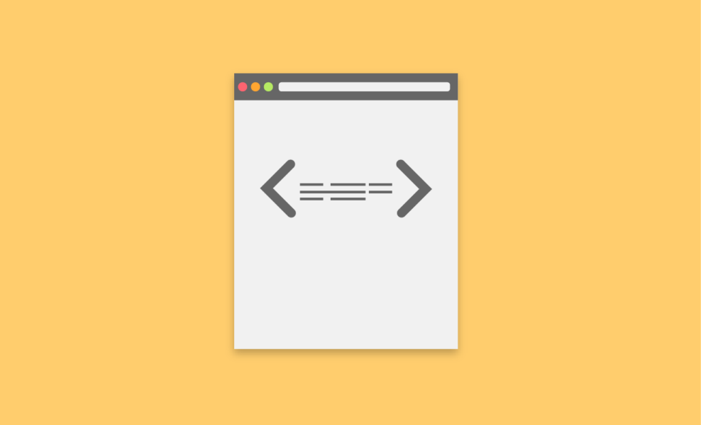
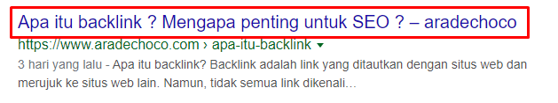
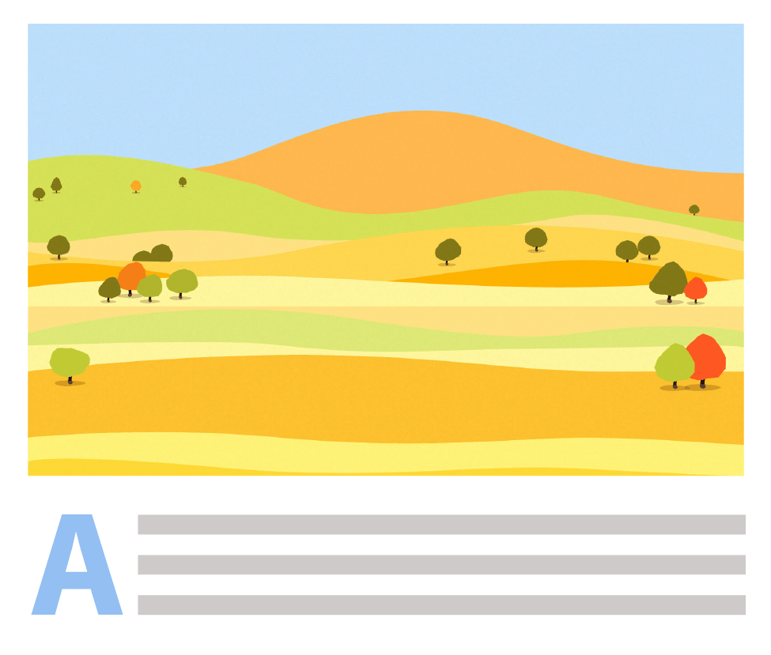
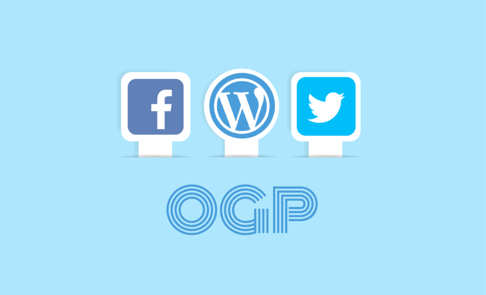
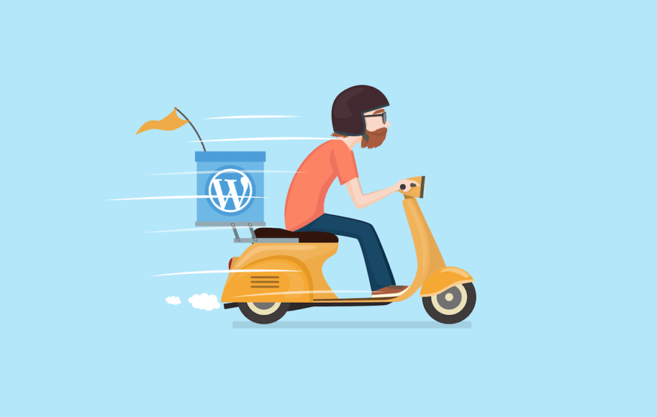
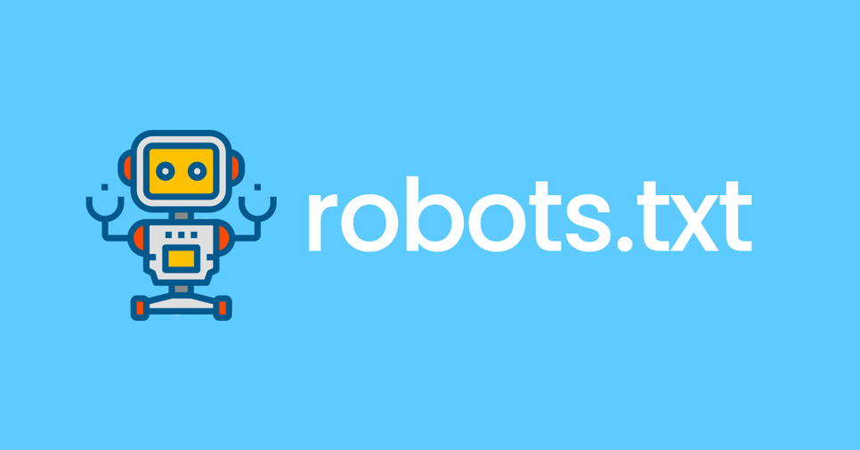

Apakah Anda baru mengenal **SEO Search Engine Optimization** (optimasi mesin pencari) dan tidak benar-benar tau harus mulai dari mana? Jangan khawatir, bahkan dengan tips SEO dasar Anda dapat meningkatkan peringkat web Anda secara signifikan. Dibawah ini saya akan berbagi tips dan dasar dasar SEO untuk pemula.

## Apa itu SEO ?

SEO adalah singkatan dari Search Engine Optimization dan salah satu teknik digital marketing paling efektif. Anda harus memastikan bahwa situs web dan konten Anda memiliki peluang terbaik untuk mencapai hasil peringkat tinggi di halaman pertama mesin pencari (SERP). 

Sederhananya, itu berarti Anda ingin mengoptimalkan situs web dan konten sedemikian rupa sehingga mesin pencari seperti Google dapat memahami tentang isi situs web dan konten Anda sehingga dapat menentukan peringkat tinggi untuk kata kunci tertentu.

Semakin tinggi peringkat situs web dan konten Anda di Google, semakin banyak orang akan mengkliknya. Dengan demikian, semakin banyak penjualan atau konversi yang akan didapatkan.

## 1. Tips SEO dasar 

### Tulis Artikel Lebih Panjang

Menurut [faktor peringkat SEO 2017](http://searchengineland.com/now-know-googles-top-three-search-ranking-factors-245882) , konten masih merupakan faktor yang sangat penting dalam peringkat SEO di samping faktor-faktor lain seperti [backlink](https://www.aradechoco.com/apa-itu-backlink/) dan RankBrain. Tapi, pada akhirnya konten dalam bentuk postingan blog atau video yang menarik pengguna dan pelanggan pada saluran akuisisi.

Dari sudut pandang SEO, konten lebih lama lebih kuat karena mencakup lebih banyak kata kunci dan juga memberikan lebih banyak informasi yang bermanfaat bagi pengguna. [Neil Patel](https://neilpatel.com/blog/why-you-need-to-create-evergreen-long-form-content-and-how-to-produce-it/) menyebutkan bahwa konten harus lebih dari `2.000 kata` dan berkualitas tinggi. Kualitas konten Anda sangat penting karena pengguna mencari konten yang unik dan menarik yang menurut mereka layak untuk dibagikan. Jadi, jika Anda ingin pengguna benar-benar tertarik pada konten Anda, syaratnya yah harus berkualitas tinggi.

Postingan blog yang lebih panjang juga membantu menurunkan `Bounce rate`. Bounce rate adalah persentase pengunjung yang meninggalkan web/blog anda setelah hanya membuka satu halaman saja, Artinya, semakin kecil persentase bounce rate berarti semakin bagus web anda.  Konten yang lebih panjang yang menarik dan berkualitas tinggi akan membuat orang tinggal lebih lama di situs web Anda. Waktu tinggal yang lebih lama sangat bermanfaat untuk peringkat Anda karena itu adalah tanda bagi Google bahwa orang-orang menikmati konten Anda. 

## 2. Fresh Content / Konten Segar 

Di samping posting yang lebih panjang, Google juga menyukai konten baru yang segar. Bukan hanya karena konten segar lebih relevan bagi pengguna, tapi juga memberi tahu Google bahwa Anda masih aktif.
Karena itu, kita semua tahu betapa sulitnya untuk terus-menerus menghasilkan konten berkualitas tinggi yang baru. Jadi, alih-alih membuat postingan baru berkualitas tinggi yang luar biasa, Anda dapat menyewa `Jasa Tulis Artikel` atau mengubah dan memperbaharui konten yang sudah lama.

Satu tips mudah adalah bahwa kita dapat memperbarui salah satu posting populer yang sudah lama. Cukup tambahkan beberapa informasi saat ini dan yang relevan dan publikasikan kembali posting dengan tanggal saat ini. Peluang sempurna untuk teknik SEO dasar ini adalah posting yang memiliki satu tahun di judulnya. Contoh yang baik adalah "Tips SEO Terbaik 2018". Posting blog seperti itu dapat diperbarui dengan sangat mudah dengan menambahkan beberapa informasi yang relevan dan mengubah judul menjadi "Tips SEO Terbaik 2019". Jangan lupa untuk mempublikasikan ulang posting dengan tanggal saat ini.

Ada banyak cara lain untuk menggunakan kembali konten yang ada. Cari tahu lebih lanjut tentang cara mudah untuk mencapai tujuan pemasaran konten Anda tanpa menghasilkan konten baru.  

## 3. Riset Kata Kunci yang akan di bidik

Menggunakan kata kunci yang tepat sangat penting! Meskipun Anda perlu menggunakan kata kunci yang tepat yang mendefinisikan tentang konten Blog Anda, Anda juga perlu mempertimbangkan apa yang dicari pengguna dan pelanggan yang potensial.
Kata kunci yang ingin di bidik harus relevan dengan topik konten blog sehingga mesin pencari dapat mengindeks situs web Anda dengan benar. Anda mungkin tidak ingin membingungkan mesin pencari dengan berfokus pada kata kunci yang sama sekali tidak relevan dengan produk atau layanan Anda yang sebenarnya, atau topik utama blog Anda.

Namun, Anda juga ingin fokus pada kata kunci yang sebenarnya dicari pelanggan. Mungkin peringkat nomor satu untuk kata kunci tertentu, tetapi jika tidak ada yang mencari kata kunci tersebut maka akan akan susah untuk mendapatkan trafik. Ini seperti menjual produk yang tidak ada yang meminta dan tidak ada yang benar-benar menginginkannya.
Ada beberapa `tools riset keyword` di luar sana yang dapat membantu menemukan apa yang dicari pengguna dan pelanggan Anda. 

Anda dapat menggunakan tools-tools seperti `Ubersuggest` atau `Kwfinder`.
Yang harus Anda cari adalah indikator utama seperti `volume pencarian` (rata-rata pencarian bulanan) dan `skor kompetisi` yang menunjukkan betapa mudah atau sulitnya untuk menentukan peringkat untuk kata kunci tertentu. Tentu saja, perlu diingat bahwa kata kunci harus relevan dengan situs web, produk atau layanan Anda.

Selain itu, Anda dapat menggunakan kata kunci `long-tail` dan kata kunci `LSI` untuk meningkatkan peringkat situs web dan untuk memberikan lebih banyak informasi ke mesin pencari sehingga mereka dapat mengetahui apa isi konten Anda.

- Kata kunci long-tail adalah istilah yang lebih spesifik. Jika Anda menggunakan kata kunci yang lebih spesifik dalam konten Anda atau situs web Anda, kemungkinan Anda dapat meningkatkan dan menerima lebih banyak pengunjung ke situs Anda.
- Kata kunci LSI (pengindeksan semantik laten) adalah kata kunci yang terkait dengan kata kunci utama Anda. Mereka bukan sinonim tetapi homonim (mirip artinya), dan akan membantu mesin pencari untuk memahami tentang apa konten Anda.

### Kata Kunci Long Tail

Kata kunci Long Tail adalah kata kunci seperti `“ransel pendakian terbaik untuk wanita”`. Mereka biasanya berisi empat atau lebih kata yang secara jelas menentukan apa yang dicari konsumen dan / atau niat mereka .

Seperti yang disebutkan, jika kata kunci Anda sangat spesifik, Anda mungkin mendapatkan lebih sedikit lalu lintas tetapi lebih banyak pengunjung yang mencari persis apa yang Anda tawarkan dan karena itu lebih cenderung untuk membeli. Bisa dikatakan `Kualitas melebihi kuantitas`. Selain itu, biasanya lebih mudah untuk menentukan peringkat kata kunci yang sangat spesifik karena lebih sedikit situs web yang menargetkannya. Jadi, mengapa tidak mencobanya?

### Kata Kunci LSI'

LSI adalah singkatan dari pengindeksan semantik laten dan berarti kata kunci yang terkait dengan topik tentang halaman Anda. Menyertakan kata kunci LSI dalam konten Anda akan membantu Google dan mesin pencari lainnya lebih memahami relevansi Anda dengan suatu topik.
Anda ingin memasukkan kata kunci LSI karena semakin banyak mesin pencari mencari lebih banyak pencocokan topik daripada pencocokan kata kunci saat mengembalikan hasil pencarian. Dan cara mereka melakukannya adalah dengan mencari kata kunci LSI.

Idenya adalah bahwa ketika menulis tentang topik tertentu, Anda secara alami akan memasukkan kata-kata yang berhubungan. Katakan misalnya, jika Anda memiliki agen konsultan SEO, Anda secara alami akan memasukkan kata-kata terkait berikut di situs web Anda.

```
konsultan internet marketing seo

konsultan pemasaran seo

prusahaan konsultan seo

konsultan top seo

pakar pemasaran internet seo

layanan pemasaran internet seo

```

Kata kunci ini relevan dan bermanfaat bagi Google untuk mengekstrak informasi. Dengan informasi ini, mesin pencari dapat memastikan bahwa konten Anda benar-benar berbicara tentang topik yang ingin Anda bidik.

Meskipun Anda secara teknis akan menggunakan kata kunci LSI hanya dengan menulis konten, tidak ada salahnya untuk melihat apakah Anda mungkin melewatkan beberapa yang bagus.
Tools keyword yang baik dapat membantu Anda menemukan kata kunci long-tail dan kata kunci LSI. 

## 4. Optimalkan Judul, Meta Tag , Heading Dan Sub-Heading



Anda sudah memiliki konten yang panjang dan berkualitas tinggi, dan sudah paham dalam memasukkan kata kunci? Lalu bagaimana dengan judul, meta, heading dan title tag?

### Title Tag / Judul

Title Tag adalah indikator tag on-page terkuat dan membawa bobot yang signifikan untuk peringkat SEO Anda. Jika ini adalah pertemuan pertama Anda dengan tag judul, ini adalah contoh bagaimana pengguna melihatnya:



Berikut daftar singkat untuk mengoptimalkan tag judul Anda:

- ✔️ Semua judul harus unik per halaman
- ✔️ Panjangnya tidak boleh lebih dari 60 karakter (termasuk homepage)
- ✔️ Tag judul harus mengandung kata kunci target

Jika Anda membuat judul tanpa mempertimbangkan kata kunci, Anda akan kehilangan peluang untuk page one. Tag judul harus berisi kata kunci yang relevan dengan halaman web dan konten Anda. Ini memberi tahu mesin pencari tentang apa situs web atau halaman itu dan membantu mengindeks situs Anda menurut kata kunci tersebut.

Google menentukan konten halaman dari tag judul, jadi pastikan untuk menjelaskan konten Anda secara akurat. Ingat perilaku pencarian Anda sendiri di Google. Segera setelah Anda menekan "enter" atau "search", Anda mungkin membaca tiga hasil pertama dengan lebih cermat melihat judul. Semakin bertarget dan menggetarkan judulnya, semakin tinggi peluang klik.

Gunakan modifier untuk judul Anda. modifier adalah kata deskriptif yang digunakan dengan kata kunci utama. Mesin pencari memberi tahu cara untuk mengembalikan halaman web paling relevan yang berisi konten terkait. Beberapa contoh modifier judul adalah yang dimulai dengan "bagaimana", "solusi", "terbaik", "panduan untuk", "tahun" atau "tinjauan". Anda dapat menggunakan tools kata kunci yang memiliki filter pola agar cepat mendapatkan saran kata kunci yang mengikuti pola itu.

> **note** Ingatlah untuk mengoptimalkan judul Anda agar beresonansi dengan apa yang dicari pengguna, daripada mengisinya dengan kata kunci ! Anda dapat menggunakan alat untuk membantu Anda melakukan brainstorming pada judul yang paling menarik.

### Meta Tag Atau Deskripsi Meta


Deskripsi meta adalah paragraf pendek teks (potongan informasi) di bawah URL yang digunakan sebagai pratinjau dalam hasil pencarian.
Uraian meta harus ditempatkan di tag `<head>` HTML halaman Anda, dan biasanya harus sepanjang `160 karakter`.

Sangat penting untuk memiliki deskripsi meta yang baik karena itulah yang dilihat pengguna ketika mereka memutuskan apakah akan mengklik tautan ke situs Anda atau tidak. 

Google dapat, atau mungkin tidak memutuskan untuk menggunakan deskripsi Anda dan bahkan dapat mengubahnya. Meskipun demikian, ini adalah salah satu tempat yang ingin Anda perhatikan karena Google akan menggunakannya ketika mencoba memahami tentang apa halaman Anda.

Anda juga dapat memasukkan kata kunci dalam deskripsi meta untuk membuatnya menarik bagi pembaca aktual yang membaca halaman hasil mesin pencari (SERP).

### Title and Sub Title 

Title and Sub Title adalah tag html `<h1>` , `<h2>` , dan `<h3>` . Ini adalah bagian judul atau yang dilihat pengguna di halaman.
Seharusnya hanya ada satu tag `<h1>` per halaman web, dan judul ini harus mengandung kata kunci utama yang menjadi fokus konten Anda.
  
Google memeriksa tag ini dengan cara yang sama seperti memeriksa tag judul, jadi bersiaplah untuk mengoptimalkan bagian halaman ini. Sering kali, `content management system` (CMS) seperti `WordPress` secara otomatis menyertakan tag `<h1>` untuk judul halaman atau artikel. Dalam hal ini, tidak perlu memasukkan yang lain.
  
Sub judul  `<h2>` dan `<h3>` juga harus menyertakan kata kunci target Anda. Namun, ingatlah untuk selalu menulis untuk pembaca dan menggunakan judul yang membantu pengunjung agar mudah menavigasi halaman Anda. 

## 5. Optimalkan URL Anda

Sebagian besar pengguna akan sedikit memperhatikan URL Anda, ini penting untuk `SEO dasar` Anda. Praktek terbaik adalah menjaga URL Anda sesederhana mungkin. [Google ingin Anda memiliki URL yang sederhana](https://support.google.com/webmasters/answer/76329?hl=en) dan mudah dibaca untuk menyediakan struktur URL yang logis.

Ini cukup berarti bahwa alih-alih angka Anda harus menggunakan teks dalam URL Anda, dan bahwa URL harus menggambarkan tentang konten apa sesingkat mungkin. Ya, semudah itu. Cobalah untuk bersikap logis dan mudah digunakan untuk URL Anda.

Di samping itu, Anda dapat menggunakan URL Anda sebagai tempat untuk meletakkan kata kunci utama Anda. Tentu saja, tidak ada isian kata kunci yang dibolehkan! Ingat, sesingkat mungkin. Namun, memasukkan kata kunci utama ke URL harusnya tidak menjadi masalah.

Misalnya, jika Anda menulis tentang `film terbaik sepanjang masa`, URL Anda bisa terlihat seperti ini: `domain.com/film-terbaik`.

Tapi tunggu dulu! Jangan mulai mengubah semua URL sekarang. Kecuali jika URL saat ini berdampak negatif pada situs Anda, lebih baik untuk tidak mengubah URL karena dapat membingungkan bagi Google dan juga bagi pengguna. Karena itu, mungkin lebih baik untuk mulai mengoptimalkan URL untuk konten baru nanti.

Namun, jika Anda harus mengubah URL Anda saat ini untuk memberikan struktur URL yang lebih baik, jangan lupa untuk melakukan [Redirects 301](https://moz.com/learn/seo/redirection) (permanen) yang tepat. 

## 6. Tautan balik / Backlink

Bagian lain yang sangat penting dari SEO dasar adalah backlink. Sebuah [backlink](https://www.aradechoco.com/apa-itu-backlink/) adalah link yang ditautkan dengan situs web dan merujuk ke situs web lain.
Sementara backlink adalah faktor penentu utama yang membantu situs web Anda meningkatkan peringkatnya, backlink tersebut harus berasal dari situs web berkualitas tinggi yang terkait dengan topik konten Anda.

Misalnya, jika blog Anda tentang pemasaran SEO, Anda ingin mendapatkan backlink dari situs terkait pemasaran. Juga, kualitas atau lebih tepatnya peringkat domain dari situs web yang memberikan Anda backlink menunjukkan seberapa kuat backlink itu untuk Anda. Mesin pencari berpikir bahwa semakin banyak backlink yang relevan dan berkualitas tinggi yang Anda miliki, semakin bermanfaat situs Anda bagi pengguna.

Pada dasarnya, Google melihat backlink sebagai pengguna memberikan suara bahwa konten Anda bermanfaat. Semakin tinggi peringkat domain suatu situs web, semakin besar kekuatan backlink atau "suara" mereka karena mereka telah menetapkan diri sebagai sumber yang dapat diandalkan.

Backlink berkualitas tinggi harus menjadi salah satu prioritas SEO dasar utama Anda karena dapat dengan mudah meroket peringkat Anda. Dengan alat backlink, Anda dapat dengan mudah memulai dan memburu beberapa backlink yang berharga itu.

Baca lebih lanjut tentang [bagaimana backlink mempengaruhi peringkat SEO Anda](https://www.aradechoco.com/apa-itu-backlink/). 

## 7. Outgoing link / Tautan keluar

Tautan keluar adalah tautan di situs web yang mengarah ke domain lain. Contoh tautan keluar adalah [contoh situs web](http://example.com/) ini , yang dapat Anda klik. 

Saat Anda menautkan ke domain lain di konten Anda, ini membantu mesin pencari memahami tentang apa halaman Anda. Memiliki tautan keluar yang lebih terkait dan berkualitas tinggi di situs web Anda dapat meningkatkan peringkat web Anda dengan membuat situs Anda diakui sebagai yang dapat dipercaya dan berkualitas tinggi oleh mesin pencari.

Berikut adalah beberapa hal yang harus Anda pertimbangkan saat melakukan tautan keluar:

- ✔️ Tautan ke blog yang relevan,
- ✔️ Tidak ada tautan agricultural (bagian dari jaringan blog pribadi),
- ✔️ Hindari terlalu banyak tautan keluar.

Ketika Anda memasukkan tautan ke situs lain dalam artikel blog, Anda juga dapat mencoba menghubungi situs tersebut untuk memberi tahu mereka bahwa Anda memberi mereka backlink. 
Dengan melakukan hal itu, mereka mungkin menemukan cara untuk memasukkan tautan ke situs Anda di halaman mereka juga. Menautkan ke situs web lain dapat bermanfaat bagi Anda dan pesaing Anda.

**Apakah menautkan ke situs lain membantu SEO?**

Ketika Anda menautkan ke halaman lain yang relevan dan berkualitas tinggi itu menunjukkan kepada Google bahwa konten Anda berharga dan bermanfaat bagi pengguna. Karenanya, menautkan ke situs lain bermanfaat untuk SEO selama Anda menautkan ke halaman yang berkualitas tinggi dan relevan.

Selain itu, pemilik laman web yang Anda tautkan mungkin memeriksa situs web Anda dan karenanya menghasilkan beberapa trafik tambahan untuk konten Anda. Seperti disebutkan, mereka bahkan mungkin membalas budi dan memberi Anda backlink untuk kedepannya. Siapa yang tahu! 
Menautkan ke halaman berkualitas tinggi lainnya tentu tidak akan merusak peringkat SEO Anda selama tidak berlebihan. 

## 8. Internal link / Tautan internal 

Meskipun penting untuk menerima tautan balik dan tautan ke orang lain, jangan lupa untuk menaruh link ke web Anda sendiri.
Internal link adalah tautan dari satu halaman web munuju ke halaman web lain dalam domain yang sama. Tautan ini sangat berguna karena memungkinkan pengguna untuk lebih mudah menavigasi situs. 

Contohnya [SEO Untuk Pemula - Langkah Awal Untuk Naik Peringkat Google](https://www.aradechoco.com/SEO-untuk-pemula/).

Tautan internal dapat membantu Anda mempromosikan konten Anda sendiri dan produk atau layanan Anda yang lain.

## 9. Optimize Image / Gambar Anda 



Gambar adalah faktor penting untuk mengoptimalan konten. Itulah sebabnya saya memutuskan untuk memasukkan pengoptimalan gambar dalam panduan **SEO dasar** ini. Kita semua tau bahwa visual seperti gambar lebih cepat dan lebih mudah diproses. Mereka lebih menarik daripada paragraf teks yang tak ada habisnya.

Sementara gambar bagus untuk pembaca blog Anda, mesin pencari dapat mengalami kesulitan memahami gambar. Untuk memudahkan mesin pencari untuk mengindeks gambar Anda dengan benar, Anda dapat menggunakan `teks alt`. Teks alternatif digunakan dalam kode HTML dan menjelaskan apa yang ditampilkan gambar. Setiap gambar harus memiliki deskripsi terperinci dan akurat dalam teks altnya.

Di samping manfaat untuk mesin pencari, alt teks juga penting untuk tuna netra atau tunanetra karena mereka memerlukan komputer atau perangkat lunak khusus yang membaca teks dengan keras. Selain itu, jika gambar tidak terlihat atau dimuat teks alt Anda akan ditampilkan dan membiarkan pembaca tahu apa gambar yang seharusnya ditampilkan.

`Last but not least`, dengan gambar yang dioptimalkan Anda meningkatkan peluang Anda untuk mencapai peringkat tinggi pada gambar Google , yang dapat menghasilkan trafik tambahan untuk situs web Anda.
Kode HTML yang menyertakan teks alt untuk gambar akan terlihat seperti ini:

```html
 
```
Dalam contoh ini, teks alt mengatakan, "foto kucing oren".
Meskipun baik untuk menulis teks alt Anda sangat deskriptif, berhati-hatilah untuk hanya memasukkan deskripsi yang benar dan untuk menghindari spam kata kunci.

## 10. Hindari Abdobe Flash  

**[Adobe Flash](https://en.wikipedia.org/wiki/Adobe_Flash)** adalah aplikasi di dalam halaman web yang memungkinkan streaming multimedia dan interaksi pengguna. Memiliki Flash di halaman web Anda bisa menjadi hal yang baik dan buruk. 
Namun, jika halaman Anda sebagian besar terdiri dari Flash, halaman akan berjalan lebih lambat dari biasanya dan itu akan memakan waktu untuk loading. Selain itu, Flash tidak dapat diakses di sebagian besar ponsel yang tidak disukai oleh pembaca, maupun Google.

**[Jakob Nielsen](https://www.nngroup.com/articles/flash-99-percent-bad/)** mengatakan bahwa sekitar 99% situs web yang menggunakan Flash memiliki kegunaan yang lebih rendah dan hambatan utama untuk desain yang baik. Jadi, solusi terbaik adalah tidak menggunakan flash. Ada banyak situs web, tools, dan plugin yang dapat memeriksa apakah Anda menggunakan Flash atau tidak. 


## 11. Social media



Seperti yang kita ketahui, akun media sosial dapat menjadi alat yang ampuh untuk situs web Anda, dan memiliki akun Facebook, Twitter, Linkedin, dan Instagram adalah salah satu dasar untuk mempromosikan situs web Anda.

Meskipun media sosial tidak secara langsung berkontribusi pada peringkat Anda atau SEO, tapi dengan memanfaatkannya dapat membawa lebih banyak tayangan dan mendapatkan trafik ke situs Anda yang secara tidak langsung meningkatkan peringkat Anda di Google. Dengan kata lain, meskipun social media signal bukan merupakan faktor peringkat langsung di Google, itu tentu berdampak pada peringkat tidak langsung.

Karena itu, jangan abaikan media sosial saat melakukan SEO dasar. Yang terbaik adalah mengoptimalkan posting media sosial dan mendistribusikan konten di antara jaringan Anda. Dengan beberapa tips dan trik mudah, Anda dapat memanfaatkan kekuatan penuh dari akun media sosial secara maksimal.
Misalnya, Anda dapat menyesuaikan tautan yang dapat dibagikan, dan menambahkan kartu Twitter ke situs web Anda untuk mempromosikan produk atau layanan Anda.

Sebuah Twitter card (atau Facebook Open Graph code) yang disertakan ke dalam halaman web akan memungkinkan Anda untuk mengontrol teks dan gambar yang muncul ketika orang-orang berbagi link ke halaman di media sosial. Ini tidak hanya akan membuat postingan lebih terlihat di media sosial, tetapi juga menyajikan konten secara lebih profesional di semua jaringan Anda.

Ada berbagai jenis card, tetapi semuanya memungkinkan untuk melampaui batas 140 karakter dan melampirkan tangkapan layar media saat Anda membagikan kiriman. Selain itu, Anda juga dapat melihat bagaimana tampilan kartu Twitter Anda dengan mencari URL Anda di alat validator kartu.

Juga, jangan lupa kata kunci dan tagar tersebut ! saya sudah membahas tentang kata kunci untuk judul Anda, deskripsi meta, konten, dan lain-lain. Tetapi jangan membuat kesalahan dengan mengabaikan kata kunci dalam konten dan tagar media sosial Anda. Aturan yang sama berlaku, mereka harus relevan dengan konten Anda dan yang terbaik ketika mereka memiliki volume pencarian yang tinggi yang menunjukkan bahwa orang benar-benar mencari kata kunci tersebut.

Alat kata kunci dapat membantu Anda menemukan data pencarian itu. Namun, waspadalah terhadap isian spam kata kunci dan hanya sertakan kata kunci yang masuk akal dan alami.

Alat yang dapat membantu melacak beberapa akun media sosial disebut [Hootsuite](https://hootsuite.com/) . Melalui alat ini Anda dapat mengelola berbagai akun media sosial pada satu platform tunggal. 


## 12. Kecepatan Situs / Site Speed



Kecepatan situs adalah faktor yang sangat penting yang dicari oleh mesin pencari saat meranking situs web. Google sendiri mengatakan bahwa [kecepatan load halaman adalah sinyal peringkat SEO](https://webmasters.googleblog.com/2010/04/using-site-speed-in-web-search-ranking.html) , dan [MunchWeb](http://munchweb.com/effect-of-website-speed) menemukan bahwa 75% pengguna tidak akan mengunjungi kembali situs web yang membutuhkan waktu lebih dari 4 detik untuk memuat seluruh halaman.

Jika Anda ingin mengetahui kecepatan muat situs web, Anda dapat menggunakan [GTMetrix](https://gtmetrix.com/) untuk memeriksanya. 

## 13. Mobile Friendly / Responsive


Apa artinya menjadi mobile friendly? Ini berarti bahwa situs web atau halaman web responsif atau adaptif terhadap perangkat seluler. Terkadang jika halaman web tidak responsif, akan ada situs web seluler yang terpisah (mis. "M.mywebsite.com"). 

Pada 2015,  [Google](http://searchengineland.com/library/google/google-mobile-friendly-update) mulai menghukum situs web yang tidak mobile friendly. Jadi, sebelum membangun sebuah web pastikan thema yang Anda pakai `Responsif` dan `Mobile friendly`.

Di samping penalti Google, penting juga untuk memiliki situs web mobile friendly karena saat ini sebagian besar konsumen menelusuri internet dengan smartphone mereka. Jika situs Anda tidak dioptimalkan itu dapat menyebabkan pengalaman pengguna menjadi sangat buruk. Statistik melaporkan bahwa pada tahun 2018, hingga 52% dari lalu lintas situs web global berasal dari perangkat seluler. 


## 14. Sitemap / Peta Situs


Memiliki sitemap memudahkan mesin pencari untuk menemukan dan memberi peringkat untuk halaman web Anda. Peta Situs memberi tahu mesin telusur kapan perubahan telah dibuat dan laman yang mungkin terlewatinya. Tidak ada ruginya memiliki sitemap dan juga meningkatkan SEO dasar Anda. Pada dasarnya, dengan sitemap Anda dapat memastikan bahwa halaman web diperbarui lebih cepat dan Google dapat menemukan semua halaman Anda. 

## 15. Robots.txt



File Robots.txt memberi tahu web crawler mesin pencari halaman mana yang akan dimasukkan dalam indeks mereka dan mana yang tidak. Misalnya, jika Anda tidak ingin halaman atau gambar tertentu dirayapi oleh bot, maka Anda dapat membatasi atau "melarang" bot itu dari akses. Ini membuat halaman pengujian dan halaman tidak dimaksudkan untuk pengguna agar tidak dimasukkan dalam hasil pencarian.

Anda dapat membuat file robots.txt dari awal tetapi ada banyak tools yang tersebar di luar sana yang dapat membuatnya jika Anda tidak punya waktu. Tentu saja, sesuatu yang harus Anda perhatikan jika memiliki halaman yang tidak ingin Anda pertimbangkan di Google. 

## 16. Menganalisa 


Untuk mengetahui apakah SEO dasar membantu situs web, Anda harus mulai melacak data situs web yang Anda bangun. [Google Analytics](https://analytics.google.com/analytics/web/) adalah alat yang hebat yang dapat menganalisis dan menyimpan semua data Anda. Tidak hanya melacak dari mana sumber trafik berasal, tetapi juga bagaimana cara mereka sampai di sana. Alat ini juga membuat laporan khusus untuk Anda saat menganalisis data Anda.

**Google Analytics** memungkinkan Anda untuk mengukur hasil halaman web melalui data `real-time`. Data ditampilkan dari jaringan yang berbeda seperti pencarian organik, pencarian berbayar, rujukan, media sosial dan lalu lintas langsung.

Memiliki Google Analytics akan membantu Anda membuat keputusan bisnis tentang di mana Anda harus menginvestasikan sumber daya dan dapat memandu Anda dalam upaya SEO. 

## 17 Berfikir seperti Pengunjung Anda

Terakhir tetapi tidak kalah pentingnya, memikirkan pengguna Anda mungkin adalah taktik SEO dasar yang paling penting.

Seperti yang disebutkan, ada banyak cara bagaimana agar dapat meningkatkan trafik ke situs web Anda: baik itu rujukan, langganan email bulanan, atau hasil share di sosial media seperti Facebook dan sebagainya.

Sementara SEO adalah cerita yang sama sekali berbeda dengan kekuatan dan kelemahannya sendiri, Anda sudah dapat mencapai banyak hal dengan beberapa perbaikan SEO dasar ke situs web Anda. Namun, ide utama SEO di era digital saat ini adalah mengutamakan pengunjung / pengguna.

Selalu mencoba untuk memikirkan apa yang dicari pengunjung Anda, keinginan mereka dan kebutuhan mereka. Ketika Anda menulis konten dengan tujuan untuk memenuhi kebutuhan pengunjung atau untuk menjawab salah satu pertanyaan yang mereka miliki, Anda memiliki peluang terbaik bahwa Google menganggap konten Anda berharga.

Jadi, Pastikan saja konten Anda bermanfaat bagi pengguna dan pengunjung Anda, dan terapkan taktik **SEO dasar** yang telah saya sebutkan sehingga Anda dapat memiliki peluang terbaik di mata Google dan akan memberikan peringkat tinggi untuk situs web Anda.


## Apakah Artikel ini Bermanfaat?

Ini hanya beberapa topik utama untuk memulai optimisasi mesin pencari. Mulai perbaiki laman web Anda dan bandingkan hasil sebelum dan sesudah. Lihat apa yang paling cocok untuk Anda karena semua halaman dan industri berbeda. SEO telah ada selama beberapa waktu dan akan selalu berkembang, jadi pastikan untuk selalu memperbarui halaman web Anda.

Ingatlah selalu hal ini, tujuan utama Google adalah memberikan pengalaman terbaik bagi pengguna mereka. Itu berarti halaman web yang paling relevan dan berkualitas tinggi adalah orang-orang yang akan mendapatkan peringkat tinggi. Kiat yang saya sebutkan di atas adalah sinyal yang diandalkan mesin pencari untuk menunjukkan apakah suatu halaman layak dan berkualitas tinggi, dan karenanya dapat membantu halaman Anda untuk peringkat setinggi yang layak.

Jangan lupa ceritakan pengalaman Anda setelah melakukan riset! 👍🏼 

Jika Anda memiliki saran, pertanyaan, atau rekomendasi, silakan tinggalkan komentar di bawah ini.

## Panduan SEO ✔️

**Jika ingin membaca lebih lanjut tentang SEO dasar, lihat artikel terkait ini:** 

- [Tanya Jawab tentang Optimasi SEO](https://www.aradechoco.com/seo-link-building/) - Link Building
- [Apa itu backlink ?](https://www.aradechoco.com/apa-itu-backlink/) Mengapa penting untuk SEO ?
- [Cara Riset Keyword](https://www.aradechoco.com/cara-riset-keyword-untuk-pemula/) : Long Tail dan Short Tail untuk Pemula
- [SEO Untuk Pemula](https://www.aradechoco.com/SEO-untuk-pemula/) - Langkah Awal Untuk Naik Peringkat Google 
- [Membangun Backlink melalui Wikipedia](https://www.aradechoco.com/backlink-melalui-wikipedia/)
- [Cara mengetahui peringkat situs web](https://www.aradechoco.com/cara-mengetahui-peringkat-situs-web/)
- [Cara Menghapus Backlink Spam](https://www.aradechoco.com/menghapus-backlink-spam/)
- [Optimasi SEO dengan Schema Markup](https://www.aradechoco.com/optimasi-schema-markup/)
- [Teknik SEO](https://www.aradechoco.com/teknik-seo/) - Aspek penting yang tidak boleh di lewatkan
- [Teknik Black Hat SEO Yang Harus di Hindari](https://www.aradechoco.com/teknik-black-hat-seo/)
- [Teknik White Hat SEO](https://www.aradechoco.com/teknik-white-hat-seo/)
- [Cara Menempatkan Keyword yang SEO pada Postingan blog](https://www.aradechoco.com/menempatkan-keyword-seo/)


