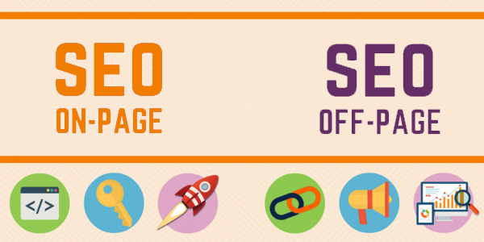

Tanggal 27 september 2019 ini kemarin google berulang tahun dan [Google baru saja mengumumkan akan merilis pembaruan inti](https://webmasters.googleblog.com/2019/08/core-updates.html).
Untuk marketer yang telah mengawasi lingkup SEO selama beberapa tahun ini, Anda akan tahu bahwa Google telah membuat beberapa perubahan besar pada algoritma mesin pencari mereka. 
Sejauh ini, sudah ada Panda, Penguin, Hummingbird, dan Pigeon, juga banyak pembaruan 2.0, 3.0, dan 4.0 juga.

## Apa itu SEO On-Page ?

Ketika Anda memikirkan taktik pengoptimalan mesin pencari paling dasar seperti menggunakan **kata kunci** dalam konten Anda dan mengoptimalkan **meta deskripsi**, **kode HTML**,**title tag**, dan **tag alt**, itulah dasar untuk SEO on-page. 
SEO one-page merujuk semua langkah yang dapat diambil secara langsung di dalam situs web Anda untuk meningkatkan posisinya di peringkat pencarian. Ini termasuk taktik dasar yang tercantum di atas, tetapi juga mempertimbangkan hal-hal seperti **kualitas konten** secara keseluruhan, **kinerja web**, dan **struktur konten**.

### Faktor SEO on-page :

#### Keyword / kata kunci

Pikirkan audiens Anda dan [keyword](https://www.aradechoco.com/cara-riset-keyword-untuk-pemula/) yang mereka cari, dan cobalah untuk membuat dan mengoptimalkan konten situs web Anda di sekitar kata kunci tersebut.

#### Meta description 

Meta deskripsi adalah deskripsi singkat yang muncul di bawah URL di halaman hasil mesin pencari dan di bawah judul di post sosial. Ini harus menggambarkan konten pada halaman itu, tetapi yang lebih penting, pastikan untuk memasukkan kata kunci yang relevan di area ini sehingga dapat dikenali oleh crawler mesin pencari. Coba dan buat deskripsi hingga di bawah 300 karakter untuk memastikan seluruh deskripsi Anda ditampilkan di hasil pencarian. 

#### Alt Text

Teks alternatif mengacu pada kata atau frasa yang dapat dikaitkan dalam file gambar untuk membantu pengindeks-an. Jika Anda memasukkan gambar kucing untuk konten yang membahas kucing, berikan teks-alt untuk gambar itu sebagai "gambar kucing lucu", dan gambar itu akan memberi peringkat untuk frasa tersebut di hasil pencarian gambar.

#### Title Tag

[Title tag](https://www.aradechoco.com/optimasi-meta-tag/) atau Tag judul mengacu pada judul halaman web, atau tajuk utama yang Anda lihat di halaman hasil mesin pencari. Ini adalah hal penting lainnya untuk memasukkan kata kunci yang relevan untuk meningkatkan peringkat di pencarian.

#### SSL / HTTPS

Keamanan web lebih penting daripada sebelumnya di 2018, mengaktifkan teknologi keamanan Secure Sockets Layer (SSL) sangat penting untuk meningkatkan keamanan, kepercayaan, dan visibilitas web. Dengan mengaktifkan SSL, Anda meningkatkan kemungkinan bahwa pihak ketiga tidak datang antara server web Anda dan server web pengunjung, memastikan bahwa informasi yang dimasukkan di situs aman. Demikian juga, Google sebenarnya lebih suka situs yang mendukung SSL, sehingga penting untuk meningkatkan visibilitas.

#### Struktur URL

Selain faktor-faktor yang tercantum di atas, struktur URL yang terorganisir penting untuk pemasar saat ini, karena memungkinkan mesin pencari dapat merayapi halaman ke halaman dengan lebih mudah , dan membuat navigasi yang baik sangat efisien bagi pengunjung. URL yang mengandung kata kunci dan mudah dipahami cenderung menghasilkan klik, dan juga membantu mesin pencari merayapi situs Anda.

#### Internal Linking

Berbicara tentang internal link , yang menghubungkan secara internal halaman terkait di situs web Anda adalah faktor penting lain dari SEO on-page. Menautkan link relevan yang berbeda di situs Anda memudahkan mesin pencari untuk merayapi semuanya, dan juga membuat pengunjung betah lebih lama.

#### Performa Halaman web

Sementara faktor-faktor lain dari SEO on-page berhubungan dengan kualitas dan struktur konten, kinerja situs web Anda dan halamannya juga merupakan faktor peringkat on-page. Halaman web yang membutuhkan waktu lama untuk dimuat atau tidak ditampilkan dengan benar di seluler atau desktop akan membuat peringkat web lebih rendah di halaman hasil mesin pencari (SERP), karena pengguna akan frustrasi, stress, kemudian pergi dari web Anda yang akan meningkatkan Bounce Rate. 

Mesin pencari mengevaluasi ini dan menggunakannya sebagai kunci dari faktor peringkat web, jadi sangat penting bagi pemilik situs web agar mempertimbangkan ukuran file gambar pada halaman mereka, mengurangi pengalihan, meningkatkan respon seluler situs mereka, dan meminimalkan jumlah dari `CSS / Javascript`.

## Apa itu SEO Off-Page?

Sementara **SEO one-page** merujuk pada faktor-faktor yang dapat dikontrol di situs web Anda sendiri, SEO off-page merujuk pada faktor-faktor peringkat halaman yang muncul dari situs web Anda, seperti [backlink](https://www.aradechoco.com/apa-itu-backlink/) dari situs lain. Ini juga termasuk metode promosi Anda, dengan mempertimbangkan jumlah paparan sesuatu yang didapat di media sosial, misalnya.

### Faktor SEO di luar halaman:

#### Backlink

Jumlah dan kualitas backlink merupakan faktor terbesar dari SEO off-page. Semakin banyak situs yang menautkannya ke konten Anda, semakin baik untuk meningkatkan peringkat web Anda. Hal ini mendorong para pemasar untuk mencoba membangun backlink berbayar, tetapi ada beberapa pendekatan organik yang dapat Anda ambil yang menghasilkan hasil yang efektif, seperti menjadi [penulis tamu](https://aradechoco.com/guest-blog-seo/) ( guest blog ).

#### Domain Authority

Diukur pada skala dari `1-100`, domain authority atau otoritas domain adalah angka yang diberikan oleh mesin pencari untuk menentukan kekuatan situs web Anda. Anggap saja sebagai nilai, pada dasarnya. Situs web dengan otoritas domain yang lebih tinggi menerima preferensi dalam hasil pencarian, sementara situs web dengan otoritas domain yang lebih rendah cenderung peringkat di bagian bawah. Otoritas domain diukur oleh beberapa faktor berbeda, termasuk berapa lama domain Anda (semakin lama semakin baik), sejarah domain, jumlah backlink, dan jumlah halaman error 404 . Dengan memastikan bahwa Anda memiliki situs web yang secara teknis terdengar mengikuti praktik terbaik SEO , Anda dapat memaksimalkan otoritas domain Anda dan meningkatkan peringkat Anda.

#### Berbagi di sosial media

Berbagi di sosial media yang menghasilkan banyak klik tentu akan membantu meningkatkan trafik ke situs dan menghasilkan banyak backlink. Konten yang dibagikan di sosial media juga akan diindeks.

SEO on-page dan off-page bekerja bersama untuk meningkatkan peringkat mesin pencari. Dengan mengerjakan apa yang Anda pelajari hari ini dan membuat konten berkualitas yang didukung oleh SEO on-page, maka Anda akan berada di jalur yang baik untuk mendapatkan backlink, meningkatkan otoritas domain Anda, dan mengendalikan SEO off-page Anda.

**Jika ingin membaca lebih lanjut tentang SEO dasar, lihat artikel terkait ini:**

- [SEO Dasar: 17 Tips Optimasi Yang Wajib Diketahui Pemula](https://www.aradechoco.com/seo-dasar-untuk-pemula/)
- [Tanya Jawab tentang Optimasi SEO](https://www.aradechoco.com/seo-link-building/) - Link Building
- [Apa itu backlink ?](https://www.aradechoco.com/apa-itu-backlink/) Mengapa penting untuk SEO ?
- [Cara Riset Keyword](https://www.aradechoco.com/cara-riset-keyword-untuk-pemula/) : Long Tail dan Short Tail untuk Pemula
- [SEO Untuk Pemula](https://www.aradechoco.com/SEO-untuk-pemula/) - Langkah Awal Untuk Naik Peringkat Google 
- [Membangun Backlink melalui Wikipedia](https://www.aradechoco.com/backlink-melalui-wikipedia/)
- [Cara mengetahui peringkat situs web](https://www.aradechoco.com/cara-mengetahui-peringkat-situs-web/)
- [Cara Menghapus Backlink Spam](https://www.aradechoco.com/menghapus-backlink-spam/)
- [Optimasi SEO dengan Schema Markup](https://www.aradechoco.com/optimasi-schema-markup/)
- [Teknik SEO](https://www.aradechoco.com/teknik-seo/) - Aspek penting yang tidak boleh di lewatkan
- [Teknik Black Hat SEO Yang Harus di Hindari](https://www.aradechoco.com/teknik-black-hat-seo/)
- [Teknik White Hat SEO](https://www.aradechoco.com/teknik-white-hat-seo/)](https://www.aradechoco.com/teknik-white-hat-seo/)
- [Cara Menempatkan Keyword yang SEO pada Postingan blog](https://www.aradechoco.com/menempatkan-keyword-seo/)
- [Optimasi Meta Tag Yang Harus Diketahui Blogger?](https://www.aradechoco.com/optimasi-meta-tag/)
- [Guest Blogging dan Pengaruhnya terhadap SEO](https://aradechoco.com/guest-blog-seo/)
