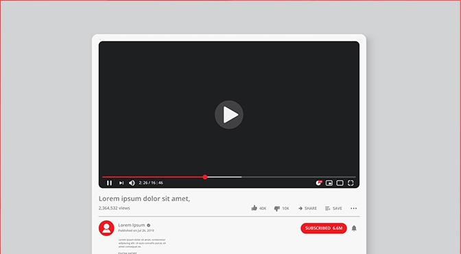

## Apa itu SEO YouTube ?

**SEO YouTube** berkaitan dengan pengoptimalan video, saluran ( chanel ), metadata, playlist ( daftar putar ) dan deskripsi untuk pencarian internal dan eksternal di YouTube.

Selain itu, salah satu cara terbaik untuk melakukan SEO YouTube adalah menyesuaikan informasi dalam video Anda: Subtitle, teks tertutup dan menambahkan transkrip / subtitle.

## Bagaimana cara melakukan SEO YouTube

Kali ini saya akan berbagi tips SEO Youtube untuk menigkatkan peringkat youtube di hasil pencarian. 

**Durasi video YouTube (Panjang Video)**

Pada awalnya, tayangan ( viewrs ) adalah bagian terpenting ketika menentukan peringkat algoritma. Semakin banyak penayangan, semakin besar kemungkinan video akan berada di posisi teratas pada hasil pencarian.

Namun, YouTube telah mengubah kebijakan itu baru-baru ini. Dengan mempertimbangkan komponen tambahan lainnya, termasuk:

- Jumlah komentar
- Jumlah suka
- Total jumlah waktu yang ditonton
- Jumlah share ke jejaring sosial

> Buatlah penonton merasa bahwa mereka terlibat dengan video Anda. 

Metrik ini akan membantu meningkatkan peringkat saat melakukan SEO YouTube.

Meski tidak ada aturan Tetapi panjang durasi video harus "tidak kurang dari 1 menit" karena dua alasan.

- Semakin panjang durasi video, semakin baik. Semakin lama menjaga audiensi di video dan semakin lama penonton akan tinggal.
- Bot YouTube akan menganggap video yang durasinya kurang dari 60 detik itu sebagai `spam`.

## Nama video YouTube

Salah satu kesalahan YouTuber pemula yang paling umum adalah tidak memberikan nama dengan cukup baik. Baik di "`File video` dan `Title video`.

Jika tidak menjelaskan detail video atau konten pada file video (File Mentah) sebelum menguploadnya ke youtube maka bot YouTube tidak akan dapat memahami apa isi video Anda.

Cara menambahkan detail dan deskripsi nama file video:

- Klik kanan pada file video dan pilih `rename`.
- Tambahkan kata kunci yang terkait dengan konten video di bagian Tag Video.
- Beri nama file video Anda dengan kata kunci utama dan kata kunci skunder.
- Tambahkan deskripsi yang menjelaskan tentang apa video tersebut.
- Simpan

> "Setelah mengunggah file ke youtube maka secara otomatis akan sesuai dengan nama file mentah video, pastikan judul dan nama file YouTube Anda sama. "

## Deskripsi video YouTube

Rahasia SEO ini sangat penting: menautkan video YouTube ke halaman situs web Anda atau Profil Sosial media. 

Ini akan membantu mendorong vierws untuk mengetahui lebih lanjut tentang merek / produk Anda dengan " melampirkan tautan dalam deskripsi video "seperti membaca informasi lebih lanjut. Memesan produk dan lainnya.

**Mengoptimalkan deskripsi video**

- Deskripsi harus unik, Google tidak menyukai deskripsi yang duplikat. Bahkan, video dengan deskripsi berulang ulang akan dihukum.
- Deskripsi minimal 200 kata.
- Gunakan kata kunci dalam deskripsi Anda.
- Gunakan kata kunci hanya sekali dalam deskripsi.

## Buat Daftar Putar / playlist di Chanel YouTube Anda.

Playlist adalah langkah terakhir saat setelah mengunggah video di YouTube.

Ini akan membantu mengkategorikan video di Chanel Anda dan membantu penonton memahami tentang apa video Anda. Pastikan untuk membuat playlist baru untuk setiap video dan menambahkan kata kunci yang terkait dengan judul.

##  Buat Thumbnail yang Sesuai dengan Isi Video

Menambahkan gambar sampul khusus dapat membuat kesan pertama yang lebih mengesankan daripada memilih video otomatis. Karena kita dapat menyesuaikan gambar sesuai kebutuhan.

Anda dapat menambahkan gambar pratinjau yang dapat memberi tahu penonton Tentang apa video Anda dan mengapa mereka harus menonton video ini? 

Dengan menambahkan thumbnail video dapat meningkatkan Rasio klik-tayang (CTR).

4 hal yang perlu diingat saat membuat pratinjau video

- Pastikan mengubah ukuran gambar menjadi 1280 x 720.
- Ukuran file gambar harus kurang dari 2MB.
- Gunakan warna-warna cerah atau kombinasikan dua warna cerah. Ini akan membantu pratinjau video Anda menonjol di atas tautan biru dan latar belakang putih. Di halaman hasil Pencarian Google.
- Jenis file gambar harus .JPG, .BMP, .GIF, .PNG.

## Kustomisasi Chanel YouTube Anda.

Di halaman profil chanel, Anda dapat menambahkan Informasi untuk menginformasikan Bot YouTube tentang apa konten Anda. Pastikan untuk mengisi informasi penting di setiap bagian halaman itu.

**4 bagian informasi yang harus di optimalkan**

Gambar latar belakang dan gambar profil.

- Gambar sampul Chanel art

Memberi nama file gambar. Contoh `Nama Chanel - Nama Bisnis -keywords.jpg`

- Deskripsi

Ini adalah cara lain untuk mengirim sinyal ke bot mesin pencari. Untuk membuatnya lebih mudah bagi mereka untuk memahami video Anda,

Gunakan deskripsi secara menyeluruh dan gunakan sekitar 2-3 kata kunci unik kata kunci sekunder dalam deskripsi di bagian atas kalimat.

- Tautan

Tambahkan tautan ke situs web ( Jika ada ) dan halaman media sosial. Untuk membantu meningkatkan traffic ke konten yang relevan.

Tautan juga dapat membantu mesin pencari menghubungkan video Anda ke situs web atau bisnis Anda.

- Subscribe ke chanel yang relevan dengan konten Anda

Berlangganan ke Saluran YouTube Populer yang terkait dengan video atau konten Anda. Google dan YouTube bots Akan memahami konten video dengan lebih baik.

## Bagikan video YouTube ke media sosial.

Secara umum , SEO tradisional melibatkan Struktur Situs Web, Konten, Kecepatan Situs Web, Kode, Kepadatan Kata Kunci, dan [backlink](https://www.aradechoco.com/apa-itu-backlink/).

Tetapi karena pengaruh jejaring sosial saat ini, Google harus memasukkan informasi yang relevan dari jejaring sosial sebagai bagian dari Pertimbangan dengan suatu algoritma Untuk peringkat saat ini.

Ada banyak hal yang dicari Google, seperti memeriksa relevansi informasi. Dengan berfokus terutama pada pengalaman pengguna.

Jika ingin video Anda mendapatkan peringkat tinggi di Google dan YouTube, Anda harus membagikannya ke media sosial. Dengan metode berikut:

- Sinkronisasikan secara otomatis Chanel YouTube Anda ke Facebook, akun Twitter, yang berarti ketika video baru diunggah Ini akan secara otomatis dikirim ke akun jejaring sosial ini setiap saat. 
- Posting ke akun jejaring sosial pribadi.
- Beli layanan berbagi video ke akun jejaring sosial populer.
- Buat Tautan Balik ke Video YouTube Anda dan Sematkan Video.

Dengan semua tips di atas Akan membantu video Anda diindeks di Google dalam 2-3 menit.

Untuk menentukan peringkat kata kunci yang sangat kompetitif seperti SEO YouTube , pakar SEO , Anda harus membuat backlink ke URL video Anda atau menyematkan video Anda di situs web lain juga.

Jika Anda melakukannya dengan benar maka Video Anda akan mendapatkan peringkat yang lebih baik untuk kata kunci tersebut, tetapi jika membuat tautan yang salah maka akan ditandai sebagai spam dan akan segera dihapus dari pengindeksan.

**Saran**

- Buat sejumlah kecil tautan pada suatu waktu selama periode waktu tertentu, seperti 3-4 tautan per minggu, Anda dapat mempublikasikan tautan video YouTube Anda di blog, Pinterest, Tumblr, Web 2.0 dan tanda tangan email. Juga, jangan lupa untuk menambahkan video Anda ke situs web pribadi Anda (jika ada).
- Prosedur peringkat video YouTube Mirip dengan peringkat situs web Faktor utama adalah backlink yang menunjuk ke video Anda. Namun, YouTube memiliki faktor lain: jumlah situs web yang menyematkan video Anda juga akan dipertimbangkan.

**Strategi yang tepat untuk membuat backlink dan menyematkan video untuk SEO YouTube.**

- Berbagi di jaringan bisnis Anda atau merek jejaring sosial: seperti Facebook Fanpage, Twitter Dan di akun Anda sendiri.
- Mengirim video ke OnlyWire (onlywire.com): Membantu mengirim video ke beberapa situs web Bookmark Sosial sekaligus, berdasarkan jumlah Bookmark Sosial yang dimiliki.
- Posting di situs web: Buat konten unik yang relevan dengan video Anda dan tambahkan tautan ke video atau embed video. Dalam konten itu dan pastikan bahwa konten Anda juga memiliki kata kunci yang terkait dengan video Anda.
- Posting di blog pribadi Anda: Jika Anda belum memiliki blog pribadi Saatnya membuatnya dengan konten yang relevan. Kemudian tambahkan tautan ke video Anda Atau sematkan video di konten itu.
- Kirim ke direktori web dan situs web profil bisnis.
- Guest Post: Tulis artikel di blog atau situs web afiliasi, lampirkan tautan, atau sematkan video ke konten itu.

## Tools SEO YouTube

Nama tools ini adalah vidIQ untuk Membantu SEO YouTube.

**Apa itu vidIQ ?**

vidIQ adalah tools gratis yang digunakan untuk Menganalisis informasi status terperinci untuk video YouTube. Tools ini dibuat sebagai ekstensi untuk Browser Chrome. 

Filtur dasar

- Menampilkan keseluruhan peringkat 
- Menampilkan statistik umum seperti Suka, Tidak Suka, Komentar, Share Sosial Media.
- Menampilkan skor SEO video.
- Menampilkan daftar periksa untuk Judul, Deskripsi, Tag, dan lainnya.

**Cara instal vidiQ**

Memasang vidIQ itu mudah. Cukup unduh atau klik untuk menginstal ke Ekstensi Chrome. Klik di [sini](https://vidiq.com/extension/)

**Baca juga**

- [5 Jenis Kata kunci SEO Yang Harus Anda Ketahui](https://www.aradechoco.com/jenis-kata-kunci/)
- [Mengenal SEO dalam 5 menit](https://www.aradechoco.com/mengenal-seo/)
- [7 faktor penting yang menentukan kesuksesan SEO](https://www.aradechoco.com/faktor-kesuksesan-seo/)
