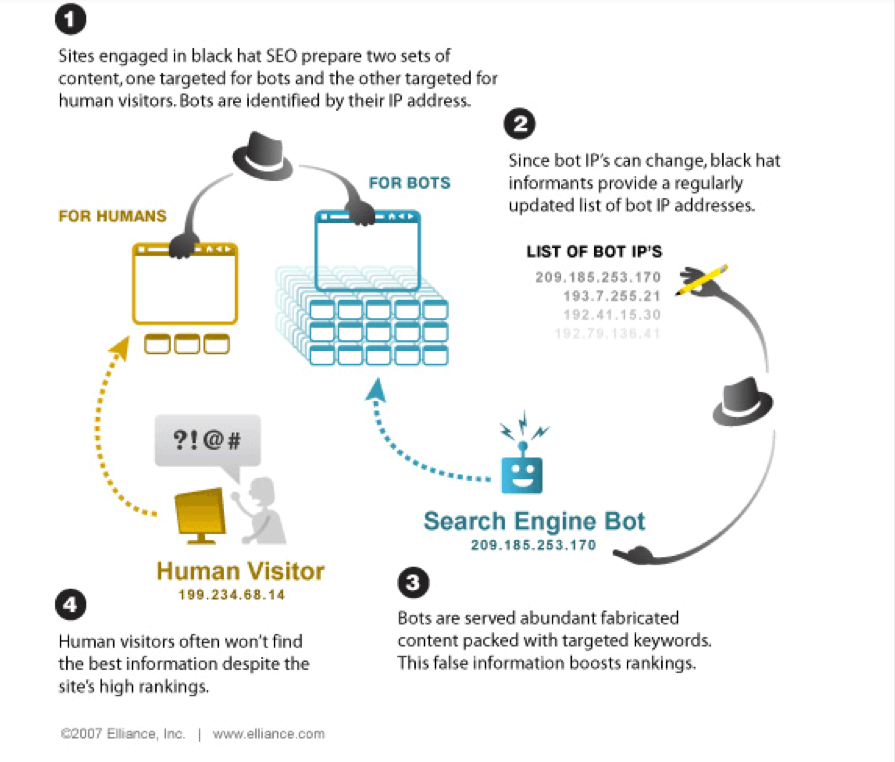

Mendapatkan peringkat di SERP teratas (Halaman Hasil Mesin Pencari) adalah kompetisi yang panjang. Dan di setiap kompetisi pasti ada yang bermain adil dan yang curang!. Di dunia SEO, saya menyebutnya **white hat** dan **black hat** SEO.

**White Hat SEO** membantu dalam mempertahankan peringkat SERP teratas Anda, namun, unutk mencapai peringkat yang lebih tinggi dengan teknik white hat membutuhkan waktu. Di sisi lain, black hat SEO dapat meningkatkan visibilitas mesin pencari Anda dengan cepat, tapi dengan janji kesuksesan jangka pendek dan risiko yang tinggi.

Berikut sedikit penjelasan lebih detail tentang kedua teknik SEO ini:

## Apa itu White Hat SEO?

Setiap upaya SEO yang dijalankan secara etis dengan mengikuti pedoman peringkat Google menandakan bahwa situs tersebut menggunakan [teknik White Hat SEO](https://www.aradechoco.com/teknik-white-hat-seo/). Guest posting, Riset kata kunci, optimisas meta tag, link internal, dll. Adalah beberapa contoh yang terkenal dari teknik white hat SEO.

## Apa itu Black Hat SEO?

Teknik black hat SEO adalah kebalikan dari teknik white hat. Yang berarti bahwa teknik black hat SEO tidak mengikuti pedoman peringkat Google. Jika perayap ( crawler ) mengidentifikasi bahwa situs web Anda menggunakan teknik black hat SEO untuk mencapai peringkat tinggi, maka akan mengindeks situs Anda dan mencegah situs Anda dari peringkat di Google.

**Sekarang…**

Jika situs web Anda tiba-tiba mengalami penurunan peringkat atau menerima pemberitahuan dari Google tentang pengindeksan ulang situs web terkait, maka Anda harus segera memeriksa apakah situs Anda mengikuti teknik black hat SEO. Pada artikel ini, Anda akan menemukan beberapa teknik black hat SEO yang signifikan yang perlu dihindari situs web pada tahun 2019.

## Teknik Black Hat SEO No. 1: Cloaking

Cloaking adalah teknik yang digunakan situs web untuk mengelabui pengguna dan juga spider mesin pencari. Dalam proses ini, dua set informasi dikirim: satu ke spider untuk tujuan pengindeksan, dan satu set informasi kepada pengguna.

Contoh penyelubungan (cloaking) adalah jika Anda mengklik kata kunci di salah satu hasil pencarian untuk kata kunci `Gambar kucing`, tetapi alih-alih mengarahkan Anda ke halaman yang berisi gambar atau informasi tentang kucing,tapi hasilnya mengarahkan Anda ke situs web spam download film. Spider mesin pencari biasanya tidak mengindeks situs yang terselubung, namun, dalam kasus yang jarang terjadi, mereka diindeks secara tidak sengaja tetapi akan dihapus saat mereka diidentifikasi sebagai situs terselubung. Google menghukum situs-situs terselubung semacam itu dengan menghapus indeks dan menghapus peringkatnya.

> **Saran: Cloaking bukan **black hat** 100%, tetapi Anda masih bisa menggunakannya sebagai teknik **white hat**. Iya! Cloaking juga dapat digunakan sebagai teknik white hat , tetapi hanya dalam kasus-kasus tertentu dan sebagai versi cloaking yang ringan.

## Teknik Black Hat SEO No. 2: Pengisian Kata Kunci

Meskipun penting untuk meriset kata kunci yang tepat untuk halaman web Anda, banyak webmaster memiliki kesalahpahaman tentang penempatan kata kunci. Mereka memasukkan halaman dengan kata kunci seakan menempatkannya secara strategis di seluruh konten mereka. Dengan melakukan itu, mereka berharap dapat menghasilkan peringkat yang lebih tinggi. Namun, saat itulah akan menjadi bumerang. Memasukkan kata kunci pada halaman dan merusak keterbacaan dan konteksnya membuatnya menjadi magnet bagi penalti Google.

**Berikut adalah contoh singkat pengisian kata kunci** : 

> “Riset Kata Kunci sangat penting untuk SEO. Jika Anda tidak melakukan riset kata kunci, maka situs Anda akan mendapatkan peringkat yang lebih rendah di SERPs. Jadi, Anda perlu melakukan riset kata kunci yang relevan untuk peringkat yang lebih tinggi. Anda dapat menggunakan alat penelitian kata kunci gratis untuk melakukan riset kata kunci."

Konten bisa ditulis dengan sedikit menyebutkan kata kunci `riset kata kunci` untuk membuatnya lebih masuk akal. Tapi, hanya untuk mendapatkan peringkat tinggi di SERP, kata kunci itu ditempatkan 5 kali dalam paragraf pendek. Isi kata kunci bertentangan dengan pedoman peringkat Google dan jika Anda masih menggunakannya pada tahun 2019 ini, bersiaplah untuk melihat peringkat Anda turun.

**Bagaimana dengan kata kunci tersembunyi?**

Terkadang, untuk tidak mengganggu konteks dan keterbacaan konten, situs web mencoba menyembunyikan kata kunci yang berlebihan dari pengguna. Bagaimana? Mereka mengubah warna teks untuk mencocokkan latar belakang halaman, membuat mereka tidak terlihat oleh pengguna sementara masih terlihat oleh crawler.

Gagasan di balik ini adalah bahwa crawler akan dapat menemukan kata kunci dan memberi peringkat konten sementara konten masih masuk akal bagi pembaca. Banyak situs menganggap menyembunyikan kata kunci sebagai cara `licik` untuk peringkat lebih tinggi, tetapi pada akhirnya, Google akan dapat menemukan teknik black hat ini dan akan menghukum situs tersebut.

> **Setelah mengoptimalkan konten Anda, hitung kepadatan kata kuncinya:

**Keyword Density** = `Frekuensi kata kunci yang digunakan / Total jumlah kata dalam sebuah artikel.`

Kepadatan kata kunci yang ideal harus dalam antara 1 sampai 3% . Melebihi persentase menandakan bahwa Anda telah mengisi konten situs web Anda dengan terlalu banyak kata kunci. Plus, pastikan untuk menggunakan kata kunci yang tepat untuk konten web Anda. Sebuah alat kata kunci dapat membantu Anda untuk menemukan kata kunci yang terbaik yang kemudian dapat menempatkan di konten Anda dengan cara yang alami.

Cari tahu di mana Anda harus [meletakkan kata kunci di posting blog Anda](https://www.aradechoco.com/menempatkan-keyword-seo/).

## Teknik Black Hat SEO No. 3: Duplicate Content

Menyalin ( copas ) konten dari situs lain dan mempostingnya di milik Anda sebagai 'asli' adalah penjiplakan dan Google mengidentifikasinya dengan cepat. Dan sekali crawler spider Google secara konsisten menemukan duplikat konten, dan segera mengindeks-indeks mereka.

Selain itu, ada banyak pendeteksi plagiarisme yang tersedia di internet yang dapat memeriksa apakah konten Anda dijiplak atau tidak. Sebagian besar dari mereka juga menyediakan sumber yang tepat dari mana informasi tertentu telah disalin. Misalahnya [Copyscape](https://www.copyscape.com/) dan [Smallseotools](https://smallseotools.com/plagiarism-checker/).

> **note: Jangan menyalin seluruh postingan, salin bagian dan kutip sumbernya atau tambahkan link sumber. Anda tidak perlu menyalin seluruh posting. Jika Anda menemukan bahwa informasi tertentu telah dijelaskan di beberapa artikel lain, Anda dapat menyalin bagian tertentu itu dan memasukkannya dalam posting Anda. Namun, pastikan untuk menautkan kembali ke artikel asli atau menambahkan URL sumber.

## Teknik Black Hat SEO No 4: Halaman Doorway Dan Gateway

[Membangun backlink](https://www.aradechoco.com/backlink-melalui-wikipedia/) adalah salah satu [teknik SEO](https://www.aradechoco.com/teknik-seo/) paling efektif. Tautan masuk dari situs DA yang lebih tinggi meningkatkan peringkat SERP situs web dengan meningkatkan DA dan kredibilitas online.

Tetapi, untuk mencapai ketiga manfaat ini dengan cepat, situs web biasanya mulai membeli backlink. Mereka sering mulai membayar jasa backlink untuk menghasilkan sejumlah link bagi mereka. Backlink itu tidak selalu dari situs DA yang bagus, dan bisa dari niche yang tidak terkait dengan web yang akan dimasukkan backlink, atau domain yang mempromosikan konten spam. Jika situs memiliki link yang mengarah dari domain tersebut, itu dapat merusak kredibilitas dan kualitas backlink mereka, yang memengaruhi peringkat situs dan DA secara signifikan.

Saran saya jangan membeli backlink dari **jasa backlink** yang belum terpercaya, dan mulailah [membangun backlink yang berkualitas](https://www.aradechoco.com/apa-itu-backlink/)

Ada beberapa strategi membangun backlink white hat yang harus digunakan situs Anda untuk membangun tautan masuk saecara alami. Anda dapat menggunakan **Guest post**, **komentar blog**, **posting forum**, dll. Atau, Anda dapat melakukan audit situs situs web pesaing Anda dan menganalisis data backlink mereka untuk menemukan peluang backlink yang baik untuk situs web Anda sendiri.

## Kesimpulan

Saran saya jangan menggunakan teknik **Black Hat SEO** untuk mengarahkan trafik ke domain mereka. Saya telah melihat situs yang menggunakannya dan menerima kesuksesan sesaat, tetapi akhirnya, masing-masing situs web itu berada di bawah radar Google dan mendapat penalti.

Selain itu, Google selalu memperbaharui dan meningkatkan algoritma peringkat hampir setiap hari, dan ini memungkinkannya untuk mengidentifikasi dan menghukum situs menggunakan black hat SEO dalam sekejap!

Jadi, jika Anda masih menggunakan teknik black hat SEO , Anda harus berhenti sekarang juga!

## Jika ingin membaca lebih lanjut tentang SEO dasar, lihat artikel terkait ini: 

- [SEO Dasar:](https://www.aradechoco.com/seo-dasar-untuk-pemula/) 17 Tips Optimasi Yang Wajib Diketahui Pemula
- [Tanya Jawab tentang Optimasi SEO](https://www.aradechoco.com/seo-link-building/) - Link Building
- [Apa itu backlink ?](https://www.aradechoco.com/apa-itu-backlink/) Mengapa penting untuk SEO ?
- [Cara Riset Keyword](https://www.aradechoco.com/cara-riset-keyword-untuk-pemula/) : Long Tail dan Short Tail untuk Pemula
- [SEO Untuk Pemula](https://www.aradechoco.com/SEO-untuk-pemula/) - Langkah Awal Untuk Naik Peringkat Google 
- [Membangun Backlink melalui Wikipedia](https://www.aradechoco.com/backlink-melalui-wikipedia/)
- [Cara mengetahui peringkat situs web](https://www.aradechoco.com/cara-mengetahui-peringkat-situs-web/)
- [Cara Menghapus Backlink Spam](https://www.aradechoco.com/menghapus-backlink-spam/)
- [Optimasi SEO dengan Schema Markup](https://www.aradechoco.com/optimasi-schema-markup/)
- [Teknik SEO](https://www.aradechoco.com/teknik-seo/) - Aspek penting yang tidak boleh di lewatkan
- [Cara Menempatkan Keyword yang SEO pada Postingan blog](https://www.aradechoco.com/menempatkan-keyword-seo/)

