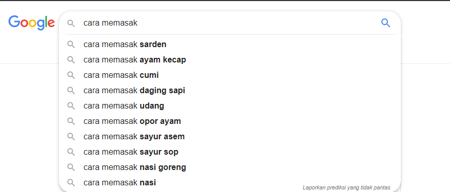
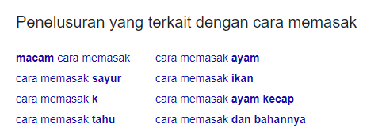

Banyak pemula mendambakan kesuksesan instan yang mengarahkan mereka untuk mengikuti teknik SEO yang tidak etis yang disebut [Teknik Black Hat SEO](https://www.aradechoco.com/teknik-black-hat-seo/). 

Meskipun pelaksanaan teknik-teknik tersebut dapat membantu peringkat situs web menjadi lebih tinggi dari pesaing mereka di SERP, tapi itu hanya bertahan sementara.

Bot mesin pencari akan terus merayapi situs web black hat yang berada di bawah radar mereka, hasilnya dapat membuat situs web menjadi de-rangking dan de-indeks. 

Jadi, dengan mengikuti teknik black hat dapat menghapus seluruh situs web Anda dari Google. Untuk menghindari risiko itu, Anda harus mengandalkan teknik SEO etis (juga disebut teknik White Hat SEO) untuk mencapai peringkat yang lebih tinggi dan untuk mengungguli pesaing Anda di SERP ( Search Engine Result Page ).

## Apa itu White Hat SEO?

Mengikuti strategi SEO resmi Google untuk meningkatkan visibilitas dan peringkat Anda disebut dengan White Hat SEO. Dasar dari setiap pedoman resmi Google adalah sederhana, 'mengutamakan pengguna'. 

Hampir setiap bulan, Google melakukan pembaruan baru yang bertujuan untuk meningkatkan kualitas pencarian untuk memberikan hasil yang lebih baik dan akurat untuk pengguna sesuai dengan permintaan pencarian mereka.

Namun, menggunakan teknik SEO white hat dapat menjadi sulit untuk mencapai peringkat tinggi karena situs web lain mungkin sudah menargetkan kata kunci yang sama.

Kita semua tahu bahwa Google selalu memberi peringkat untuk konten yang berkualitas pada SERP, jadi, bagaimana cara memberi tahu Google bahwa konten kita juga lebih baik?

Pada artikel ini, saya akan berbagi **beberapa teknik white hat SEO paling populer** untuk mengungguli pesaing Anda di Google.

## Riset Keyword

#### Apa itu riset kata kunci?

Proses pencarian keyword yang relevan dengan volume pencarian tinggi tapi persaingan yang lebih rendah, dan menambahkannya ke database kata kunci atau daftar kata kunci target Anda, disebut [riset keyword / kata kunci](https://www.aradechoco.com/jenis-kata-kunci/). 

Ini adalah komponen dasar untuk membuat mesin pencari jadi friendly, dengan menargetkan kata kunci yang tepat agar dapat meningkatkan peringkat Anda di SERPs.

#### Bagaimana cara melakukan riset keyword?

Ada banyak tools untuk meriset kata kunci yang tersedia di internet yang dapat membantu menemukan kata kunci yang tepat untuk situs web Anda. Satu tools riset keyword yang gratis adalah [Google AdWords](https://ads.google.com/home/tools/keyword-planner/).

Cari tahu [cara riset keyword yang tepat](https://www.aradechoco.com/cara-riset-keyword-untuk-pemula/).

Namun, pesaing Anda pasti memiliki cara dan tools yang berbeda dan mungkin Tools Premium, jadi jika Anda ingin mengungguli mereka, Anda harus melakukan riset kata kunci yang sangat tertarget, tapi untuk pemula gunakan tools yang gratis dulu sebagai acuan untuk kedepannya.

## Riset Keyword Berdasarkan Intent Pengguna

Melakukan riset kata kunci berdasarkan niat pengguna dapat meningkatkan peluang peringkat Anda bersama dengan tingkat konversi saat Anda menargetkan pengguna yang tepat. 

Karena itu, Anda harus mengidentifikasi maksud pengguna di balik permintaan pencarian dan mengoptimalkan konten Anda.

Salah satu cara untuk mengidentifikasi maksud pencarian pengguna adalah melalui Google. Anda dapat memasukkan kueri apa pun di kolom pencarian dan fitur saran otomatis Google akan memberi Anda pertanyaan terkait. Pertanyaan ini didasarkan pada apa yang dicari orang di Google.

Juga, ada bagian 'pencarian terkait dengan ...' di akhir SERP. Anda dapat memeriksanya juga dan memperpanjang daftar kata kunci berbasis niat Anda lebih lanjut.

# Riset Keyword Berdasarkan Pesaing Anda

Ketika berbicara tentang mengungguli pesaing Anda, belajar tentang kata kunci apa yang mereka gunakan dan target adalah penting. Untuk menemukan kata kunci yang menjadi target pesaing Anda, Anda dapat menggunakan tools [Competitor Analysis](https://blog.rankwatch.com/how-to-conduct-seo-competitor-analysis/) .

Setelah Anda mengambil daftar kata kunci pesaing Anda, penelitian kata kunci Anda akan menjadi lebih disempurnakan karena Anda tahu persis kata kunci apa yang akan ditargetkan untuk peringkat di atas pesaing Anda di Google.

Setelah Anda membuat konten yang menargetkan kata kunci pesaing Anda, Anda dapat menggunakan beberapa metode membangun backlink untuk mengungguli pesaing Anda. Dan jangan khawatir, 'mencuri' backlink pesaing Anda bukanlah teknik Black hat SEO; ini hanya teknik smart white hat SEO.

## Desain & Navigasi Situs Web yang Disempurnakan

Situs web Anda harus memiliki desain yang mudah dinavigasi. Tidak hanya meningkatkan UX (Pengalaman Pengguna), tetapi juga meningkatkan peringkat situs web Anda. Google menggunakan beberapa faktor dan juga sinyal pengguna untuk memberi peringkat situs web. 

Jika situs web Anda memiliki desain dan navigasi yang buruk, pengguna akan dengan cepat meninggalkan situs Anda yang meningkatkan `bounce rate`.

Tingkat bounce rate yang sangat tinggi adalah sinyal negatif SEO dan karenanya akan mempengaruhi peringkat Anda secara negatif. Oleh karena itu, pastikan situs web Anda dirancang dengan baik dengan navigasi yang **User Friendly**, untuk memastikan bahwa pengguna akan tinggal lebih lama di situs web Anda.

Kriteria lain dari desain situs web yang baik adalah rasio kontras warnanya. Rasio kontras warna yang baik memastikan bahwa situs Anda mudah dibaca untuk pengguna, meningkatkan UX situs web Anda. 

Ada beberapa alat di internet yang dapat membantu Anda [mengoptimalkan rasio kontras warna situs web Anda](https://developers.google.com/web/tools/lighthouse/) .

## Buat Konten Berkualitas

[Membuat konten yang berkualitas dan unik](https://www.aradechoco.com/menulis-artikel-seo/) adalah strategi yang tidak pernah menua dalam SEO. Baik orang dan mesin pencari lebih suka konten yang memberikan nilai unik. 

[Saat membuat konten](https://www.aradechoco.com/judul-artikel-seo-friendly/), Anda harus menganalisis apakah dan sejauh mana pesaing Anda sudah membahas topik tersebut. Sangat membantu untuk mempelajari pendekatan mereka dan untuk menyusun daftar aspek yang belum mereka bahas dalam posting mereka tentang topik yang sama.

Setelah menganalisis konten pesaing, Anda dapat membuat konten yang mencakup semuanya - area yang dicakup pesaing Anda serta informasi tambahan. Dengan cara ini, Anda dapat membuat nilai lebih bagi pengguna daripada pesaing Anda.

## Link Building 

[Link Building](https://www.aradechoco.com/seo-link-building/) adalah salah satu teknik white hat SEO paling kuat dan dapat mengarahkan banyak sekali lalu lintas ke domain Anda sekaligus meningkatkan kredibilitas dan otoritasnya. 

Hampir setiap situs web yang mendapat peringkat di bagian atas hasil pencarian memiliki jumlah tautan yang layak, dan ini menunjukkan kepada Google bahwa situs web tersebut kredibel dan harus berkualitas tinggi. 

Meskipun backlink adalah bagian yang sangat penting dari SEO, Anda tidak boleh **membeli backlink** untuk meningkatkan peringkat Google Anda. `Membeli backlink` adalah teknik black hat SEO dan dapat membuat Anda dihukum oleh Google .

Sebaliknya, Anda harus membangun link secara alami. Ada beberapa [metode membangun backlink](https://www.aradechoco.com/apa-itu-backlink/) untuk melakukannya. 

Misalnya, Anda dapat mendekati situs web yang mempunyai otoritas domain yang tinggi untuk membangun tautan melalui [Guest Blogging](https://www.aradechoco.com/guest-blog-seo/) atau menjadi penulis tamu. 

Namun, pastikan untuk hanya mencari backlink dari situs web berkualitas tinggi dan relevan dengan situs Anda. Karena, tautan dari situs web spam dapat membahayakan peringkat SEO Anda.

### Teliti Backlink Pesaing Anda

Jika Anda ingin mengungguli pesaing Anda, Anda harus memiliki backlink berkualitas tinggi. Ingat, jumlah backlink kurang penting daripada kualitas backlink. Tentu saja perlu memiliki jumlah backlink yang layak, tetapi mereka harus berasal dari situs otoritas tinggi.

Sama seperti kata kunci, Anda dapat `meniru` backlink pesaing juga. Anda dapat memanfaatkan [tools Pemeriksa Backlink](https://www.rankwatch.com/backlinks/) untuk melakukan riset backlink komprehensif pada pesaing Anda dan mulai memeriksa profil backlink mereka.

Setelah Anda mengumpulkan lebih banyak informasi tentang domain-domain yang memiliki link ke pesaing Anda, Anda dapat mendekati situs web tersebut untuk guset post / postingan buku tamu dan peluang tautan lainnya.

## Luangkan Waktu

Teknik / strategi White Hat SEO tidak akan memberikan kesuksesan instan. Diperlukan waktu (sekitar sebulan) bagi situs web Anda untuk mengalami peningkatan peringkat.

Saya tahu, ada banyak faktor yang berperan di sini. Anda mungkin tidak menargetkan kata kunci yang tepat, atau mungkin kata kunci yang Anda targetkan terlalu kompetitif. Namun, lebih baik menghabiskan waktu dan upaya menyempurnakan teknik white hat SEO Anda daripada menggunakan teknik black hat seo dan menjadi mangsa dari penalti Google.

Jadi, terus tingkatkan teknik white hat Anda untuk memberikan nilai lebih kepada pengguna, dan dengan beberapa waktu Anda akan melihat hasilnya.

## Jika ingin membaca lebih lanjut tentang SEO dasar, lihat artikel terkait ini: 

- [Tanya Jawab tentang Optimasi SEO](https://www.aradechoco.com/seo-link-building/) - Link Building
- [Apa itu backlink ?](https://www.aradechoco.com/apa-itu-backlink/) Mengapa penting untuk SEO ?
- [Cara Riset Keyword](https://www.aradechoco.com/cara-riset-keyword-untuk-pemula/) : Long Tail dan Short Tail untuk Pemula
- [SEO Untuk Pemula](https://www.aradechoco.com/SEO-untuk-pemula/) - Langkah Awal Untuk Naik Peringkat Google 
- [Membangun Backlink melalui Wikipedia](https://www.aradechoco.com/backlink-melalui-wikipedia/)
- [Cara mengetahui peringkat situs web](https://www.aradechoco.com/cara-mengetahui-peringkat-situs-web/)
- [Cara Menghapus Backlink Spam](https://www.aradechoco.com/menghapus-backlink-spam/)
- [Optimasi SEO dengan Schema Markup](https://www.aradechoco.com/optimasi-schema-markup/)
- [Teknik SEO](https://www.aradechoco.com/teknik-seo/) - Aspek penting yang tidak boleh di lewatkan
