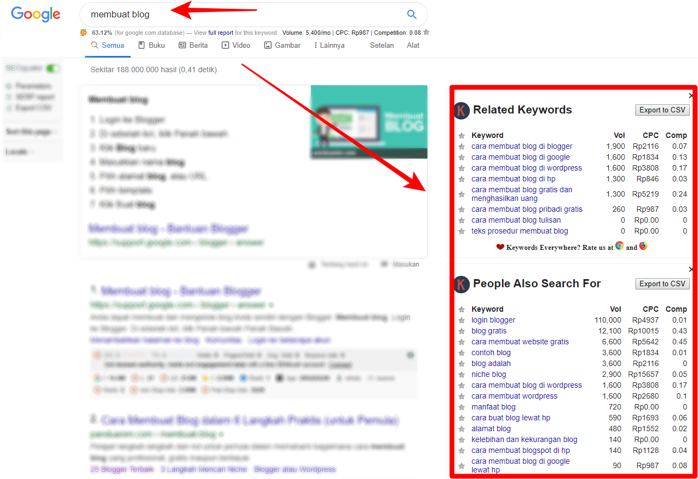
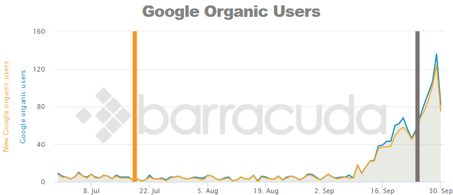
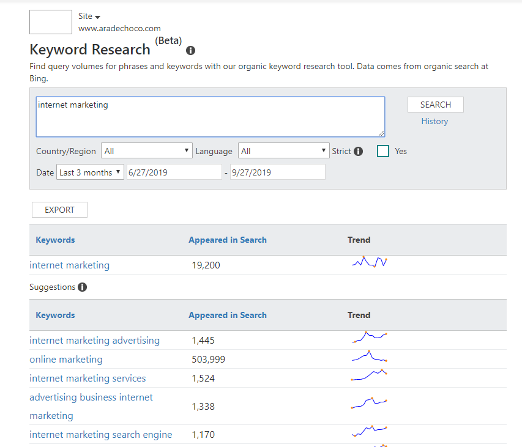
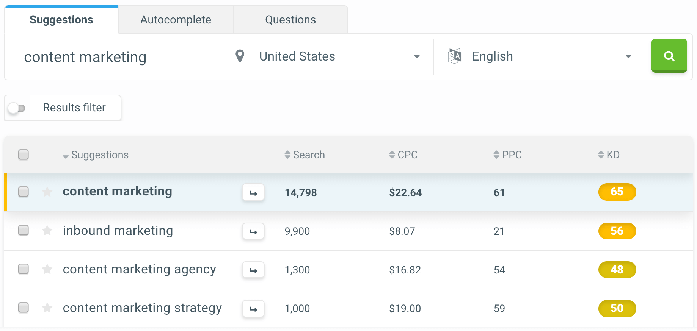

Jika ingin memulai belajar tentang SEO atau ingin mencapai hasil yang lebih baik dengan biaya yang tidak banyak untuk memaksimalkan website atau blog anda agar bisa tampil di halam pertama pencarian google, berikut ini adalah 25 tools SEO gratis terbaik untuk digunakan.

## 1. [Answer The Public](https://answerthepublic.com/)

**Temukan **450+** ide keyword dalam hitungan detik**.

Sebagian besar alat SEO mendapatkan data mereka dari tempat yang sama, contohnya **Google Keyword Planner**.

Answer The Public sedikit berbeda.

Tools ini dapat menemukan pertanyaan yang diajukan orang-orang di forum, blog, dan media sosial.

Dan mengubah pertanyaan itu menjadi keyword atau kata kunci yang sangat mengagumkan:

**Fitur Terbaik**: `Vs. Kata kunci`

Anda akan terkejut betapa banyaknya orang mencari kata kunci "X vs. Y" di Google.

(Misalnya: "iPhone vs. Android")

Dan Jawab Publik memiliki bagian dari hasil yang didedikasikan untuk "Vs. Kata kunci ”.

## 2. [Woorank’s SEO & Website Analysis Tool](https://chrome.google.com/webstore/detail/seo-website-analysis/hlngmmdolgbdnnimbmblfhhndibdipaf?hl=en)

Dapatkan daftar peningkatan SEO dalam hitungan detik.

Ini adalah **ekstensi Chrome** yang sangat berguna.

Pertama, Anda bisa mendapatkan skor SEO keseluruhan.

Kemudian, tools ini menunjukkanbya secara tepat bagaimana meningkatkan SEO on-page dan off-page situs Anda.

**Fitur Terbaik**: `Marketing Checklist`

Sebagian besar tools SEO hanya memberi tahu Anda tentang masalah ... bukan solusi.

Apa yang keren tentang **Woorank** adalah bahwa ia dapat memberi daftar tindakan apa yang harus dilakukan yang bisa di gunakan untuk memperbaiki masalah yang Anda hadapi.

## 3. [Animalz Revive](https://revive.animalz.co/)

Tingkatkan dan perbarui konten lama.

Animalz Revive membantu Anda menemukan konten yang lebih lama di situs web Anda yang membutuhkan pembaruan, peningkatan… atau keduanya.

Sebelum memakai tools ini, Anda harus login melalui email yang terkait dengan akun Google Analytics Anda. Dan menunggu 24 - 48 jam. Meski agak membuang waktu, setidaknya alat ini memberi tahu artikel mana yang perlu di perbaharui.

**Fitur Terbaik**: “Traffic Loss Since Peak (Views)”

Fitur ini membuat Anda tahu persis berapa banyak pengunjung yang hilang karena tidak memperbarui konten Anda.

## 4. [CanIRank](https://www.canirank.com/)

Jawab pertanyaan dengan cepat: "Bisakah saya memberi peringkat untuk kata kunci ini?". 

CanIRank adalah tools dengan tingkat kesulitan kata kunci yang sangat detail.

Dan tidak seperti kebanyakan tools, CanIRank tidak hanya memberi tahu Anda:

“Kata kunci ini sangat kompetitif”
Atau
“Kata kunci ini memiliki persaingan yang rendah”

Tapi malah, memberi tahu apakah Anda dapat memberi peringkat atau tidak untuk kata kunci tersebut . Sangat keren.

**Fitur Terbaik**: "Bagaimana Anda bisa menargetkan kata kunci ini dengan lebih baik?"

CanIRank tidak hanya untuk mengukur kompetisi halaman pertama.

Ini juga memberi saran mendalam untuk membantu Anda menentukan peringkat untuk istilah tertentu.

## 5. [Google’s Mobile-Friendly Test](https://search.google.com/test/mobile-friendly)

Siapkan situs Anda untuk Pengindeksan Mobile-first Google.

Anda mungkin pernah mendengar bahwa Google baru-baru ini membuat perubahan besar pada algoritme mereka.

(Perubahan ini secara resmi di keluarkan 2018 kemarin [Mobile-first Indexing](https://webmasters.googleblog.com/2018/03/rolling-out-mobile-first-indexing.html).

Intinya adalah:

Jika situs Anda tidak mobile friendly, maka Anda dalam masalah besar.

Untungnya, tidak perlu melakukan pengembangan untuk pembaruan ini. Yang perlu Anda lakukan adalah menjalankan situs Anda melalui alat Uji Mobile-Friendly.

Dan ini memberi tahu Anda apakah situs Anda disiapkan untuk algoritma baru Google:

**Fitur Terbaik**: “Masalah pemuatan halaman”

Fitur ini menunjukkan bagaimana Anda dapat meningkatkan kode situs Anda. Dengan begitu, perayap seluler Google dapat menemukan dan mengindeks semua sumber daya di situs Anda.

## 6. [Seed Keywords](https://www.seedkeywords.com/)

Temukan ide kata kunci yang sepenuhnya baru ( fresh ).

Sebagian besar tools riset keyword bekerja dengan cara yang sama persis:

- Masukkan kata kunci seed ke dalam alat.
- Dapatkan daftar istilah yang terkait erat.

Masalah dengan approach ini adalah ini:

Setiap orang mengetikkan kata kunci seed yang sama ke dalam alat ini.

Nah, Seed Keywords mengambil pendekatan yang sangat berbeda, Anda bertanya kepada pelanggan Anda bagaimana mereka mencari Anda secara online.

Lalu, ketikkan kata kunci unggulan itu ke dalam alat penelitian kata kunci favorit Anda.

**Fitur Terbaik**: "Send inquiry"

Setelah hasilnya masuk, Anda dapat menggunakan SeedKeywords untuk melakukan pencarian Google untuk kata kunci yang diberikan orang kepada Anda.

Dengan begitu Anda dapat dengan cepat memindai hasil pencarian ... dan melihat seberapa kompetitif kata kunci itu.

## 7. [SEMRush](https://www.semrush.com/)

Salin kata kunci terbaik pesaing Anda.

SEMRush mempunyai paket berbayar dengan banyak fitur luar biasa.

Tetapi versi gratisnya juga cukup keren.

Baik menggunakan gratis atau berbayar, SEMRush bekerja dengan cara yang sama:

Ia menemukan kata kunci yang tepat untuk peringkat pesaing Anda.

**Fitur Terbaik**: Kata Kunci Magic

Masukkan kata kunci ... dan dapatkan daftar kata kunci!

## 8. [Seobilitas](https://www.seobility.net/en/)

Dapatkan analisis situs SEO lebih mendalam.

SEObility merangkak seluruh situs dan memberi tahu Anda tentang masalah optimisasi mesin pencari seperti:

- Lambatnya memuat halaman
- Halaman yang diblokir
- Masalah peta situs
- Masalah SEO teknis
- Masih banyak lagi

Anda biasanya mendapatkan data ini dari alat SEO berbayar. Tapi Seobility memberi Anda data secara gratis.

**Fitur Terbaik**: Laporan Konten

Laporan ini memberi Anda daftar halaman yang memiliki masalah SEO terkait konten.

(Hal-hal seperti: konten tipis , judul meta yang hilang, isian kata kunci, dan konten duplikat)

## 9. [Keywords Everywhere](https://keywordseverywhere.com/)

Dapatkan data kata kunci dari seluruh web.

Keywords Everywhere dengan cepat menjadi salah satu alat riset kata kunci favorit saya.

Mengapa?

Karena dapat menunjukkan volume pencarian, persaingan kata kunci dan info BPK ... di dalam browser Anda.

**Fitur Terbaik**: Bulk Upload

Ingin mendapatkan data tentang daftar kata kunci yang sangat banyak?

Nah, Anda dapat mengunggah daftar kata kunci hingga 10k ...

## 10. [BROWSEO](http://www.browseo.net/)

Lihat situs Anda melalui mata mesin pencari.

Ternyata, mesin pencari melihat situs Anda SANGAT berbeda dari yang Anda lakukan.

Dan BROWSEO memberi Anda jenis visi x-ray yang dimiliki mesin pencari.

**Fitur Terbaik**: Pratinjau SERP

Dapatkan pratinjau manis tentang bagaimana halaman Anda muncul di hasil pencarian:

Ini berguna untuk mencari tahu apakah judul dan tag deskripsi Anda ramah-SEO (atau terlalu panjang). Dan mengoptimalkan judul dan deskripsi juga dapat membantu Anda mendapatkan lebih banyak klik organik.

## 11. [Detailed.com](https://detailed.com/links/)

Dapatkan informasi tentang pesaing Anda.

Memberi tahu secara detail daftar situs paling populer sesuai niche Anda.

Dengan begitu, Anda dapat mengukur pesaing terbesar Anda.

(Dan meniru cara yang mereka lakukan)

**Fitur Terbaik**: “Mention”

Fitur ini menunjukkan yang baru saja menautkan (dan men-tweet tentang) pesaing Anda.

## 12. [Google Search Console](https://www.google.com/webmasters/tools/)

Dapatkan bantuan SEO langsung dari Google.

Tidak ada daftar tools SEO gratis yang akan lengkap tanpa Google Search Console.

Mengapa?

GSC adalah software SEO yang sangat kaya akan fitur. Dan tidak seperti hampir semua tools lainnya di pasar, Anda tahu datanya valid.

(Lagi pula, berasal dari Google)

Misalnya, Anda dapat menggunakan Google Search Console sebagai pelacak peringkat untuk memeriksa peringkat situs Anda di SERPs.

**Fitur Terbaik**: Index Coverage Report

Indeks Cakupan Laporan memberi Anda daftar halaman di situs yang tidak terindeks.

Anda juga dapat melihat bagaimana mengembalikan semuanya ke jalurnya yang seharusnya.

## 13. [Google Analytics](https://www.google.com/analytics/)

Google Analytics adalah layanan gratis dari Google yang dapat menampilkan statistik pengunjung pada sebuah situs web.

Sebenarnya GA bukanlah alat SEO, tapi hampir tidak mungkin untuk menjalankan kampanye SEO tanpa itu.

Kenapa?

Data di Google Analytics dapat memberi tahu Anda apakah upaya SEO Anda membuahkan hasil.

Seperti :

- Trafik organik
- Bounce rate
- Sumber trafik
- Waktu di situs
- Kecepatan halaman

**Fitur Terbaik**: Google Analytics dan Integrasi Google Search Console

Google Analytics sangat kuat.

Apalagi ketika digabungkan dengan Google Search Console

Menautkan akun GSC dengan GA kemudian menghubungkan dapat memberikan Anda info bermanfaat, seperti kata kunci yang digunakan orang untuk menemukan situs Anda, RKT organik Anda, dan banyak hal keren lainnya.

- [Cara Menggunakan Google Analytics Like a Pro](https://www.aradechoco.com/menggunakan-google-analytics/)

## 14. [Screaming Frog](https://www.screamingfrog.co.uk/seo-spider/)

Temukan dan perbaiki masalah SEO teknis dalam hitungan detik.

Menemukan masalah SEO teknis di situs Anda bisa menjadi masalah besar.

Masukkan: Screaming Frog.

Alat bagus ini merayapi situs Anda menggunakan perayap mirip Google. Dan itu menghasilkan laporan tentang masalah potensial (seperti HTTP header errors, javascript rendering issues, bloated HTML, dan crawl errors).

## 15. [Keys4Up](http://www.keys4up.com/)

Buat daftar ide kata kunci yang belum dimanfaatkan.

Keys4Up menggunakan algoritma kepemilikan untuk menghasilkan ide kata kunci "lateral"

Misalnya, ketika Anda mengetik "Bisnis Online" ke dalam alat, Anda TIDAK mendapatkan daftar variasi istilah itu.

(Seperti: "Strategi Bisnis Online").

Sebaliknya, Anda akan mendapatkan kata kunci yang orang akan mengasosiasikan dengan istilah yang:

**Fitur Terbaik**: Ekspor Kata Kunci

Satu-satunya kelemahan dari Keys4Up adalah Anda tidak dapat melihat berapa banyak orang mencari kata kunci tersebut.

Untungnya, Anda dapat mengekspor kata kunci ke CSV ... dan mengunggah CSV itu ke alat SEO lain yang menyediakan volume pencarian bulanan.

## 16. [Yoast WordPress Plugin](https://wordpress.org/plugins/wordpress-seo/)

Plugin SEO terbaik untuk WordPress.

Jika situs Anda berjalan di WordPress, Anda perlu menginstal Yoast SEO.

Sejauh ini plugin SEO paling kuat di market.

Bagian terbaik? Ini 100% gratis.

**Fitur Terbaik**: XML Sitemap Generator

Peta Situs membantu Google dan mesin pencari lainnya menemukan, crawler, dan mengindeks semua halaman di situs Anda.

Dengan plugin Yoast, Anda tidak perlu mengotak-atik peta situs Anda setiap kali Anda menambahkan halaman baru ke situs.

Itu karena Yoast memperbarui sitemap Anda secara otomatis. Keren.

## 17. [Panguin Tool](https://barracuda.digital/panguin-seo-tool/)

Dapatkan ke bagian bawah penurunan peringkat.

Alat ini menghubungkan trafik pencarian Anda dengan pembaruan Google yang dikenal.

Mengapa ini membantu?

Nah, jika Anda melihat bahwa peringkat Anda turun sekitar waktu pembaruan Google besar, Anda dapat mencari tahu apa yang salah ... dan memperbaikinya.

**Fitur Terbaik**: Mengaktifkan / Menonaktifkan Pembaruan

Panguin memudahkan Anda melakukan pembaruan tertentu.

Misalnya, jika Anda adalah pebisnis lokal yang berfokus pada SEO lokal, Anda hanya dapat meminta Panguin HANYA menunjukkan kepada Anda pembaruan Google yang memengaruhi hasil lokal.

# 18. [Wordtracker Scout](https://www.wordtracker.com/scout)

Curi kata kunci pesaing Anda.

Scout Wordtracker mengambil pendekatan unik untuk penelitian kata kunci ...

Alih-alih memasukkan kata kunci ke dalam alat, Wordtracker menunjukkan kepada Anda istilah yang paling umum pada halaman.

Dengan begitu, Anda dapat mengunjungi salah satu halaman pesaing Anda ... dan mengambil kata kunci yang mereka gunakan dalam konten mereka.

> note : Ekstensi Ini hanya tersedia di Chrome dan tidak didukung untuk Firefox

**Fitur Terbaik**: Peluang

Menunjukkan kepada Anda kata kunci mana dalam daftar Anda yang memiliki rasio volume dan persaingan pencarian terbaik.

## 19. [Lipperhey](https://www.lipperhey.com/en/)

Penganalisa situs web yang kuat.

Lipperhey adalah penganalisa SEO berfitur lengkap yang tidak memerlukan biaya sepeser pun.

**Fitur Terbaik**: Saran Kata Kunci

Dapatkan daftar kata kunci untuk ditambahkan ke halaman tertentu di situs Anda.

Yang dapat membantu Anda mendapatkan lebih banyak trafik organik dari kata kunci ekor panjang / keyword long-tail 

## 20. [Bing Webmaster Tools](https://www.bing.com/toolbox/webmaster)

Optimalkan situs Anda untuk Bing.

Bing Webmaster Tools pada dasarnya adalah Google Search Console ... tetapi untuk Bing.

Jadi, jika ingin situs Anda diindeks (dan diperingkat) oleh Bing, wajib hukumnya mendaftarkan web anda ke Bing Webmaster Tools.

**Fitur Terbaik**: Alat riset Kata Kunci

Dapatkan gagasan kata kunci (dan data) langsung dari Bing.

Dan tidak seperti Google Keyword Planner, data dari Bing hanya untuk pencarian organik (bukan Bing PPC atau Adwords).

## 21. [Dareboost](https://www.dareboost.com/en)

Analisis situs Anda untuk kecepatan, SEO, keamanan, dan lainnya.

Dareboost bukan sepenuhnya alat SEO.

Tetapi ia menganalisis situs Anda untuk hal-hal yang secara tidak langsung berdampak pada SEO, seperti kecepatan dan keamanan pemuatan situs Anda .

**Fitur Terbaik**: Prioritas

Biarkan Anda tahu harus mulai dari mana. Bermanfaat jika Anda kekurangan waktu.

## 22. [Siteliner](http://www.siteliner.com/)

Dapatkan laporan SEO lengkap secara gratis.

Siteliner memindai situs Anda untuk masalah SEO (seperti halaman yang diblokir, pengalihan kacau dan link yang rusak).

**Fitur Terbaik**: Perbandingan dengan Situs Lain

Ini memungkinkan Anda membandingkan kecepatan pemuatan dan ukuran halaman situs Anda dengan situs lain di basis data Siteliner. Sangat bermanfaat untuk pembandingan.

## 23. [KWFinder](https://kwfinder.com/)

Alat riset kata kunci tanpa basa-basi.

Bagian terbaik dari KWFinder adalah betapa mudahnya menggunakannya.

Ini adalah alat kata kunci yang valid yang banyak digunakan oleh para profesional.

**Fitur Terbaik**: LPS

LPS = Kekuatan Profil Tautan.

Fitur ini pada dasarnya memberi tahu Anda berapa banyak tautan yang perlu Anda peringkat untuk kata kunci tersebut.

Jadi jika Anda menemukan kata kunci yang memiliki LPS lebih dari 50+, Anda tahu bahwa perlu melakukan beberapa link building serius untuk menentukan peringkat.

## 24. [Varvy SEO Tool](https://varvy.com/)

Dapatkan pemeriksaan situs SEO gratis.

Varvy adalah alat audit SEO yang sangat keren.

Sebagian besar alat analisis SEO hanya memberi Anda informasi tingkat permukaan.

Tetapi dengan Varvy, Anda mendapatkan akses ke data yang tidak diperlihatkan oleh sebagian besar alat gratis lainnya ... termasuk keramahan seluler, teks alt yang hilang, pengaturan HTTPS, analisis robots.txt, dan lainnya.

**Fitur Terbaik**: Panduan Google

Varvy tidak hanya memberi Anda daftar masalah SEO.

Ini juga memberi Anda rekomendasi spesifik yang dapat Anda terapkan untuk memperbaikinya ... langsung dari Pedoman Webmaster Google .

## 25. [MozBar](https://moz.com/)

MozBar adalah bilah alat SEO gratis yang berfungsi dengan browser Chrome. Ini memberikan akses mudah ke metrik tingkat lanjut pada laman web dan SERP.

Dengan MozBar, Anda dapat dengan mudah mengakses skor Otoritas Halaman dan Domain dari setiap halaman atau situs.

Fitur Analisis Halaman memungkinkan Anda menjelajahi elemen di halaman mana pun (mis. Markup, judul halaman, atribut umum, metrik tautan).

Anda dapat menemukan kata kunci pada halaman yang Anda lihat, sorot dan bedakan tautan, dan bandingkan metrik tautan dari berbagai situs di SERP.

Jika Anda perlu melakukan riset SEO terperinci saat bepergian, MozBar adalah salah satu opsi terbaik untuk dipertimbangkan.

Anda dapat membuka lebih banyak fitur yang lebih canggih seperti Optimasi Halaman dan Kesulitan Kata Kunci dengan berlangganan MozPro.

## Panduan SEO

- [SEO Dasar: 17 Tips Optimasi Yang Wajib Diketahui Pemula](https://www.aradechoco.com/seo-dasar-untuk-pemula/)
- [SEO Untuk Pemula](https://www.aradechoco.com/SEO-untuk-pemula/) - Langkah Awal Untuk Naik Peringkat Google 
